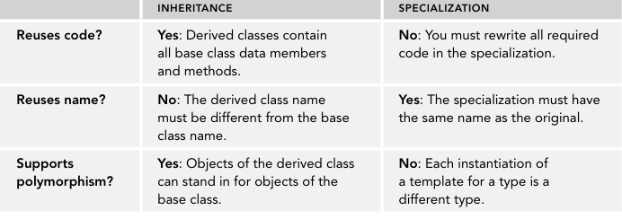

### generic programming
goal: reuse code
tool: template  --> parameterize types and values
object: data and behaviors

### class template
definition: the types of some of the variables, return types of methods, and/or parameters to the methods are specified as template parameters.
used in: containers, data structures
without it: 
   1. polymorphism: many subclass derived from a same parent class. virutal function. pointers(can have nullptr compared with values)
   2. shortage: example, GamePieces --> ChessPieces, unique_ptr<GamePieces>, cannot make full use of the functionality of ChessPieces. cannot store primitive types such as int, double(they don't derive from GamePieces).
advantages: type safety; 


#### an example of class template interface
recall: once you have a user-declared destructor, it’s deprecated for the compiler to implicitly generate a copy constructor or copy assignment operator,  move constructor or move assignment operator.
```cpp
export template <typename T>
class Grid {
    public:
        explicit Grid(size_t width = DefaultWidth, size_t height = DefaultHeight);
        virtual ~Grid() = default; // user-declared destructor
        // Explicitly default a copy constructor and assignment operator.
        Grid(const Grid& src) = default;
        Grid& operator=(const Grid& rhs) = default;
        // Explicitly default a move constructor and assignment operator.
        Grid(Grid&& src) = default;
        Grid& operator=(Grid&& rhs) = default;
        std::optional<T>& at(size_t x, size_t y);
        const std::optional<T>& at(size_t x, size_t y) const;
        size_t getHeight() const { return m_height; }
        size_t getWidth() const { return m_width; }
        static const size_t DefaultWidth { 10 };
        static const size_t DefaultHeight { 10 };
    private:
        void verifyCoordinate(size_t x, size_t y) const;
        std::vector<std::vector<std::optional<T>>> m_cells;
        size_t m_width { 0 }, m_height { 0 };
};


// the implementation is in the same file as declaration
template <typename T>
void Grid<T>::verifyCoordinate(size_t x, size_t y) const
{
    if (x >= m_width) {
        throw std::out_of_range {
            std::format("{} must be less than {}.", x, m_width) };
    }
    if (y >= m_height) {
        throw std::out_of_range {
            std::format("{} must be less than {}.", y, m_height) };
    }
}
template <typename T>
const std::optional<T>& Grid<T>::at(size_t x, size_t y) const
{
    verifyCoordinate(x, y);
    return m_cells[x][y];
}
template <typename T>
std::optional<T>& Grid<T>::at(size_t x, size_t y)
{
    return const_cast<std::optional<T>&>(std::as_const(*this).at(x, y));
}

```

#### using class template
```cpp
using IntGrid = Grid<int>;
void processIntGrid(IntGrid&) {}
```

#### how the complier processes templates
1. encounter definitions: syntax checking; not compile templates(don't the types of templates);
2. encounter instantiation: replace T with type such as `int`. different types generate different codes
3. selective instantiation: generates code for `virtual functions`; but generates code only for those `non-virtual methods` that you actually call.
4. force the compiler to generate code for all method: `template class Grid<int>`. error checking.  explicit template instantiations
5. Template Requirements on Types: the type `T` is: destructible, copy/move constructible, and copy/move assignable.

#### Distributing Template Code Between Files
```cpp
export module gird;

export import :definition;
export import :implemetation;

// =============
export module grid:definition;
import <vector>;
import <optional>;
export template <typename T> class Grid { ... };

// =============
export module grid:implementation;
import :definition;
import <vector>;
...
export template <typename T>
Grid<T>::Grid(size_t width, size_t height) : m_width { width }, m_height { height }
{ ... }

```

#### template parameters
1. write a class with as many template parameters as you want
2. don't have to be types; can have default values
3. need not specify the default values such as `T` in the template specification for the method definitions after you provide default value for `T` in the beginning
4. unlike normal function parameters
```cpp
template <typename RetType = long long, typename T1, typename T2>
RetType add(const T1& t1, const T2& t2) { return t1 + t2; }

auto result { add(1, 2) };
```

#### Non-type Template Parameters
1. integral types(int, char, long ...), enumeration types, pointers, references, nullptr_t, auto, auto&, auto*
2. c++20: floating-point, class types(limitation)
3. Non-type template parameters become part of the type specification of instantiated objects
```cpp
export template <typename T = int, size_t WIDTH = 10, size_t HEIGHT = 10>
class Grid
{
    public:
        Grid() = default;
        virtual ~Grid() = default;
        // Explicitly default a copy constructor and assignment operator.
        Grid(const Grid& src) = default;
        Grid& operator=(const Grid& rhs) = default;
        std::optional<T>& at(size_t x, size_t y);
        const std::optional<T>& at(size_t x, size_t y) const;
        size_t getHeight() const { return HEIGHT; }
        size_t getWidth() const { return WIDTH; }
    private:
        void verifyCoordinate(size_t x, size_t y) const;
        std::optional<T> m_cells[WIDTH][HEIGHT]; // C-styles arrays don't support move semantics
};

template <typename T, size_t WIDTH, size_t HEIGHT>
const std::optional<T>& Grid<T, WIDTH, HEIGHT>::at(size_t x, size_t y) const
{
    verifyCoordinate(x, y);
    return m_cells[x][y];
}
Grid<> myIntGrid;
Grid<int> myGrid;
Grid<int, 5> anotherGrid;
Grid<int, 5, 5> aFourthGrid;

// wrong 
Grid myIntGrid; // not use template
```

#### class template argument deduction
1. function: the compiler can automatically deduce the template parameters from the arguments passed to a class template constructor. ex: `std::pair p{1, 2.0}`; 
2. This type deduction is disabled for `std::unique_ptr` and `shared_ptr`.You pass a `T*` to their constructors, which means that the compiler would have to choose between deducing `<T>` or `<T[]>`, a dangerous choice to get wrong. So, just remember that for `unique_ptr` and `shared_ptr`, you need to keep using `make_unique()` and `make_shared()`.
3. User-Defined Deduction Guides
```cpp
// defined outside the definition but inside the same namespace as the SpreadSheetCell class.
// constructor  --> decuction
// const char*  --> std::string
SpreadSheetCell(const char*) -> SpreadSheetCell<std::string>;
// explicit  behaves the same as constructors
explicit TemplateName(Parameters) -> DeduceTemplate;

namespace std{
   explicit vector(std::initilizer_list<const char*>) -> vector<std::string>;
}
```

### method templates
1. C++ allows you to templatize individual methods of a class
2. can be inside in a normal class or a class template
3. useful for assignment operators and copy constructors in class templates.
4. Virtual methods and destructors cannot be method templates.
5. why we need it? cannot pass `Grid<int>` to construct or assign to `Grid<double>`
```cpp
export template <typename T>
class Grid
{
    public:
        template <typename E>
        Grid(const Grid<E>& src);
        template <typename E>
        Grid& operator=(const Grid<E>& rhs);
        void swap(Grid& other) noexcept;
    // Omitted for brevity
};

template <typename T>
template <typename E>
Grid<T>::Grid(const Grid<E>& src)
: Grid { src.getWidth(), src.getHeight() }
{
    // The ctor-initializer of this constructor delegates first to the
    // non-copy constructor to allocate the proper amount of memory.
    // The next step is to copy the data.
    for (size_t i { 0 }; i < m_width; i++) {
        for (size_t j { 0 }; j < m_height; j++) {
            m_cells[i][j] = src.at(i, j);
        }
    }
}

// ============
template <typename T, size_t WIDTH, size_t HEIGHT>
template <typename E, size_t WIDTH2, size_t HEIGHT2>
Grid<T, WIDTH, HEIGHT>::Grid(const Grid<E, WIDTH2, HEIGHT2>& src)
{
    for (size_t i { 0 }; i < WIDTH; i++) {
        for (size_t j { 0 }; j < HEIGHT; j++) {
            if (i < WIDTH2 && j < HEIGHT2) {
                m_cells[i][j] = src.at(i, j);
            } else {
                m_cells[i][j].reset();
            }
        }       
    }
}
```

### class template specialization
1. `class Grid {};` is illegal. there is a class template named Grid
2. When you specialize a template, you don’t “inherit” any code; specializations are not like derivations.


```cpp
export module grid:string;
import :main; // origin definition in this module partition file

export template<>
class Grid<const char*>
{
    public:
        explicit Grid(size_t width = DefaultWidth, size_t height = DefaultHeight);
        virtual ~Grid() = default;
        // Explicitly default a copy constructor and assignment operator.
        Grid(const Grid& src) = default;
        Grid& operator=(const Grid& rhs) = default;
        // Explicitly default a move constructor and assignment operator.
        Grid(Grid&& src) = default;
        Grid& operator=(Grid&& rhs) = default;
        std::optional<std::string>& at(size_t x, size_t y);
        // the template argument is const char*
        const std::optional<std::string>& at(size_t x, size_t y) const;
        size_t getHeight() const { return m_height; }
        size_t getWidth() const { return m_width; }
        static const size_t DefaultWidth { 10 };
        static const size_t DefaultHeight { 10 };
    private:
        void verifyCoordinate(size_t x, size_t y) const;
        std::vector<std::vector<std::optional<std::string>>> m_cells;
        size_t m_width { 0 }, m_height { 0 };
};

```

### deriving from class template
1. If the derived class inherits from the template itself, it must be a template as well. 
2. you can derive from a specific instantiation of the class template, in which case your derived class does not need to be a template
3. derived class templates don't really derive from generic template, but from the instantiation for the same type
4. Use inheritance for extending implementations and for polymorphism. Use specialization for customizing implementations for particular types.


### function template
1. override
2. friend function
```cpp
// Forward declare Grid template.
export template <typename T> class Grid;
// Prototype for templatized operator+.
export template <typename T>
Grid<T> operator+(const Grid<T>& lhs, const Grid<T>& rhs);
export template <typename T>
class Grid
{
    public:
        friend Grid operator+<T>(const Grid& lhs, const Grid& rhs);
        // Omitted for brevity
};
```

#### return type of function templates
1. compiler deduces the return type of a function by using `auto`. but strips `const` and `reference` qualifier. (`decltype` does not)
2.  C++ supports `auto return type deduction` and `decltype(auto)` 

```cpp
template <typename T1, typename T2>
auto add(const T1& t1, const T2& t2) {
    return t1 + t2;
}

const std::string message {"message"};
const std::string& getString() {return message;}

auto m1 {getString()}; // type(m1) == std::string
const auto& m2 {getString()}; // type(m2) == const std::string&
decltype(getString()) m3 {getString()}; // type(m3) == const std::string&
decltype(auto) m3 {getString()}; // the same as m3

// new version of add  c++14
template <typename T1, typename T2>
decltype(auto) add(const T1& t1, const T2& t2) {
    return t1 + t2;
}

// before c++14
template <typename T1, typename T2>
auto add(const T1& t1, const T2& t2) -> decltype(t1+t2) {
    return t1 + t2;
}
```

#### Abbreviated Function Template Syntax
1. introduced in C++20
2. each parameter specified as `auto` becomes a different template type parameter. 
3.  cannot use the deduced types explicitly in the implementation of the function template, as these automatically deduced types have no name. use `decltype(parameter name)` such as `decltype(t1)`
```cpp
template <typename T1, typename T2>
decltype(auto) add(const T1& t1, const T2& t2) {}

// c++20
decltype(auto) add(const auto& t1, const auto& t2) {return t1+t2;}
```

### variable templates
1. 变量模板
```cpp
template <typename T>
constexpr T pi {T{3.141592653589793238462643383279502884}};

float piFloat {pi<float>};
auto piDouble {pi<double>};
// std::numbers::pi;
```


### concepts
1. definition: named requirements used to constrain template type and non-type parameters of class and function templates.
2. grammer: written as predicates that are evaluated at compile time to verify the template arguments passed to a template.
3. goal: make template-related compiler errors more human readable
4. When writing concepts, make sure they model semantics and not just syntax. `int` and `string` support `operator+`, they have same syntax but not senamtics. sortable and swappable are good concepts

#### syntax
1. definition generic syntax: `template <parameter-list> concept concept-name = constraits-expression;`
2. concept expression: `concept-name<argument-list>` -> `true` or `false`

#### constraits expression
1. evaliate to a Boolean without any type conversions
2. requires expressions. syntax: `requires (parameter-list) {requirements;}`
3. Existing concept expressions can be combined using conjunctions (&&) and disjunctions (||)


```cpp
template <typename T>
concept C = sizeof(T)==4;

// simple requirements   an arbitrary expression statement
template <typename T>
concept Incrementable = requires(T x) {x++; ++x;};


// type requirements verify a certain type is valid; verify that a certain template can be instantiated with a given type
template <typename T>
concept C = requires {typename T::value_type;
                    typename SomeTemplate<T>;};


//compound requirements verify that something does not throw any exceptions and/or to verify that a certain method returns a certain type
// check method noexcept and return type
template <typename T>
concept C = requires(T x, T y) {
    {x.swap(y)} noexcept;
};

// std::convertible_to<From, To>: another concepts
// the return type of x.size() is passed to From (the first parameter of convertible_to)
template <typename T>
concept C = requires (const T x) {
    { x.size() } -> convertible_to<size_t>; 
};

template <typename T>
concept Comparable = requires(const T a, const T b) {
    { a == b } -> convertible_to<bool>;
    { a < b } -> convertible_to<bool>;
    // ... similar for the other comparison operators ...
};

// nested requirements
template <typename T>
concept C = requires (T t) {
    requires sizeof(t) == 4;
    ++t; --t; t++; t--;
};

template <typename T>
concept IncrementableAndDecrementable = Incrementable<T> && Decrementable<T>;
```

#### predifined standard concepts
1. core language concepts: `same_as`, `derived_from`, `convertible_to`, `integral`, `floating_point`...
2. comparison concepts: `equality_comparable`, `totally_ordered`...
3. object concepts: `movable`, `copyable`
4. callable concepts: `invocable`, `predicate`
5. <concepts>, <iterator>, <ranges>

```cpp
template <typename T>
concept IsDerivedFromFoo = derived_from<T, Foo>;

template <typename T>
concept DefaultAndCopyConstructible =
default_initializable<T> && copy_constructible<T>;
```

#### type-constrained auto
```cpp
Incrementable auto value1 { 1 }; // ok
Incrementable auto value { "abc"s }; // wrong
```

#### type constraints
```cpp
// function
template <convertible_to<bool> T>
void handle(const T& t);

template <Incrementable T>
void process(const T& t);

template <typename T> requires Incrementable<T>
void process(const T& t);

template <typename T> requires convertible_to<T, bool>
void process(const T& t);

template <typename T> requires requires(T x) { x++; ++x; }
void process(const T& t);

template <typename T> requires (sizeof(T) == 4)
void process(const T& t);

template <typename T> requires Incrementable<T> && Decrementable<T>
void process(const T& t);

template <typename T> requires is_arithmetic_v<T>
void process(const T& t);

// class template
template <std::derived_from<GamePiece> T>
void GameBoard<T>::move(size_t xSrc, size_t ySrc, size_t xDest, size_t yDest) { ... }

// class method
template <std::derived_from<GamePiece> T>
void GameBoard<T>::move(size_t xSrc, size_t ySrc, size_t xDest, size_t yDest)
requires std::movable<T>
{ ... }

// class specification
template <std::floating_point T>
bool AreEqual(T x, T y, int precision = 2)
{
// Scale the machine epsilon to the magnitude of the given values and multiply
// by the required precision.
return fabs(x - y) <= numeric_limits<T>::epsilon() * fabs(x + y) * precision
|| fabs(x - y) < numeric_limits<T>::min(); // The result is subnormal.
}


template <std::floating_point T>
size_t Find(const T& value, const T* arr, size_t size)
{
    for (size_t i { 0 }; i < size; i++) {
        if (AreEqual(arr[i], value)) {
        return i; // Found it; return the index.
        }
    }
    return NOT_FOUND; // Failed to find it; return NOT_FOUND.
}
```
