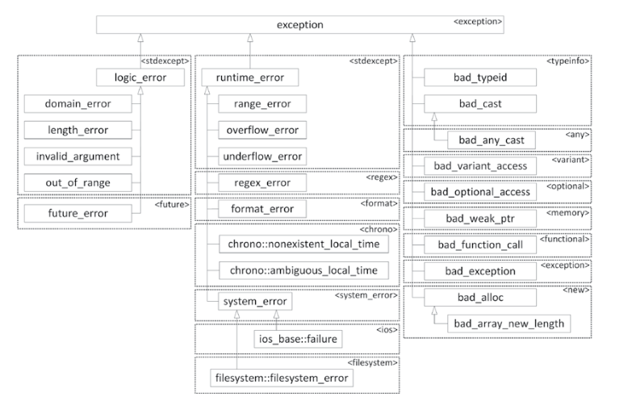

### exception
1. definition:  a mechanism for a piece of code to notify another piece of code of an “exceptional” situation or error condition without progressing through the normal code paths. The code that encounters the error `throws` the exception, and the code that handles the exception `catches` it.
2. `C` 处理：uses integer function return codes, and the errno macro to signify errors. Each thread has its own errno value.
3. `exception` 的类型可以任意的，包括 `int`等。一个好的`exception`: 名字表示异常类型；内部有异常信息（包括出现异常的文件，所在行等）
4. 只有 `try`语句捕捉的异常与 `catch`块中参数相容时，才会执行 `catch`块中的代码 未成功捕捉异常程序会退出
5. a `terminate_handler` is usually set up to create a so-called `crash dump` before terminating the process. A `crash dump` usually contains information such as the` call stack` and `local variables` at the time the uncaught exception was thrown. 
6. Always use `throw;` to rethrow an exception. Never do something like `throw e;` to rethrow a caught exception e! `(slicing)`

### exception mechanics
1.  a `try/catch` construct to handle an exception, and a `throw` statement that throws an exception.

#### exceptions
1. `<stdexcept>`: `invalid_argument`, `runtime_error`
2. `<exception>`: `exception`


```cpp
try {
    function-throw-exception();
} catch (const exception& ex) {
    cout << ex.what() << endl;
    // rethrow this exception
    throw;
}

try {
    divide(10, 2);
    divide(3, 0);
} catch (std::invalid_argument& e) {
    cout << e.what() << endl;
}

// exception type
ifstream file(path_to_your_file, ios_base::binary | ios_base::ate);
if (file.fail()) {
    throw 4; // 继承C语言？？通过错误代码表示不同的错误？
}


vector<int> readIntegerFile(string_view filename)
{
    ifstream inputStream { filename.data() };
    if (inputStream.fail()) {
    // We failed to open the file: throw an exception.
        throw invalid_argument { "Unable to open the file." };
    }
    // Read the integers one-by-one and add them to a vector.
    vector<int> integers;
    int temp;
    while (inputStream >> temp) {
        integers.push_back(temp);
    }
        if (!inputStream.eof()) {
    // We did not reach the end-of-file.
    // This means that some error occurred while reading the file.
    // Throw an exception.
        throw runtime_error { "Error reading the file." };
    }
    return integers;
}

vector<int> myInts;
try {
    myInts {readIntegerFile(filename)};
} catch (const invalid_argument& e) {}
catch (const runtime_error& e) {}
catch (...) {} // match any type of exceptions. useful in poorly documented code

```


#### 自定义未能捕捉异常的情形
```cpp
[[noreturn]] void myTerminate(void) {
    cout << "some information" << endl; 
    _Exit(1);
}

main: old_handle = set_terminate(myTerminate); //terminate_handle == myTerminate   cstdlib

```

#### noexcept specifier
1. `noexcept` 函数抛出异常程序会终止
2. 基类的虚函数可以不是 `noexcept`的同时子类的 override 函数 可以是`noexcept`
3. noexcept operator
```cpp
void printValues(const vector<int>&) noexcept(true); // false: can throw exception

void f1() noexcept {}
void f2() noexcept(false) {}
void f3() noexcept(noexcept(f1())) {}
void f4() noexcept(noexcept(f2())) {} // get the return value type of a function
```

#### writing exception classes
1. 继承自 `exception` 或第三库
2. `std::source_location`: `file_name()`, `function_name()`, `line()`, `column()`, `static current()`

```cpp
class FileError : public exception
{
public:
    FileError(string filename) : m_filename { move(filename) } {}
    const char* what() const noexcept override { return m_message.c_str(); }
    virtual const string& getFilename() const noexcept { return m_filename; }
protected:
    virtual void setMessage(string message) { m_message = move(message); }
private:
    string m_filename;
    string m_message;
};

// source_location for logging
void logMessage(string_view message, const source_location& location=source_location::current()) 
{
    cout << format("{}({}): {}:{}", location.file_name(), location.line(), location.function_name(), message) << endl;
}

void foo()
{
    logMessage("hello world");
}


class MyException : public exception
{
public:
    MyException(string message, source_location location = source_location::current())
    : m_message { move(message) }, m_location { move(location) }
    { }
    const char* what() const noexcept override { return m_message.c_str(); }
    virtual const source_location& where() const noexcept{ return m_location; }
private:
    string m_message;
    source_location m_location;
};
```

#### nested exceptions
1. background: It could happen that during handling of a first exception, a second exceptional situation is triggered that requires a second exception to be thrown. Unfortunately, when you throw the second exception, all information about the first exception that you are currently trying to handle will be lost.
2. function: nest a caught exception in the context of a new exception. 
3. the return type of `throw_with_nested` is: derived class of `nested_exception` and `passed_exception`
4. use `dynamic_cast` to get `nested exception`. `nested_ptr->rethow_nested` 抛出 inside exception


```cpp
class MyException : public exception
{
public:
    MyException(string message) : m_message { move(message) } {}
    const char* what() const noexcept override { return m_message.c_str(); }
private:
    string m_message;
};  

void doSomething() noexcept(false) {
    try {
        throw runtime_error {"error"};
    } catch (std::runtime_error& e) {
        cout << format("{} caught a runtime_error", __func__) << endl;
        cout << format("{} throwing MyException", __func__) << endl;
        throw_with_nested(MyException{ "MyException with nested runtime_error" });
    }
}

try {
    doSomething();
} catch (const MyException& e) {
    cout << format("{} caught MyException: {}", __func__, e.what()) << endl;
    const auto* nested { dynamic_cast<const nested_exception*>(&e) };
    if (nested) {
        try {
            nested->rethrow_nested();
        } catch (const runtime_error& e) {
        // Handle nested exception.
            cout << format(" Nested exception: {}", e.what()) << endl;
        }
    }
}

// another version
try {
    doSomething();
} catch (const MyException& e) {
    cout << format("{} caught MyException: {}", __func__, e.what()) << endl;
    try {
        rethrow_if_nested(e);
    } catch (const runtime_error& e) {
        // Handle nested exception.
        cout << format(" Nested exception: {}", e.what()) << endl;
    }
}

```

#### ways to avoid resources leak when encoutered exception
1. stack unwinding and clean
2. use smarter pointer or RAII (preferred)
3. catch (...), cleanup (delete ptr;) and rethrow

### common error-handing issues
