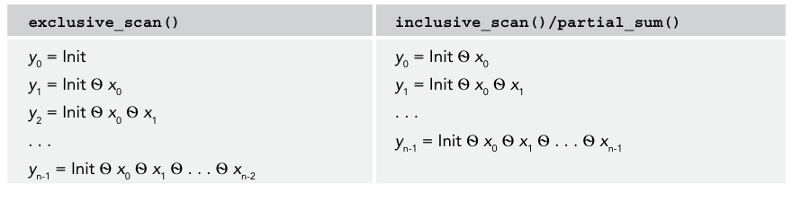

## goals
Algorithms explained
The details of the Standard Library algorithms


### overview
1. algorithms work on `iterator` intermediaries instead of on the containers themselves.
2. `<algorithm>`, `<numeric>`
3. c++ 20 most of them are marked `constexpr`

### examples
1. If `find()` fails to find an element, it returns an iterator equal to the end iterator specified in the function call, not the end iterator of the underlying container.


```cpp
// 1. find, find_if
vector<int> v1 {1,2,3,4,5,6,7};
auto it {std::find(cbegin(v1), cend(v1), 4)}; // vector<int>::iterator it = ...
auto cendIt {end(it)};
// initializers for if statements
if (auto it { find(cbegin(myVector), endIt, number) }; it == endIt) {
    cout << "Could not find " << number << endl;
} else {
    cout << "Found " << *it << endl;
}

bool pred(int num) {return num > 3};
auto it { find_if(cbegin(myVector), endIt, perfectScore) };
if (it == endIt) {
    cout << "No perfect scores" << endl;
} else {
    cout << "Found a \"perfect\" score of " << *it << endl;
}

// 2. accumulate
double geometricMeanFunctor(span<const int> values)
{
    int mult { accumulate(cbegin(values), cend(values), 1, multiplies<>{}) };
    return pow(mult, 1.0 / values.size());
}

```

### algorithm callback
1. The algorithms are allowed to make multiple copies of given callbacks, such as functors and lambda expressions, and call different copies for different elements.
2. the `callbacks` must be stateless. For functors, this means that the function call operator needs to be `const`; thus, you cannot write functors such that they count on any internal state to the object being consistent between calls. Similar for lambda expressions, they cannot be marked as mutable.
3. `generate()`, `generate_n()`, these make one copy of the callback, they don't return that copy. 
4. `for_each()`:  It copies the given predicate once into the `for_each()` algorithm and returns that copy when finished. You can access the changed state through this returned value
5. using `std::ref()` to pass a reference to callback into algorithm.

```cpp
auto isPerfectSocre {[total=0](int i) mutable {
    cout << ++total << endl; return i>=100;
}};
vector myVector {1,2,3};
auto endIt {cend(myVector)};
auto it {find_if(cbegin(myVector), cend(myVector), isPerfectScore /*ref(isPerfectScore)*/)};
if (it != endIt) { cout << "Found a \"perfect\" score of " << *it << endl; } 
isPerfectScore(1);
// output: 1 2 3 1

```

## details
`<algorithm>`, `<number>`

### Non-modifying Sequence Algorithms
searching, comparision, counting

1. search: `find`, `find_if`, `find_first_of`, `search`, `find_if_not`, `find_end`, `search_n`
2. specialized searchers: `default_search`, `boyer_moore_searcher`, `boyer_moore_horspool_searecher`, all defined in `<functional>`
3. counting: `all_of`, `any_of`, `none_of`, `count`, `count_if`

```cpp
// search, default operator== and operator< for comparison
// The list of elements to be searched.
vector myVector { 5, 6, 9, 8, 8, 3 };
auto beginIter { cbegin(myVector) };
auto endIter { cend(myVector) };
// Find the first element that does not satisfy the given lambda expression.
auto it { find_if_not(beginIter, endIter, [](int i){ return i < 8; }) };
if (it != endIter) {
    cout << "First element not < 8 is " << *it << endl;
}
// Find the first pair of matching consecutive elements.
it = adjacent_find(beginIter, endIter);
if (it != endIter) {
    cout << "Found two consecutive equal elements with value " << *it << endl;
}
// Find the first of two values.
vector targets { 8, 9 };
it = find_first_of(beginIter, endIter, cbegin(targets), cend(targets));
if (it != endIter) {
    cout << "Found one of 8 or 9: " << *it << endl;
}
// Find the first subsequence.
vector sub { 8, 3 };
it = search(beginIter, endIter, cbegin(sub), cend(sub));
if (it != endIter) {
    cout << "Found subsequence {8,3}" << endl;
} else {
    cout << "Unable to find subsequence {8,3}" << endl;
}
// Find the last subsequence (which is the same as the first in this example).
auto it2 { find_end(beginIter, endIter, cbegin(sub), cend(sub)) };
if (it != it2) {
    cout << "Error: search and find_end found different subsequences " << "even though there is only one match." << endl;
}
// Find the first subsequence of two consecutive 8s.
it = search_n(beginIter, endIter, 2, 8);
if (it != endIter) {
    cout << "Found two consecutive 8s" << endl;
} else {
    cout << "Unable to find two consecutive 8s" << endl;
}

// using specialized searcher
string text { "This is the haystack to search a needle in." };
string toSearchFor { "needle" };
boyer_moore_searcher searcher { cbegin(toSearchFor), cend(toSearchFor) };
auto result { search(cbegin(text), cend(text), searcher) };
if (result != cend(text)) {
    cout << "Found the needle." << endl;
} else {
    cout << "Needle not found." << endl;
}

// comparision
vector<int> myVector;
list<int> myList;
cout << "Populate the vector:" << endl;
populateContainer(myVector);
cout << "Populate the list:" << endl;
populateContainer(myList);
// Compare the two containers
if (equal(cbegin(myVector), cend(myVector), cbegin(myList), cend(myList))) {
    cout << "The two containers have equal elements" << endl;
} else {
    // If the containers were not equal, find out why not
    auto miss { mismatch(cbegin(myVector), cend(myVector), cbegin(myList), cend(myList)) };
    cout << "The following initial elements are the same in the vector and the list:" << endl;
    for (auto i { cbegin(myVector) }; i != miss.first; ++i) {
        cout << *i << '\t';
    }
    cout << endl;
}
// all_of()
vector vec2 { 1, 1, 1, 1 };
if (all_of(cbegin(vec2), cend(vec2), [](int i){ return i == 1; })) {
    cout << "All elements are == 1" << endl;
} else {
    cout << "Not all elements are == 1" << endl;
}
// any_of()
vector vec3 { 0, 0, 1, 0 };
if (any_of(cbegin(vec3), cend(vec3), [](int i){ return i == 1; })) {
    cout << "At least one element == 1" << endl;
} else {
    cout << "No elements are == 1" << endl;
}
// none_of()
vector vec4 { 0, 0, 0, 0 };
if (none_of(cbegin(vec4), cend(vec4), [](int i){ return i == 1; })) {
    cout << "All elements are != 1" << endl;
} else {
    cout << "Some elements are == 1" << endl;
}
vector values { 1, 2, 3, 4, 5, 6, 7, 8, 9 };
int value { 3 };
auto tally { count_if(cbegin(values), cend(values), [value](int i){ return i > value; }) };
cout << format("Found {} values > {}.", tally, value) << endl;
```

### Modifying Sequence Algorithms
1. copy element from one range to another, removing elements, reverse the order of elements in a range, generate elements in-place
2. The modifying algorithms cannot insert elements into a destination. They can only `overwrite/modify` whatever elements are in the destination already.
3. Ranges from `maps` and `multimaps` cannot be used as destinations of modifying algorithms

```cpp
// generate
vector<int> values(10); // Create a vector of 10 elements.
int value { 1 };
generate(begin(values), end(values), [&value]{ value *= 2; return value; });
for (const auto& i : values) { cout << i << " "; }


// transform
// version 1: a callback to each element in a range
vector<int> myVector;
populateContainer(myVector);
cout << "The vector contains:" << endl;
for (const auto& i : myVector) { cout << i << " "; }
cout << endl;
transform(begin(myVector), end(myVector), begin(myVector), [](int i){ return i + 100;});
cout << "The vector contains:" << endl;
for (const auto& i : myVector) { cout << i << " "; }

// version 2: a callback to two ranges
// omit for simplity
transform(begin(vec1), end(vec1), begin(vec2), begin(vec1),
[](int a, int b){return a + b;});
cout << "Vector1: "; printContainer(vec1);
cout << "Vector2: "; printContainer(vec2);

// copy and copy_backward
vector<int> vec1, vec2;
populateContainer(vec1);
vec2.resize(size(vec1));
copy(cbegin(vec1), cend(vec1), begin(vec2));
for (const auto& i : vec2) { cout << i << " "; }

// copy from backward. be ware of end(vec2)
copy_backward(cbegin(vec1), cend(vec1), end(vec2));

vector<int> vec1, vec2;
populateContainer(vec1);
vec2.resize(size(vec1));
auto endIterator { copy_if(cbegin(vec1), cend(vec1), begin(vec2), [](int i){ return i % 2 == 0; }) };
vec2.erase(endIterator, end(vec2));
for (const auto& i : vec2) { cout << i << " "; }

// move and move_backward
// define a class has destructor, move assignment operator, constructor(including copy) but not have copy assignment operator

// replace and replace_if
vector<int> values;
populateContainer(values);
replace_if(begin(values), end(values), [](int i){ return i % 2 != 0; }, 0);
for (const auto& i : values) { cout << i << " "; }

// erase delete elements in a container
// c++20 std::erase, std::earse_if  preferred
// associative containers use container.erase(key)

void removeEmptyStrings(vector<string>& strings)
{
    // accepts range, not iterators
    erase_if(strings, [](const string& str){ return str.empty(); });
}
int func()
{
vector<string> myVector {"", "one", "", "two", "three", "four"};
for (auto& str : myVector) { cout << "\"" << str << "\" "; }
cout << endl;
removeEmptyStrings(myVector);
for (auto& str : myVector) { cout << "\"" << str << "\" "; }
cout << endl;
}


// remove: swap values (target with "tails")
void removeEmptyStrings(vector<string>& strings)
{
    auto it { remove_if(begin(strings), end(strings), [](const string& str){ return str.empty(); }) };
    // Erase the removed elements.
    strings.erase(it, end(strings));
}

// unique: removes all duplicate contiguous elements. 
vector myVec{1,1,2,4,5,1,2,1};
std::remove(std::unique(begin(myVec), end(myVec)), end(myVec));

// shuffle: rearrange a range
vector values { 1, 2, 3, 4, 5, 6, 7, 8, 9, 10 };
random_device seeder;
const auto seed { seeder.entropy() ? seeder() : time(nullptr) };
std::random::mt19937 engine {
static_cast<std::random::mt19937::result_type>(seed) };
for (int i { 0 }; i < 6; ++i) {
    shuffle(begin(values), end(values), engine);
    for (const auto& value : values) { cout << value << " "; }
    cout << endl;
}

// sample
vector values { 1, 2, 3, 4, 5, 6, 7, 8, 9, 10 };
const size_t numberOfSamples { 5 };
vector<int> samples(numberOfSamples);
random_device seeder;
const auto seed { seeder.entropy() ? seeder() : time(nullptr) };
default_random_engine engine {
static_cast<default_random_engine::result_type>(seed) };
for (int i { 0 }; i < 6; ++i) {
    sample(cbegin(values), cend(values), begin(samples), numberOfSamples, engine);
    for (const auto& sample : samples) { cout << sample << " "; }
    cout << endl;
}


// reverse
vector<int> values;
populateContainer(values);
reverse(begin(values), end(values));
for (const auto& i : values) { cout << i << " "; }

// shifting elements
// fall off either end of the range are removed
vector values { 11, 22, 33, 44, 55 };
// Shift elements to the left by 2 positions.
auto newEnd { shift_left(begin(values), end(values), 2) };
// Resize the vector to its proper size.
values.erase(newEnd, end(values));
for (const auto& value : values) { cout << value << " "; }
cout << endl;
// Shift elements to the right by 2 positions.
auto newBegin { shift_right(begin(values), end(values), 2) };
// Resize the vector to its proper size.
values.erase(begin(values), newBegin);
for (const auto& value : values) { cout << value << " "; }
cout << endl;
```

## operational algorightms
1. `for_each` and `for_each_n`: just use range-based for loop.
```cpp
// foreach
map<int, int> myMap { { 4, 40 }, { 5, 50 }, { 6, 60 } };
for_each(cbegin(myMap), cend(myMap), [](const auto& p)
{ cout << p.first << "->" << p.second << endl; });
```

## partition algorithms
1. `partition_copy()` copies elements from a source to two different destinations. The destination for each element is selected based on the result of a predicate, either true or false.return type is a pair of iterators
2. The `partition()` algorithm sorts a sequence such that all elements for which a predicate returns true are before all elements for which it returns false,without preserving the original order of the elements within each partition. 

```cpp
vector<int> vec1, vecOdd, vecEven;
populateContainer(vec1);
vecOdd.resize(size(vec1));
vecEven.resize(size(vec1));
auto pairIters { partition_copy(cbegin(vec1), cend(vec1),
begin(vecEven), begin(vecOdd), [](int i){ return i % 2 == 0; }) };
vecEven.erase(pairIters.first, end(vecEven));
vecOdd.erase(pairIters.second, end(vecOdd));


partition(begin(values), end(values), [](int i){ return i % 2 == 0; });
cout << "Partitioned result: ";
for (const auto& i : values) { cout << i << " "; }
```

## sorting algorighms
1. not relevent to associative containers
2. `list` and `forward_list` should use container specific version of `sort`

```cpp

// sort is_sorted, is_sorted_until
vector<int> values;
populateContainer(values);
sort(begin(values), end(values), greater<>{});
if (is_sorted(begin(values), end(values))) {
    // do somtheing/
}
// nth_element  selection algorithm
// rearranges the elements in the range such that the element in the position pointed to by nth is the element that would be in that position if the whole range were sorted. preceding the nth element are less than the new nth element, and the ones following it are greater than the new nth element.

vector<int> values;
populateContainer(values);
// Find the third largest value.
nth_element(begin(values), begin(values) + 2, end(values), greater<>{});
cout << "3rd largest value: " << values[2] << endl;

// get five largest elements
nth_element(begin(values), begin(values) + 4, end(values), greater<>{});
// nth_element() has partitioned the elements, now sort the first subrange.
sort(begin(values), begin(values) + 5);
// And finally, output the sorted subrange.
for_each_n(begin(values), 5, [](const auto& element) { cout << element << " "; });
```

## binary search algorithm
1. `lower_bound`: not less than a given value. consider whether the value is in the range
2. `upper_bound`: greater than a given value.
3. `equal_range`: return a pair of `[lower, upper)`

```cpp
vector<int> values;
populateContainer(values);
// Sort the container
sort(begin(values), end(values));
cout << "Sorted vector: ";
for (const auto& i : values) { cout << i << " "; }
cout << endl;
// lower_bound
while (true) {
    int number;
    cout << "Enter a number to insert (0 to quit): ";
    cin >> number;
    if (number == 0) { break; }
    auto iter { lower_bound(begin(values), end(values), number) };
    values.insert(iter, number);
    cout << "New vector: ";
    for (const auto& i : values) { cout << i << " "; }
cout << endl;
}

// binary_search
while (true) {
    int number;
    cout << "Enter a number to find (0 to quit): ";
    cin >> number;
    if (number == 0) { break; }
    if (binary_search(cbegin(values), cend(values), number)) {
        cout << "That number is in the vector." << endl;
    } else {
        cout << "That number is not in the vector." << endl;
    }
}
```

## set algorithms
1. worked on any sorted ranges
2. `include`, `set_union`, `set_intersection`, `set_diffenrence`, `set_symmetric_difference`
3. You can’t use iterator ranges from associative containers, including sets, to store the results because they don’t allow changes to their keys.


```cpp
// omit for the definition of vec1, vec2, result, DumpRange
if (includes(cbegin(vec1), cend(vec1), cbegin(vec2), cend(vec2))) {
    cout << "The second set is a subset of the first." << endl;
}
if (includes(cbegin(vec2), cend(vec2), cbegin(vec1), cend(vec1))) {
    cout << "The first set is a subset of the second" << endl;
}

result.resize(size(vec1) + size(vec2));
auto newEnd { set_union(cbegin(vec1), cend(vec1), cbegin(vec2), cend(vec2), begin(result)) };
DumpRange("The union is: ", begin(result), newEnd);
newEnd = set_intersection(cbegin(vec1), cend(vec1), cbegin(vec2), cend(vec2), begin(result));
DumpRange("The intersection is: ", begin(result), newEnd);
newEnd = set_difference(cbegin(vec1), cend(vec1), cbegin(vec2), cend(vec2), begin(result));
DumpRange("The difference between set 1 and 2 is: ", begin(result), newEnd);
newEnd = set_symmetric_difference(cbegin(vec1), cend(vec1), cbegin(vec2), cend(vec2), begin(result));
DumpRange("The symmetric difference is: ", begin(result), newEnd);

// merge to concatenate two sorted ranges
vectorMerged.resize(size(vectorOne) + size(vectorTwo));
merge(cbegin(vectorOne), cend(vectorOne), cbegin(vectorTwo), cend(vectorTwo), begin(vectorMerged));

// min max and clamp
cout << clamp(-3, 1, 10) << endl; // 1
cout << clamp(3, 1, 10) << endl; // 3
cout << clamp(22, 1, 10) << endl; // 10
```

## constrained algorithms 
1. defined in `std::ranges` namespace. using `concepts`


```cpp
vector values{1,2,3,4,5,6};
auto result {ranges::find(values, 4)};
```

##  numerical processing algorithms
1. `accumulate()`, `reduce()`, i`nner_product()`, `transform_reduce()`, add defined in `<numeric>` also called `accumulate`, `aggregate`, `compress`, `inject`, `fold`
2. scan algorithm: also called, `prefix sum`, `cumulative sum`, `partial sum`
3. `exclusive_scan()`, `inclusive_scan()/partial_sum()`, `transform_exclusive_scan()`, and `transform_inclusive_scan()`, all defined in` <numeric>`.

```cpp
vector values { 1, 3, 6, 4, 6, 9 };
double result1 { accumulate(cbegin(values), cend(values), 0.0) }; // default operator+
double result2 { reduce(execution::par_unseq, cbegin(values), cend(values)) }; // default functor: std::plus<>()


// 向量的内积 operator+ operator*
vector v1 { 1, 2, 3, 4 };
vector v2 { 9, 8, 7, 6 };
cout << inner_product(cbegin(v1), cend(v1), cbegin(v2), 0) << endl;

// transform_reduce
// 1. one range
// Init Ѳ f(x0) Ѳ f(x1) Ѳ . . . Ѳ f(xn−1)   Ѳ:default: operator+

// 2. two ranges
// behaves the same as inner_product  std::plus and std::multiplies

```

