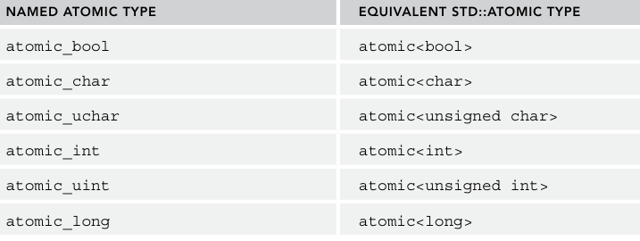
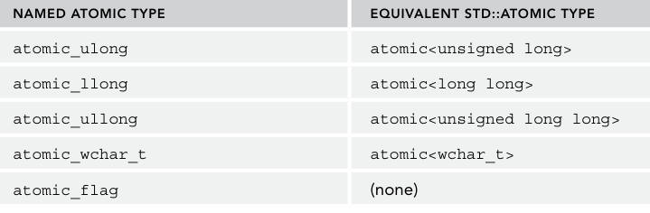

## goals
1. What multithreaded programming is
2. How to launch multiple threads
3. How to cancel threads
4. How to retrieve results from threads
5. What deadlocks and race conditions are, and how to use mutual exclusion to prevent them
6. How to use atomic types and atomic operations
7. What condition variables are
8. How to use semaphores, latches, and barriers
9. How to use futures and promises for inter-thread communication
10. What thread pools are
11. What resumable functions, or coroutines are


## introductions
1. `race conditions`: multiple threads want to access any kind of shared resources. 
2. `tearing`: a specific case or consequence of a data race. torn read(one thread is writing when other thread reads) and torn write(two threads write part of the data).
3. `deadlock`: Two threads are deadlocked if they are both waiting for the other thread to do something
4. `false-sharing`: cache lines are usually 64-bits.. If something needs to be written to a cache line, the entire line needs to be locked. This can bring a serious performance penalty for multithreaded code if your data structure is not properly designed.
5. `hardware_destructive_interference_size`: returns you the minimum recommended offset between two concurrently accessed objects to avoid cache line sharing. `<new>`

## thread
1. execute: `global function`, `functor`, `lambda expression`, `a member function of a class`
2. A thread object is said to be `joinable` if it represents or represented an active thread in the system. Before a joinable thread object is destroyed, you need to make sure to call either `join()` or `detach()` on it.
3. A call to `join()` is a blocking call, it waits until the thread has finished its work. A call to `detach()` detaches a thread object from its underlying OS thread, in which case the OS thread keeps running independently.
4. Thread function arguments are always copied into some internal storage for the thread. Use std::ref() or cref() from <functional> to pass them by reference.
5. `thread_local`, you can mark any variable as thread local, which means that each thread will have its own unique copy of the variable, and it will last for the entire duration of the thread
6. The C++ standard does not include any mechanism for canceling a running thread from another thread. method1: `<jthread>`; method2: provide some communication mechanism that the two threads agree upon 
7. A `jthread` is virtually identical to a thread, except: It automatically joins in its destructor; It supports so-called cooperative cancellation (because a thread that supports `cancellation` needs to periodically check if it needs to cancel itself).
8. `<stop_token>`: `std::stop_token`, checking for a cancellation request. A cancellable thread needs to periodically call `stop_requested()` on a `stop_token` to find out if it needs to stop its work. A `stop_token` can be used with a `condition_variable_any` so a thread can wake up when it needs to stop.
9. `std::stop_source`:  request a thread to cancel its execution. This is done by calling the `request_stop()` method on a `stop_source`. If a `stop_source` is used to request a cancellation, that stop request is visible to all associated `stop_sources` and `stop_tokens`. Then `stop_requested()` method can be used to check whether a stop has already been requested.
10. get results from threads: `pointers or refs`; `futures`; data members of a functor.
11. exceptions: Exceptions thrown in one thread Threads cannot be caught in another thread. 

```cpp
// exception handle across threads
exception_ptr current_exception() noexcept; // called from inside a catch block. 
[[noreturn]] void rethrow_exception(exception_ptr p);
template<class E> exception_ptr make_exception_ptr(E e) noexcept;

void doSomeWork()
{
    for (int i { 0 }; i < 5; ++i) {
        cout << i << endl;
    }
    cout << "Thread throwing a runtime_error exception..." << endl;
    throw runtime_error { "Exception from thread" };
}

void threadFunc(exception_ptr& err)
{
    try {
        doSomeWork();
    } catch (...) {
        cout << "Thread caught exception, returning exception..." << endl;
        err = current_exception(); // runtime error, exception_ptr&
    }
}

void doWorkInThread()
{
    exception_ptr error;
    // Launch thread.
    thread t { threadFunc, ref(error) };
    // Wait for thread to finish.
    t.join();
    // See if thread has thrown any exception.
    if (error) {
        cout << "Main thread received exception, rethrowing it..." << endl;
        rethrow_exception(error);
    } else {
        cout << "Main thread did not receive any exception." << endl;
    }
}
int main()
{
    try {
    doWorkInThread();
    } catch (const exception& e) {
        cout << "Main function caught: '" << e.what() << "'" << endl;
    }
}

```

```cpp
// normal function
void counter(int id, int numIterations) {
    for (int i { 0 }; i < numIterations; ++i) {
        cout << "Counter " << id << " has value " << i << endl;
    }
}

auto t1 {std::thread(counter, 1, 6)};
t.join();

class Counter
{
public:
    Counter(int id, int numIterations) : m_id { id }, m_numIterations { numIterations } { }

    void operator()() const
    {
        for (int i { 0 }; i < m_numIterations; ++i) {
            cout << "Counter " << m_id << " has value " << i << endl;
        }
    }
private:
    int m_id;
    int m_numIterations;
};

auto t2 thread(Counter(1, 5));
t2.join();


int id { 1 };
int numIterations { 5 };
thread t3 { [id, numIterations] {
    for (int i { 0 }; i < numIterations; ++i) {
        cout << "Counter " << id << " has value " << i << endl;
    }
} };
t3.join();


class Request
{
public:
    Request(int id) : m_id { id } { }
    void process() { cout << "Processing request " << m_id << endl; }
private:
    int m_id;
};

Request req { 100 };
thread t4 { &Request::process, &req }; // process 成员函数必须要对象才能调用！
t4.join();

// thread_local
int k{0};
thread_local int n{0};
void threadFunction(int id)
{
    cout << format("Thread {}: k={}, n={}\n", id, k, n);
    ++n;
    ++k;
}

thread t1 { threadFunction, 1 }; t1.join();
thread t2 { threadFunction, 2 }; t2.join();

jthread job([](stop_token token) {
    while (!token.stop_requested()) {
        // do jour job
    }
});
// in another jthread
job.requrest_stop();
```

## atomic operations library
1. Atomic types allow atomic access, which means that concurrent reading and writing without additional `synchronization` is allowed. 
2. operations on atomics of a certain type might use a synchronization mechanism such as mutual exclusion objects. This might happen, for example, when the hardware you are targeting lacks the necessary instructions to perform an operation atomically.
3. `is_lock_free()`:  an atomic type to query whether it supports lock-free operation. (whether its  operations run without any explicit synchronization mechanism underneath.)
4. `atomic<T>::is_always_lock_free` is a constant. `true` or `false`
5. `atomic_flag` is an atomic boolean, always lock free.





### atomic operations
1. Atomic integral types support the following atomic operations: `fetch_add(), fetch_sub(), fetch_and(), fetch_or(), fetch_xor(), ++, --, +=, -=, &=, ^=, and |=.` Atomic pointer types support `fetch_add(), fetch_sub(), ++, --, +=, and -=`.
2. Before C++20, using `std::atomic` with floating-point types, such as `atomic<float>` and `atomic<double>` provided atomic reading and writing, but did not provide atomic arithmetic operations. C++20 adds support for `fetch_add()` and `fetch_sub()` for floating-point atomic types.
3. The C++ standard provides `memory_order_relaxed`, `memory_order_consume`, `memory_order_acquire`, `memory_order_release`, `memory_order_acq_rel`, and `memory_order_seq_cst`, all of which are defined in the `std` namespace. 
4. C++20 introduces support for `atomic<std::shared_ptr<T>>` through `<memory>`.
5. C++20 also introduces `std::atomic_ref`. It is basically the same as `std::atomic`, even with the same interface, but it works with references, while atomic always makes a copy of the value it is provided with. 
6. `wait`, `notify_one`, `notify_all`  efficiently wait until an atomic variable is modified


```cpp
bool atomic<T>::compare_exchange_strong(T& expected, T desired) {
    if (*this == expected) {
        *this = desired;
        return true;
    } else {
        expected = *this;
        return false;
    }
}

T atomic<T>::fetch_add(T value, memory_order = memory_order_seq_cst);

#include <atomic>

void increment(atomic<T>& counter) {
    for (int i{0};i<100;++i) {
        ++counter; 
        this_thread::sleep_for(1ms);// std::chrono::literals.
    }
}

void increment(int& counter)
{
    atomic_ref<int> atomicCounter { counter };
    for (int i { 0 }; i < 100; ++i) {
        ++atomicCounter;
        this_thread::sleep_for(1ms);
    }
}

// recommend
void increment(atomic<int>& counter)
{
    int result { 0 };
    for (int i { 0 }; i < 100; ++i) {
        ++result;
        this_thread::sleep_for(1ms);
    }
    counter += result;
}

atomic<int> counter { 0 };
vector<thread> threads;
for (int i { 0 }; i < 10; ++i) {
    threads.push_back(thread { increment, ref(counter) });
}


for (auto& t : threads) {
    t.join();
}

// waiting on atomic variable
atomic<int> value {0};

thread job { [&value] {
    cout << "Thread starts waiting." << endl;
    value.wait(0);  // old value
    cout << "Thread wakes up, value = " << value << endl;
} };
this_thread::sleep_for(2s);
cout << "Main thread is going to change value to 1." << endl;
value = 1;
value.notify_all(); // main thread to notify thread `job`
job.join();
```

## mutual exclusion
1. `Scalars` such as Booleans and integers can often be synchronized properly with atomic operations, however, when your data is more complex and you need to use that data from multiple threads, you must provide explicit synchronization.
2. `mutex`
   1. A thread that wants to use (read/write) memory shared with other threads tries to lock a mutex object. If another thread is currently holding this lock, the new thread that wants to gain access blocks until the lock is released or until a timeout interval expires.
   2. Once the thread has obtained the lock, it is free to use the shared memory. Of course, this assumes that all threads that want to use the shared data correctly acquire a lock on the mutex.
   3. After the thread is finished with reading/writing to the shared memory, it releases the lock to give some other thread an opportunity to obtain the lock to the shared memory. If two or more threads are waiting on the lock, there are no guarantees as to which thread will be granted the lock and thus allowed to proceed.
3. A spinlock is a form of mutex in which a thread uses a busy loop (spinning) to try to acquire a lock, performs its work, and releases the lock.
4. `std::mutex`, `recursive_mutex`, `shared_mutex`: all suported methods: `lock()`, `try_lock()`, `unlock()`. `lock_shared()`, `try_lock_shared()`, `unlock_shared()`  
5. three timed mutex classes: `std::timed_mutex`, `recursive_timed_mutex`, and `shared_timed_mutex`. `try_lock_for(rel_time)`, `try_lock_until(abs_time)`
6. `locks`: `lock_guard`, `unique_lock`, `shared_lock`, `scoped_lock`. 7. `lock_guard`, accepts a reference to `mutex`, an instance of `std::adopt_lock_t` (optional), which assumes that the calling thread has already obtained a lock on the referenced mutex.
7. `std::unique_lock` is a more sophisticated lock that allows you to defer lock acquisition until later in the execution, long after the declaration. You can use the `owns_lock()` method or the unique_lock’s `bool` conversion operator to see if the lock has been acquired. 
8. `std::lock()`, locks all the given mutex objects in an unspecified order without the risk of deadlocks. `std::try_lock()` return -1 if all succeed, otherwise index.
9. `scoped_lock`:  is similar to `lock_guard`, except that it accepts a variable number of mutexes. 
10. You can use `std::call_once()` in combination with `std::once_flag` to make sure a certain function or method is called exactly one time, no matter how many threads try to call `call_once()` with the same `once_flag`.

```cpp
// constructor of unique_lock. shared_lock is the same as it;
explicit unique_lock(mutex_type& m);
unique_lock(mutex_type& m, defer_lock_t) noexcept; // std::defer_lock
unique_lock(mutex_type& m, try_to_lock_t);
unique_lock(mutex_type& m, adopt_lock_t);
unique_lock(mutex_type& m, const chrono::time_point<Clock, Duration>& _time);
unique_lock(mutex_type& m, const chrono::duration<Rep, Period>& rel_time);
```


```cpp
atomic_flag spinlock = ATOMIC_FLAG_INIT; // Uniform initialization is not allowed.
static const size_t NumberOfThreads { 50 };
static const size_t LoopsPerThread { 100 };
void dowork(size_t threadNumber, vector<size_t>& data)
{
    for (size_t i { 0 }; i < LoopsPerThread; ++i) {
        while (spinlock.test_and_set()) { } // Spins until lock is acquired.
        // Save to handle shared data...
        data.push_back(threadNumber);
        spinlock.clear(); // Releases the acquired lock.
    }
}
int func()
{
    vector<size_t> data;
    vector<thread> threads;
    for (size_t i { 0 }; i < NumberOfThreads; ++i) {
        threads.push_back(thread { dowork, i, ref(data) });
    }
    for (auto& t : threads) {
        t.join();
    }
    cout << format("data contains {} elements, expected {}.\n", data.size(), NumberOfThreads * LoopsPerThread);
}

once_flag g_onceFlag;
void initializeSharedResources()
{
    // ... Initialize shared resources to be used by multiple threads.
    cout << "Shared resources initialized." << endl;
}
void processingFunction()
{
    // Make sure the shared resources are initialized.
    call_once(g_onceFlag, initializeSharedResources); // once_flag and function.
    // ... Do some work, including using the shared resources
    cout << "Processing" << endl;
}
int func2()
{
    // Launch 3 threads.
    vector<thread> threads { 3 };
    for (auto& t : threads) {
        t = thread { processingFunction };
    }
    // Join on all threads
    for (auto& t : threads) {
        t.join();
    }
}

// synchronized stream  std::basic_osyncstream
class Counter
{
    public:
    Counter(int id, int numIterations): m_id { id }, m_numIterations { numIterations } { }
    void operator()() const
    {
        for (int i { 0 }; i < m_numIterations; ++i) {
        osyncstream { cout } << "Counter " << m_id << " has value " << i << endl;
    }
    }
private:
    int m_id;
    int m_numIterations;
};


```

## conditional variables
1. Condition variables allow a thread to block until a certain condition is set by another thread or until the system time reaches a specified time. 
2. `std::condition_variable`: A condition variable that can wait only on a `unique_lock<mutex>`
3. `std::condition_variable_any`: A condition variable that can wait on any kind of object, including custom lock types.

```cpp
// supported methods
notify_one();
notify_all();
wait(unique_lock<mutex>& lk); // unlock lk, blocks this thread, waiting for a notification. after accepting notification, acquiring the lock again
wait_for(unique_lock<mutex>& lk, const chrono::duration<Rep, Period>& rel_time);
wait_until(unique_lock<mutex>& lk, const chrono::time_point<Clock, Duration>& abs_time);
// wait can also accept a predicate.
while (!predicate()) {
    wait(lk);
}
```

## other libraries

### latch
1. A `latch` is a single-use thread coordination point. A number of threads block at a latch point. Once a given number of threads reach the latch point, all threads are unblocked and allowed to continue execution. Basically, it’s a counter that’s counting down with each thread arriving at the latch point.
2. The constructor accepts the required number of threads that need to reach the latch point. 
3. can be decremented by a participating thread more than once.

```cpp

arrive_and_wait(); // decrease the counter of latch and block the thread
wait(); // will not decrease the counter
try_wait(); // check the counter has reached zero.
count_down(); // decremented without blocking.

latch startLarch {1}; // constructor.

std::vector<jthread> threads;

for (int i{0}; i<10; ++i) {
    threads.push_back(jthread {[&startLatch] {
        // Do some initialization... (CPU bound)
        // Wait until the latch counter reaches zero.
        startLatch.wait();
        // Process data...
    }});
}
// Load data... (I/O bound)
// Once all data has been loaded, decrement the latch counter
// which then reaches zero and unblocks all waiting threads.
startLatch.count_down();
```

#### another example
```cpp
#include <functional>
#include <iostream>
#include <latch>
#include <string>
#include <thread>

struct Job
{
    const std::string name;
    std::string product{"not worked"};
    std::thread action{};
};
 
int main()
{
    Job jobs[]{{"Annika"}, {"Buru"}, {"Chuck"}};
 
    std::latch work_done{std::size(jobs)};
    std::latch start_clean_up{1};
 
    auto work = [&](Job& my_job)
    {
        my_job.product = my_job.name + " worked";
        work_done.count_down();
        start_clean_up.wait();
        my_job.product = my_job.name + " cleaned";
    };
 
    std::cout << "Work is starting... ";
    for (auto& job : jobs)
        job.action = std::thread{work, std::ref(job)};
 
    work_done.wait();
    std::cout << "done:\n";
    for (auto const& job : jobs)
        std::cout << "  " << job.product << '\n';
 
    std::cout << "Workers are cleaning up... ";
    start_clean_up.count_down();
    for (auto& job : jobs)
        job.action.join();
 
    std::cout << "done:\n";
    for (auto const& job : jobs)
        std::cout << "  " << job.product << '\n';
}
```

### barriers
1. A barrier is a reusable thread coordination mechanism consisting of a sequence of phases.  A number of threads block at the barrier point. When a given number of threads reach the barrier, a phase completion callback is executed, all blocking threads are unblocked, the thread counter is reset, and the next phase starts. 

```cpp
arrive(); // arrives at the barrier and decrement the count
wait(); // block until its phase completion
arrive_and_wait(); // arrive + wait.
arrive_and_drop(); // decrements counts by one permanently.

void completionFunction() noexcept { /* ... */ }
int main()
{
    const size_t numberOfThreads { 4 };
    barrier barrierPoint { numberOfThreads, completionFunction };
    vector<jthread> threads;
    for (int i { 0 }; i < numberOfThreads; ++i) {
        threads.push_back(jthread { [&barrierPoint] (stop_token token) {
        while (!token.stop_requested()) {
        // ... Do some calculations ...
        // Synchronize with other threads.
        barrierPoint.arrive_and_wait();
        }
    } });
    }
}
```


#### another example
```cpp
#include <barrier>
#include <iostream>
#include <string>
#include <thread>
#include <vector>
 
int main()
{
    const auto workers = { "Anil", "Busara", "Carl" };
 
    auto on_completion = []() noexcept
    {
        // locking not needed here
        static auto phase = "... done\n" "Cleaning up...\n";
        std::cout << phase;
        phase = "... done\n";
    };
 
    std::barrier sync_point(std::ssize(workers), on_completion);
 
    auto work = [&](std::string name)
    {
        std::string product = "  " + name + " worked\n";
        std::cout << product;  // ok, op<< call is atomic
        sync_point.arrive_and_wait();
 
        product = "  " + name + " cleaned\n";
        std::cout << product;
        sync_point.arrive_and_wait();
    };
 
    std::cout << "Starting...\n";
    std::vector<std::jthread> threads;
    threads.reserve(std::size(workers));
    for (auto const& worker : workers)
        threads.emplace_back(work, worker);
}
```


### semahpores
1. Semaphores are lightweight synchronization primitives that can be used as building blocks for other synchronization mechanisms such as mutexes, latches, and barriers. 
2. a `semaphore` consists of a counter representing a number of slots. The counter is initialized in the constructor. If you acquire a slot, the counter is decremented, while releasing a slot increments the counter. 
3. `std::counting_semaphore` and `binary_semaphore`. non-negative slots and one slot.


```cpp
acquire(); // decrement the counter. 0-> block until counter>0
try_acquire(); // Tries to decrement the counter but does not block if the counter is already zero. Returns true if the counter could be decremented, false otherwise.
try_acquire_for();
try_acquire_until();
release(); // increment the counter and unblocks threads.


counting_semaphore semaphore { 4 };
vector<jthread> threads;
for (int i { 0 }; i < 10; ++i) {
    threads.push_back(jthread { [&semaphore] {
    semaphore.acquire();
    // ... Slot acquired ... (at most 4 threads concurrently)
    semaphore.release();
    } });
}
```

#### another example
```cpp
#include <chrono>
#include <iostream>
#include <semaphore>
#include <thread>
 
// global binary semaphore instances
// object counts are set to zero
// objects are in non-signaled state
std::binary_semaphore
    smphSignalMainToThread{0},
    smphSignalThreadToMain{0};
 
void ThreadProc()
{
    // wait for a signal from the main proc
    // by attempting to decrement the semaphore
    smphSignalMainToThread.acquire();
 
    // this call blocks until the semaphore's count
    // is increased from the main proc
 
    std::cout << "[thread] Got the signal\n"; // response message
 
    // wait for 3 seconds to imitate some work
    // being done by the thread
    using namespace std::literals;
    std::this_thread::sleep_for(3s);
 
    std::cout << "[thread] Send the signal\n"; // message
 
    // signal the main proc back
    smphSignalThreadToMain.release();
}
 
int main()
{
    // create some worker thread
    std::thread thrWorker(ThreadProc);
 
    std::cout << "[main] Send the signal\n"; // message
 
    // signal the worker thread to start working
    // by increasing the semaphore's count
    smphSignalMainToThread.release();
 
    // wait until the worker thread is done doing the work
    // by attempting to decrement the semaphore's count
    smphSignalThreadToMain.acquire();
 
    std::cout << "[main] Got the signal\n"; // response message
    thrWorker.join();
}
```

## futures
1. A `future` can be used to more easily get the result out of a thread and to transport exceptions from one thread to another thread, which can then handle the exception however it wants. 
2. A `promise` is something where a thread stores its result. A future is used to get access to the result stored in a promise.
3.  Once a function, running in the same thread or in another thread, has calculated the value that it wants to return, it can put this value in a promise. This value can then be retrieved through a future. You can think of this mechanism as an inter-thread communication channel for a result.


### std::promise and std::future
1. You can call `set_value()` on a `promise` to store a result, or you can call `set_exception()` on it to store an exception in the promise, but only once. If you call it multiple times, an `std::future_error` exception will be thrown.
2. A thread A that launches another thread B to calculate something can create an std::promise and pass this to the launched thread. a promise cannot be copied, but it can be moved into a thread! Thread B uses that promise to store the result. Before moving the promise into thread B, thread A calls get_future() on the created promise to be able to get access to the result once B has finished. 


```cpp
void doWork(promise<int> thePromise) {
    // do some work
    thePromise.set_value(42);
}

int main() {
    promise<int> myPromise;
    auto theFuture {myPromise.get_future()};
    thread theThread {dowork, move(myPromise)};
    // do some work
    // get the result

    int result {theFuture.get()};
    cout << "Result: " << result << endl;
    // Make sure to join the thread.
    theThread.join();
}
```
### std::packaged_task
1. better than explicitly using `std::promise`.  The future is retrieved from the `packaged_task` by calling `get_future()`. A thread is launched, and the `packaged_task` is moved into it.
2.  A packaged_task automatically creates a promise, automatically stores the result of the called function,  and automatically stores any exceptions thrown from the function in the promise.


```cpp
int calculateSum(int a, int b) { return a + b; }
int main()
{
    // Create a packaged task to run calculateSum.
    packaged_task<int(int, int)> task { calculateSum };
    // Get the future for the result of the packaged task.
    auto theFuture { task.get_future() };
    // Create a thread, move the packaged task into it, and
    // execute the packaged task with the given arguments.
    thread theThread { move(task), 39, 3 };

    // Do some more work...
    // Get the result.
    int result { theFuture.get() };
    cout << result << endl;
    // Make sure to join the thread.
    theThread.join();
}

```

### std::async
1. If you want to give the C++ runtime more control over whether or not a thread is created to calculate something, you can use `std::async()`. It accepts a function to be executed and returns a future that you can use to retrieve the result. 
2. `launch::async`: Forces the runtime to execute a function asynchronously on a different thread
3. `launch::deferred`: Forces the runtime to execute a function synchronously on the calling thread when `get()` is called
4. `launch::async | launch::deferred`: Lets the runtime choose (= default behavior)
5. A future returned by a call to `async()` blocks in its destructor until the result is available. That means that if you call `async()` without capturing the returned future, the `async()` call effectively becomes a blocking call! 

```cpp
int calculate() { return 123; }
int main()
{
    auto myFuture { async(calculate) };
    //auto myFuture { async(launch::async, calculate) };
    //auto myFuture { async(launch::deferred, calculate) };
    // Do some more work...
    // Get the result.
    int result { myFuture.get() };
    cout << result << endl;
}
```

### exception handling
1. When you use `packaged_task` or `async()`, any exception thrown from the launched function is automatically stored in the promise. If you use std::promise directly as your promise, you can call `set_exception()` to store an exception in it. 

```cpp
int calculate()
{
    throw runtime_error { "Exception thrown from calculate()." };
}
int main()
{
    // Use the launch::async policy to force asynchronous execution.
    auto myFuture { async(launch::async, calculate) };
    // Do some more work...
    // Get the result.
    try {
        int result { myFuture.get() };
        cout << result << endl;
    } catch (const exception& ex) {
        cout << "Caught exception: " << ex.what() << endl;
    }
}

```

### std::shared_future
1. `std::future<T>` only requires T to be move-constructible. When you call get() on a `future<T>`, the result is moved out of the future and returned to you. This means you can call get() only once on a `future<T>`
2. `get()` multiple times, use ` std::shared_future<T>`. created by `std::future::share()` or passing(moving) a future to the shared_future constructor.
3. `shared_future` can be used to wake up multiple threads at once. 

```cpp
promise<void> thread1Started, thread2Started;
promise<int> signalPromise;
auto signalFuture { signalPromise.get_future().share() };
//shared_future<int> signalFuture { signalPromise.get_future() };
auto function1 { [&thread1Started, signalFuture] {
    thread1Started.set_value();
    // Wait until parameter is set.
    int parameter { signalFuture.get() };
    // ...
} };
auto function2 { [&thread2Started, signalFuture] {
    thread2Started.set_value();
    // Wait until parameter is set.
    int parameter { signalFuture.get() };
    // ...
} };
// Run both lambda expressions asynchronously.
// Remember to capture the future returned by async()!
auto result1 { async(launch::async, function1) };
auto result2 { async(launch::async, function2) };
// Wait until both threads have started.
thread1Started.get_future().wait();
thread2Started.get_future().wait();
// Both threads are now waiting for the parameter.
// Set the parameter to wake up both of them.
signalPromise.set_value(42);
```

## thread pool
use `TBB`

## coroutines
1. A `coroutine` is a function that can be suspended in the middle of its execution and resumed at a later point in time. Any function with one of the following in its body is a coroutine:
   1. `co_await`: Suspends the execution of a coroutine while waiting for a computation to finish. Execution is resumed when the computation is finished.
   2. `co_return`: Returns from a coroutine (just return is not allowed in a coroutine). The coroutine cannot be resumed after this.
   3. `co_yield`: Returns a value from a coroutine back to the caller and suspends the coroutine, subsequently calling the coroutine again continues its execution at the point where it was suspended.
2. there are two types of coroutines: `stackfull` and `stackless`. A stackfull coroutine can be suspended from anywhere deep inside a nested call. On the other hand, a stackless coroutine can only be suspended from the top stack frame.
3. When a `stackless` coroutine is suspended, only the `variables` and `temporaries` with `automatic storage duration` in the body of the function are saved; the call stack is not saved. Hence, memory usage for stackless coroutines is minimal, allowing for millions or even billions of coroutines to be running concurrently. C++20 only supports the stackless variant.

