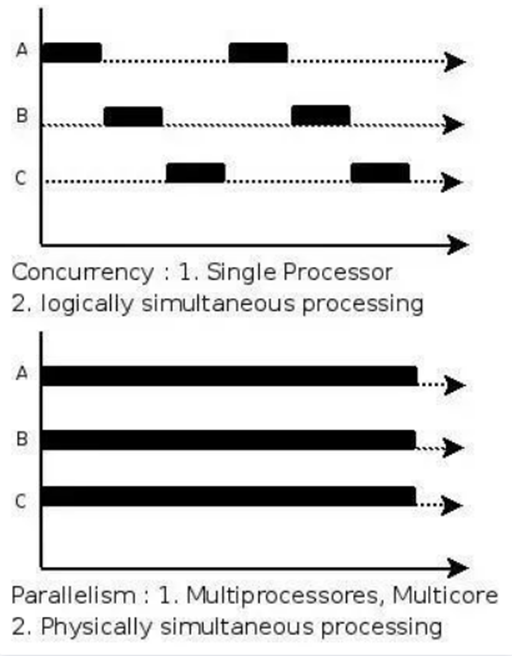

## 从tbb开始的并行编程(CPU)
1. 并发(concurrent)与并行(parallel)的区别：看起来是真的 与 真的 


```shell
vcpkg install tbb:x64-windows
sudo apt-get install libtbb-dev # for ubuntu
sudo pacman -S tbb # arch linux


```

## 基于tbb的任务组的多线程
1. 一个任务不一定对应一个线程，如果任务数量超过CPU最大的线程数，会由 TBB 在用户层负责调度任务运行在多个预先分配好的线程，而不是由操作系统负责调度线程运行在多个物理核心

### example 1
```cpp
// two function that will be run in two different threads.
void download(std::string_view str) {
	std::cout << "downlading starts ..." << std::endl;
	for (int i{ 1 }; i <= 10; ++i) {
		std::this_thread::sleep_for(std::chrono::milliseconds{ 100 });
		std::cout << std::format("    downloading {}%.\n", i*10);
	}
	std::cout << "downlading completes ..." << std::endl;
}

void interact() {
	std::string str;
	std::cin >> str;
	std::cout << str << std::endl;
}

// task group
tbb::task_group tg{}; // or task_group tg; RAII??? 
// accept function objects, lambda expressions and the like
tg.run([&] {
    download("hello.zip");
    });
tg.run([&] {
    interact();
    });

tg.wait(); // execute tasks in threads.

// another way: using parallel_invoke. don't need task_group
// auto `wait`
tbb::parallel_invoke([&] {download("hello.zip"); },
    [&] {interact(); });

```

### example 2: find elements.
```cpp
std::string str{ "Hello world!" };
char ch{ 'd' };
auto func1{ [&] {
    for (size_t i{0}; i < str.size() / 2; ++i) {
        if (str[i] == ch) {
            std::cout << "find it.\n";
        }
    }
    
    } };
auto func2{ [&] {
for (size_t i{str.size() / 2}; i < str.size(); ++i) {
    if (str[i] == ch) {
        std::cout << "find it.\n";
    }
}

} };

tbb::parallel_invoke(std::ref(func1), std::ref(func2));
```


## 并行循环

### example 1: parallel map
```cpp
// launch 8 threads
size_t n{ 1 << 26 }, maxt{ 8 };
std::vector<float> vec(n);
tbb::task_group tg;
for (size_t i{ 0 }; i < maxt; ++i) {
    auto beg{ i * n / maxt };
    auto end{ std::min(n, (i + 1) * n / maxt) };
    tg.run([&, beg, end]() {
        for (size_t j{ beg }; j < end; ++j) {
            vec[j] = std::sinf(j);
        }
    });

}

tg.wait();
for (size_t i{ 0 }; i < 20; ++i) {
    std::cout << std::format("sin{} = {}\n", i, vec[i]);
}
std::cout << std::endl;

// using parallel for 
// anonymous blocked_range, we should put it in the parameter list.
// captured objects have their own names.
// usually named objects -- capture
// otherwise (some `filter`, `transform` function) as predicate-- parameters
tbb::parallel_for(tbb::blocked_range<size_t>(0, n),
    [&](tbb::blocked_range<size_t> r) {
        for (size_t i{ r.begin() }; i < r.end(); ++i) {
            vec[i] = std::sinf(i);
    }
});

// or 
tbb::parallel_for((size_t)0, n, [&](size_t i) {vec[i]=std::sinf(i)});

// or based on iterator
tbb::parallel_for_each(vec.begin(), vec.end(), [&](float& f){
    f=42.0f;
});

// 2d
size_t n{ 1 << 13 }, maxt{ 8 };
std::vector<float> vec(n*n);
tbb::parallel_for(tbb::blocked_range2d<size_t>(0, n, 0, n),
    [&](tbb::blocked_range2d<size_t> r) {
        for (size_t i{ r.rows().begin() }; i < r.rows().end(); ++i) {
            for (size_t j{ r.cols().begin() }; j < r.cols().end(); ++j) {
                vec[i*n + j] = std::sinf(i) * std::sinf(j);
            }
    }
});


// 3d pages, rows, cols
```

## reduce and scan

