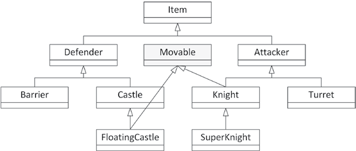

### goals
1. An overview of C++ language features that are common, but for which you might have forgotten the syntax
2. What RAII is and why it is a powerful concept
3. What the double dispatch technique is and how to use it
4. How to use mixin classes
5. What frameworks are
6. The model-view-controller paradigm

### concepts
1. A `design technique` is a standard approach for solving a particular problem in C++. Often, a design technique aims to overcome an annoying feature or language deficiency. Other times, a design technique is a piece of code that you use in many different programs to solve a common C++ problem.

### reviews
```cpp
// 1. classes
export module simple;
export class Simple {
public:
    Simple() {}
    virtual ~Simple() = default;

    Simple(const Simple&) = delete;
    Simple& operator=(const Simple&) = delete;

    Simple(Simple&&) noexcept = default;
    Simple& operator=(Simple&&) noexcept = default; // move all datas
    
    virtual void publicMethod() {}
    int m_publicInteger;
protected:
    virtual void protectedMethod(); // Protected method
    int m_protectedInteger { 41 }; // Protected data member
private:
    virtual void privateMethod(); // Private method
    int m_privateInteger { 42 }; // Private data member
    static const int Constant { 2 }; // Private constant
    static inline int ms_staticInt { 3 }; // Private static data member
};

// 2. derive from a class
export module derived_simple;
export import simple;

export class DerivedSimple : public simple {
public:
    DerivedSimple() : Simple{} // Constructor
    { /* Implementation of constructor */ }
    /* virtual */ void publicMethod() override // Overridden method
    {
    // Implementation of overridden method
    Simple::publicMethod(); // You can access base class implementations.
    }
    virtual void anotherMethod() // New method
    { /* Implementation of new method */ }
};

// 3. lambda expression
vector values { 1, 2, 3, 4, 5, 6, 7, 8, 9 };
int callCount { 0 };
auto count { count_if(begin(values), end(values),
    [&callCount](int value) {
    ++callCount;
    return value % 2 == 0;
    })
};
cout << format("There are {} even elements in the vector.", count) << endl;
cout << format("Lambda was called {} times.", callCount) << endl;


// 4. copy and swap idiom
// implement a possibly throwing operation on an object with a strong exception-safety guarantee, that is, all-or-nothing. 
export module copy_and_swap;
export class CopyAndSwap
{
public:
    CopyAndSwap() = default;
    virtual ~CopyAndSwap(); // Virtual destructor
    CopyAndSwap(const CopyAndSwap& src); // Copy constructor
    CopyAndSwap& operator=(const CopyAndSwap& rhs); // Copy assignment operator
    void swap(CopyAndSwap& other) noexcept; // noexcept swap() method
private:
// Private data members...
};
// Standalone noexcept swap() function
export void swap(CopyAndSwap& first, CopyAndSwap& second) noexcept;
CopyAndSwap::~CopyAndSwap() { /* Implementation of destructor. */ }
CopyAndSwap::CopyAndSwap(const CopyAndSwap& src)
{
// This copy constructor can first delegate to a non-copy constructor
// if any resource allocations have to be done. 
// Make a copy of all data members...
}

// not blong to std::swap
void swap(CopyAndSwap& first, CopyAndSwap& second) noexcept
{
    first.swap(second);
}
void CopyAndSwap::swap(CopyAndSwap& other) noexcept
{
    using std::swap; // Requires <utility>. swap int, vector ... so we need std::swap to swap `resources`
    // Swap each data member, for example:
    // swap(m_data, other.m_data);
}
CopyAndSwap& CopyAndSwap::operator=(const CopyAndSwap& rhs)
{
    // Copy-and-swap idiom.
    auto temp { rhs }; // Do all the work in a temporary instance.
    swap(temp); // Commit the work with only non-throwing operations.
    return *this;
}


// 5. throw and catch exceptions
import <stdexcept>;
import <iostream>;
using namespace std;
void throwIf(bool throwIt)
{
    if (throwIt) {
        throw runtime_error { "Here's my exception" };
    }
}
int main()
{
    try {
        throwIf(false); // Doesn't throw.
        throwIf(true); // Throws.
    } catch (const runtime_error& e) {
        cerr << "Caught exception: " << e.what() << endl;
        return 1;
    }
}

// 6. write to a file
import <iostream>;
import <fstream>;
using namespace std;
int main()
{
    ofstream outputFile { "FileWrite.out", ios::trunc };
    if (outputFile.fail()) {
        cerr << "Unable to open file for writing." << endl;
        return 1;
    }
    outputFile << "Hello!" << endl;
    outputFile.close();
    ofstream appendFile { "FileWrite.out", ios_base::app };
    if (appendFile.fail()) {
        cerr << "Unable to open file for appending." << endl;
        return 2;
    }
    appendFile << "World!" << endl;
}

// 7. read from a file
using namespace std;
int main()
{
    ifstream inputFile { "FileWrite.out" };
    if (inputFile.fail()) {
        cerr << "Unable to open file for reading." << endl;
    return 1;
    }
    string nextToken;
    while (inputFile >> nextToken) {
        cout << "Token: " << nextToken << endl;
    }
}

// 8. using constrain template parameters
import <concepts>;
export template <typename T> requires std::floating_point<T> || std::integral<T>
class SimpleWrapper
{
public:
    SimpleWrapper(T& object) : m_object { object } { }
    T& get() { return m_object; }
private:
    T& m_object;
};

```

### there must be a better way

#### Resource Acquisition Is Initialization
1.  the constructor of a new RAII instance acquires ownership of a certain resource and initializes the instance with that resource, which is why it’s called resource acquisition is initialization. The destructor automatically frees the acquired resource when the RAII instance is destroyed.


```cpp
#include <cstdio>
class File final
{
public:
    explicit File(std::FILE* file) : m_file { file } { }
    ~File() { reset(); }
    // Prevent copy construction and copy assignment.
    File(const File& src) = delete;
    File& operator=(const File& rhs) = delete;
    // Allow move construction and move assignment.
    File(File&& src) noexcept = default;
    File& operator=(File&& rhs) noexcept = default;
    // get(), release(), and reset()
    std::FILE* get() const noexcept { return m_file; }
    [[nodiscard]] std::FILE* release() noexcept
    {
        std::FILE* file { m_file };
        m_file = nullptr;
        return file;
    }
    void reset(std::FILE* file = nullptr) noexcept
    {
        if (m_file) { fclose(m_file); }
        m_file = file;
    }
private:
    std::FILE* m_file { nullptr };
};
```

2. a pitfall of using RAII
3. Make sure you always name your RAII instances! Additionally, it’s recommended not to include a default constructor in an RAII class. That avoids some of the issues discussed here
```cpp
class Foo
{
public:
    void setData()
    {
        unique_lock<mutex> lock(m_mutex); // OK!
        unique_lock<mutex> (m_mutex); // local variable m_mutex hide the class member `m_mutex`
        unique_lock<mutex> {m_mutex}; // create a no named temporary variable, lock the m_mutex and unlock it at the end of the statement.
        unique_lock<mutex> (m); // create a local variable and initialize it with default constructor.
        unique_lock<mutex> { m }; // compiler issues an error.


    }
private:
    mutex m_mutex;
};

```

### double dispatch
1. Double dispatch is a technique that adds an extra dimension to the concept of polymorphism, which provides a way to make functions virtual for more than one object. polymorphism lets the program determine behavior based on types at run time. 
2. Sometimes, however, you need a method to behave according to the run-time type of two objects, instead of just one. 
3. Some object-oriented languages provide the ability to choose a method at run time based on the run-time types of two or more objects. They call this feature `multimethods`.
4. Double dispatch is really a special case of multiple dispatch, in which a behavior is chosen depending on the run-time types of two or more objects. In practice, double dispatch, which chooses a behavior based on the run-time types of exactly two objects, is usually sufficient.

```cpp
// 1. brute force
class Animal {
public:
    virtual bool eats(const Animal& prey) const = 0;
};

bool Bear::eats(const Animal& prey) const
{
    if (typeid(prey) == typeid(Bear)) {
        return false;
    } else if (typeid(prey) == typeid(Fish)) {
        return true;
    } else if (typeid(prey) == typeid(TRex)) {
        return false;
    }
    return false;
}

bool Fish::eats(const Animal& prey) const
{
    if (typeid(prey) == typeid(Bear)) {
        return false;
    } else if (typeid(prey) == typeid(Fish)) {
        return true;
    } else if (typeid(prey) == typeid(TRex)) {
        return false;
    }
    return false;
}

bool TRex::eats(const Animal& prey) const
{
    return true;
}

// 2. simple polymorphism with overloading
class Animal
{
public:
    virtual bool eats(const Bear&) const = 0;
    virtual bool eats(const Fish&) const = 0;
    virtual bool eats(const TRex&) const = 0;
};

class Bear : public Animal
{
public:
    bool eats(const Bear&) const override { return false; }
    bool eats(const Fish&) const override { return true; }
    bool eats(const TRex&) const override { return false; }
};

Bear myBear;
Fish myFish;
Animal& animalRef { myBear };
cout << animalRef.eats(myFish) << endl; // OK!
Animal& animalRef2 { myFish };
cout << myBear.eats(animalRef2) << endl; // BUG! No method Bear::eats(Animal&)

// 3. double dispatch
// Forward declarations.
class Fish;
class Bear;
class TRex;
class Animal
{
public:
    virtual bool eats(const Animal& prey) const = 0;
    // cannot eatenBy(const Animal&); the reason is above.
    virtual bool eatenBy(const Bear&) const = 0;
    virtual bool eatenBy(const Fish&) const = 0;
    virtual bool eatenBy(const TRex&) const = 0;
};

class Bear : public Animal
{
public:
    bool eats(const Animal& prey) const override{ return prey.eatenBy(*this); }
    bool eatenBy(const Bear&) const override { return false; }
    bool eatenBy(const Fish&) const override { return false; }
    bool eatenBy(const TRex&) const override { return true; }
};
class Fish : public Animal
{
public:
    bool eats(const Animal& prey) const override{ return prey.eatenBy(*this); }
    bool eatenBy(const Bear&) const override { return true; }
    bool eatenBy(const Fish&) const override { return true; }
    bool eatenBy(const TRex&) const override { return true; }
};

class TRex : public Animal
{
    public:
    bool eats(const Animal& prey) const override{ return prey.eatenBy(*this); }
    bool eatenBy(const Bear&) const override { return false; }
    bool eatenBy(const Fish&) const override { return false; }
    bool eatenBy(const TRex&) const override { return true; }
};
```


### mixin classes
1. Mixin classes are a way that you can add functionality to a class without committing to a full is-a relationship. (--able)
2. implementation: using multiple inheritance; using class templates.
3. Mixin classes contain actual code that can be reused by other classes. 

#### using inheritance

Movable is a mixin class


```cpp
class Movable {
public:
    virtual void move() {}
};

// `mixes in` the functionality provided by the `Movable` mixin class into the FloatingCastle class
class FloatingCastle:public Castle, public Movable {}
```

#### using class templates
1. curiously recurring template pattern (CRTP).
2. The mixin class itself is a `class template` accepting a template type parameter and derives `itself` from that type, which is why it’s said to be recurring.

```cpp
template <typename T>
class SelfDrivable : public T { /* ... */ };

SelfDrivable<Car> selfDrivingCar;
SelfDrivable<Truck> selfDrivingTruck;
```

### using framework
1. When you start working with a new framework, your first task is to find out what makes it tick. To what design principles does it subscribe? What mental model are its developers trying to convey? What aspects of the language does it use extensively? 

### the model-view-controller paradigm
1. also known as `MVC`. This paradigm models the notion that many applications commonly deal with a set of data, one or more views on that data, and manipulation of the data.
2. In `MVC`, a set of data is called the `model`.the model often takes the form of a class with many getters and setters.
3. A `view` is a particular visualization of the model.there could be two views on a `RaceCar`. The first view could be a graphical view of the car, and the second could be a graph that shows the level of damage over time. The important point is that both views are operating on the same data—they are different ways of looking at the same information
4. The `controller` is the piece of code that changes the model in response to some event. 
5. The `MVC` pattern has evolved into several different variants, such as `model-view-presenter (MVP)`, `model-view-adapter (MVA)`, `model-view-viewmodel (MVVM)`


```cpp
// model
class RaceCar
{
public:
    RaceCar();
    virtual ~RaceCar() = default;
    virtual double getSpeed() const;
    virtual void setSpeed(double speed);
    virtual double getDamageLevel() const;
    virtual void setDamageLevel(double damage);
private:
    double m_speed { 0.0 };
    double m_damageLevel { 0.0 };
};
```


