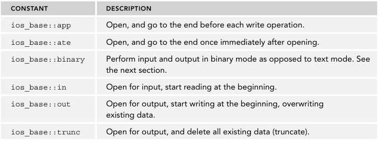
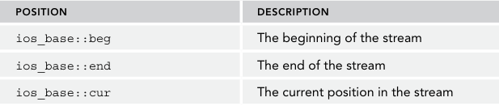

### basic stream
1. `cin`: input stream
2. `cout`: buffered output stream
3. `cerr`: unbuffered output stream
4. `clog`: a buffered version of cerr

`flush()` send all data from buffered stream to destination
streams include data and `current position`

### stream sources and destination
console, file, string

### output with streams
1. `endl` flushes the destination buffer, so use it judiciously in performance critical code, such as tight loops.
2. `put()` 接受单字符
3. `write()` 接受字符数组
4. when output buffered data? `endl`; stream goes out scope or is destructed; buffer is full; `flush`

```cpp
const char* test{"hello there"};
cout.write(test, strlen(test));

cout.put('a');
```
#### handling output errors
1. `bad`: fatal error
2. `fail`: recent ops have failed. do not do anything about next ops.  `!cout` 等同于 `!cout.fail()`
3. `eof`
4. `good`: `!fail() && !eof()`
5. catch error: `ios_base::failure`
6. `clear`: reset error state


```cpp
if (cout.good()) {
    cout.put('o');
}

cout.flush();
if (!cout) {
    cerr << "Unable to flush to standard out" << endl;
}

// error test
cout.exceptions(ios::failbit | ios::badbit | ios::eofbit);
try {
    cout << "Hello world!" << endl;
} catch (const ios_base::failure& ex) {
    cerr << "Caught exception: " << ex.what() << "error code = " << ex.code() << endl;
}

```
#### output manipulators
defined in <ios> and <iomanip>
1. `boolalpha`, `noboolalpha`  true, false
2. `hex, oct, dec`
3. `setprecision`  takes an argument
4. `setw`: field width
5. `showpoint` `noshowpoint`: decimal point for floating point
6. `setfill` takes an argument

```cpp
// Boolean values
bool myBool { true };
cout << "This is the default: " << myBool << endl;
cout << "This should be true: " << boolalpha << myBool << endl;
cout << "This should be 1: " << noboolalpha << myBool << endl;
// Simulate printf-style "%6d" with streams
int i { 123 };
printf("This should be ' 123': %6d\n", i);
cout << "This should be ' 123': " << setw(6) << i << endl;
// Simulate printf-style "%06d" with streams
printf("This should be '000123': %06d\n", i);
cout << "This should be '000123': " << setfill('0') << setw(6) << i << endl;
// Fill with *
cout << "This should be '***123': " << setfill('*') << setw(6) << i << endl;
// Reset fill character
cout << setfill(' ');
// Floating-point values
double dbl { 1.452 };
double dbl2 { 5 };
cout << "This should be ' 5': " << setw(2) << noshowpoint << dbl2 << endl;
cout << "This should be @@1.452: " << setw(7) << setfill('@') << dbl << endl;
// Reset fill character
cout << setfill(' ');
```

### input with stream
1. the `>>` operator tokenizes values according to whitespace
2. handing error
3. input `eof`: windows -- `ctrl+Z + enter`. linux--`ctrl+D + enter`

```cpp
cout << "Enter numbers on separate lines to add.\n"
<< "Use Control+D followed by Enter to finish (Control+Z in Windows).\n";
int sum { 0 };
if (!cin.good()) {
    cerr << "Standard input is in a bad state!" << endl;
    return 1;
}
while (!cin.bad()) {
    int number;
    cin >> number;
    if (cin.good()) {
        sum += number;
    } else if (cin.eof()) {
        break; // Reached end of file
    } else if (cin.fail()) {
        // Failure!
        cin.clear(); // Clear the failure state.
        string badToken;
        cin >> badToken; // Consume the bad input.
        cerr << "WARNING: Bad input encountered: " << badToken << endl;
    }
}
cout << "The sum is " << sum << endl;
```

#### input method
1. `get()`: return the next character in the stream including `std::char_traits<char>::eof`
2. `get(char)`
3. `unget()`: back up by one position.
4. `putback(char)`: one char being put back on the stream
5. `peek()`: look ahead before read a value. 相当于只看但不读取
6. `stream.getline(buffer, size, end)`: obtain a single line of data. `end-of-line` does not in buffer. a three parameter signals the end of "line"(actually maybe multi-line, the end-of-line is not `\n\r` in this case).
7. `getline(stream, std::string)`


```cpp
string readName(istream& stream)
{
    string name;
        while (stream) { // Or: while (!stream.fail()) {
        int next { stream.get() };
        if (!stream || next == std::char_traits<char>::eof())
            break;
        name += static_cast<char>(next);// Append character.
    }
    return name;
}

string readName2(istream& stream)
{
    string name;
    char next;
        while (stream.get(next)) {
            name += next;
        }
    return name;
}
```

### string stream
`<sstream>`

1. `str()`: ostringstream.str() -> std::string

### file systems
`std::ofstream`, `ifstream`


1. default mode: `text`

```cpp
int main(int argc, char* argv[])
{
    ofstream outFile { "test.txt", ios_base::trunc };
    if (!outFile.good()) {
        cerr << "Error while opening output file!" << endl;
        return -1;
    }
    outFile << "There were " << argc << " arguments to this program." << endl;
    outFile << "They are: " << endl;
    for (int i { 0 }; i < argc; i++) {
        outFile << argv[i] << endl;
    }
}
```

### jumping around with seek and tell
获取希望读取、写入字符的位置

1. `seekg`: get for input stream
2. `seekp`: put for output stream
3. `tellg`: return `std::streampos`

```cpp
ofstream fout { "test.out" };
if (!fout) {
    cerr << "Error opening test.out for writing" << endl;
    return 1;
}
// 1. Output the string "54321".
fout << "54321";

// 2. Verify that the marker is at position 5.
streampos curPos { fout.tellp() };
if (curPos == 5) {
    cout << "Test passed: Currently at position 5" << endl;
} else {
    cout << "Test failed: Not at position 5" << endl;
}

// 3. Move to position 2 in the output stream.
fout.seekp(2, ios_base::beg);

// 4. Output a 0 in position 2 and close the output stream. change value not insert value
fout << 0;
fout.close();

// 5. Open an input stream on test.out.
ifstream fin { "test.out" };
if (!fin) {
    cerr << "Error opening test.out for reading" << endl;
    return 1;
}

// 6. Read the first token as an integer.
int testVal;
fin >> testVal;
if (!fin) {
    cerr << "Error reading from file" << endl;
return 1;
}

// 7. Confirm that the value is 54021.
const int expected { 54021 };
if (testVal == expected) {
    cout << format("Test passed: Value is {}", expected) << endl;
} else {
    cout << format("Test failed: Value is not {} (it was {})", expected, testVal) << endl;
}

```

### linking stream together
function: `flush-on-access` -- when data is requested from an input stream, its linked output stream is automat-ically flushed.

```cpp
ifstream infile("input.txt");
ofstream outfile("output.txt");

infile.tie(&outfile);
outfile << "hello world!";

string nexttoken;
infile >> nexttoken;
```

### BIDIRECTIONAL I/O
support both input and output

### filesystem support library
defined in `<filesystem>`. namespace `std::filesystem`
function: query path, interating over a directory.so on

```cpp
// path
path p1 {R"(D:\Foo\Bar)"};
path p2 {"D:/Foo/Bar"};

cout << p1 << endl;

path p {R"(D:\Foo)"};
p.append("Bar");
p /= "Bar";
cout << endl;

for (const auto& comp: p) {
    // different compent   D \\ Foo Bar
    cout << comp << endl;
}

// stem(), extension(), root_name(), filename()

// directory entry
path myPath { "c:/windows/win.ini" };
directory_entry dirEntry { myPath };
if (dirEntry.exists() && dirEntry.is_regular_file()) {
    cout << "File size: " << dirEntry.file_size() << endl;
}

// helper function: copy(), create_directory(), exists, remove() ...
space_info s { space("c:\\") };
cout << "Capacity: " << s.capacity << endl;
cout << "Free: " << s.free << endl;

// directory iteration
void printDirectoryStructure(const path& p)
{
    if (!exists(p)) {
        return;
    }
    recursive_directory_iterator begin { p };
    recursive_directory_iterator end { };
    for (auto iter { begin }; iter != end; ++iter) {
        const string spacer(iter.depth() * 2, ' ');
        auto& entry { *iter }; // Dereference iter to access directory_entry.
        if (is_regular_file(entry)) {
            cout << format("{}File: {} ({} bytes)",
            spacer, entry.path().string(), file_size(entry)) << endl;
        } else if (is_directory(entry)) {
            cout << format("{}Dir: {}", spacer, entry.path().string()) << endl;
        }
    }
}
```