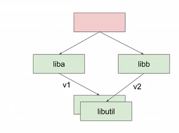
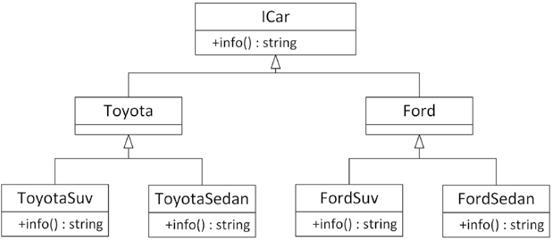
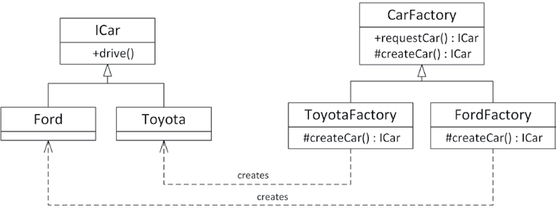

### goals
1. What a pattern is and what the difference is with a design technique
2. How to use the following patterns:
   1. Dependency injection (组件模式 component pattern)
   2. Abstract factory
   3. Factory method
   4. Adapter
   5. Proxy
   6. Iterator
   7. Observer
   8.  Decorator
   9.  Chain of responsibility
   10. Singleton
3. A design pattern is a standard approach to program organization that solves a general problem.
4. live at head: update to the latest commit from the master branch as often as possible
5. `Version skew` happens when two or more distributed systems with a dependency between them get deployed–and because their mutual deployment isn’t atomic, they temporarily operate at different versions. A more concrete example is: System A calls System B. A change is made to both systems. Both systems get deployed.



### dependency injection
1. Dependency injection is one way to support the dependency inversion principle (DIP). With dependency injection, interfaces are used to invert dependency relationships.
2.  If a component needs a set of services, interfaces to those services are injected into the component. Dependency injection makes unit testing easier, as you can easily mock services away


#### A logging mechanism
1. functionality:
    1. log single strings
    2. log message has an associated log level
    3. logger can be set up to only log messages of a certain log level
    4. logged message is flushed to disk

```cpp
export class ILogger
{
public:
    virtual ~ILogger() = default; // Virtual destructor.
    // Enumeration for the different log levels.
    enum class LogLevel {
        Error,
        Info,
        Debug
    };
    // Sets the log level.
    virtual void setLogLevel(LogLevel level) = 0;
    // Logs a single message at the given log level.
    virtual void log(std::string_view message, LogLevel logLevel) = 0;
};

export class Logger : public ILogger
{
public:
    explicit Logger(std::string_view logFilename);
    virtual ~Logger();
    void setLogLevel(LogLevel level) override;
    void log(std::string_view message, LogLevel logLevel) override;
private:
    // Converts a log level to a human readable string.
    std::string_view getLogLevelString(LogLevel level) const;
    std::ofstream m_outputStream;
    LogLevel m_logLevel { LogLevel::Error };
};

Logger::Logger(string_view logFilename)
{
    m_outputStream.open(logFilename.data(), ios_base::app);
    if (!m_outputStream.good()) {
        throw runtime_error { "Unable to initialize the Logger!" };
    }
}
Logger::~Logger()
{
    m_outputStream << "Logger shutting down." << endl;
    m_outputStream.close();
}


void Logger::setLogLevel(LogLevel level)
{
    m_logLevel = level;
}

string_view Logger::getLogLevelString(LogLevel level) const
{
    switch (level) {
        case LogLevel::Error: return "ERROR";
        case LogLevel::Info: return "INFO";
        case LogLevel::Debug: return "DEBUG";
    }
    throw runtime_error { "Invalid log level." };
}

void Logger::log(string_view message, LogLevel logLevel)
{
    if (m_logLevel < logLevel) { return; }
    m_outputStream << format("{}: {}", getLogLevelString(logLevel), message)
    << endl;
}

// using dependency injection
class Foo
{
public:
    explicit Foo(ILogger& logger) : m_logger { logger } { }
    void doSomething()
    {
        m_logger.log("Hello dependency injection!", ILogger::LogLevel::Info);
    }
private:
    ILogger& m_logger;
};

Logger concreteLogger { "log.out" };
concreteLogger.setLogLevel(ILogger::LogLevel::Debug);
Foo f { concreteLogger };
f.doSomething();
```

### abstract factory pattern
1. When you use factories in your program, portions of code that want to create a particular object ask the factory for an instance of the object instead of calling the object constructor themselves. 
2. a benefit of using factories is that they can be used alongside class hierarchies to construct objects without knowing their exact type. 
3. Another reason to use a factory is when the creation of your objects requires certain information, states, resources, and so on, owned by the factory, and which clients of the factory should not know about. 

#### a car factory simulation
The approach used in this example is called an `abstract factory` because the type of object created depends on which concrete factory is being used.




```cpp
export class ICar
{
public:
    virtual ~ICar() = default; // Always a virtual destructor!
    virtual std::string info() const = 0;
};
export class Ford : public ICar { };
export class FordSedan : public Ford
{
public:
    std::string info() const override { return "Ford Sedan"; }
};
export class FordSuv : public Ford
{
public:
    std::string info() const override { return "Ford Suv"; }
};

export class Toyota : public ICar { };
export class ToyotaSedan : public Toyota
{
public:
    std::string info() const override { return "Toyota Sedan"; }
};
export class ToyotaSuv : public Toyota
{
public:
    std::string info() const override { return "Toyota Suv"; }
};


export class IAbstractCarFactory
{
public:
    virtual ~IAbstractCarFactory() = default; // Always a virtual destructor!
    virtual std::unique_ptr<ICar> makeSuv() = 0;
    virtual std::unique_ptr<ICar> makeSedan() = 0;
};
export class FordFactory : public IAbstractCarFactory
{
public:
    std::unique_ptr<ICar> makeSuv() override {
        return std::make_unique<FordSuv>(); 
    }
    std::unique_ptr<ICar> makeSedan() override {
        return std::make_unique<FordSedan>(); 
    }
};

void createSomeCars(IAbstractCarFactory& carFactory)
{
    auto sedan { carFactory.makeSedan() };
    auto suv { carFactory.makeSuv() };
    cout << format("Sedan: {}\n", sedan->info());
    cout << format("Suv: {}\n", suv->info());
}

int main()
{
    FordFactory fordFactory;
    ToyotaFactory toyotaFactory;
    createSomeCars(fordFactory);
    createSomeCars(toyotaFactory);
}
```

### factory method pattern
1. With the `factory method pattern`, you just ask for a car from the factory, and the concrete factories decide what exactly to build.



```cpp
export class ICar
{
public:
    virtual ~ICar() = default; // Always a virtual destructor!
    virtual std::string info() const = 0;
};
export class Ford : public ICar
{
public:
    std::string info() const override { return "Ford"; }
};
export class Toyota : public ICar
{
public:
    std::string info() const override { return "Toyota"; }
};

export class CarFactory
{
public:
    virtual ~CarFactory() = default; // Always a virtual destructor!
    std::unique_ptr<ICar> requestCar()
    {
    // Increment the number of cars produced and return the new car.
        ++m_numberOfCarsProduced;
        return createCar();
    }
    size_t getNumberOfCarsProduced() const { 
        return m_numberOfCarsProduced; 
    }

protected:
    virtual std::unique_ptr<ICar> createCar() = 0;

private:
    size_t m_numberOfCarsProduced { 0 };
};

export class FordFactory : public CarFactory
{
protected:
    std::unique_ptr<ICar> createCar() override {
        return std::make_unique<Ford>(); 
    }
};
export class ToyotaFactory : public CarFactory
{
protected:
    std::unique_ptr<ICar> createCar() override {
        return std::make_unique<Toyota>(); 
    }
};

class LeastBusyFactory : public CarFactory
{
public:
// Constructs a LeastBusyFactory instance, taking ownership of  the given factories.
    explicit LeastBusyFactory(vector<unique_ptr<CarFactory>>&& factories);
protected:
    unique_ptr<ICar> createCar() override;
private:
    vector<unique_ptr<CarFactory>> m_factories;
};

LeastBusyFactory::LeastBusyFactory(vector<unique_ptr<CarFactory>>&& factories)
: m_factories { move(factories) }
{
    if (m_factories.empty()) {
        throw runtime_error { "No factories provided." };
    }
}
unique_ptr<ICar> LeastBusyFactory::createCar()
{
CarFactory* bestSoFar { m_factories[0].get() };
for (auto& factory : m_factories) {
    if (factory->getNumberOfCarsProduced() < bestSoFar->getNumberOfCarsProduced()) {
        bestSoFar = factory.get();
    }
}
    return bestSoFar->requestCar();
}

// test
vector<unique_ptr<CarFactory>> factories;
// Create 3 Ford factories and 1 Toyota factory.
factories.push_back(make_unique<FordFactory>());
factories.push_back(make_unique<FordFactory>());
factories.push_back(make_unique<FordFactory>());
factories.push_back(make_unique<ToyotaFactory>());
// To get more interesting results, preorder some cars.
factories[0]->requestCar();
factories[0]->requestCar();
factories[1]->requestCar();
factories[3]->requestCar();
// Create a factory that automatically selects the least busy
// factory from a list of given factories.
LeastBusyFactory leastBusyFactory { move(factories) };
// Build 10 cars from the least busy factory.
for (size_t i { 0 }; i < 10; i++) {
    auto theCar { leastBusyFactory.requestCar() };
    cout << theCar->info() << endl;
}
```

### the adapter pattern
1. the abstraction given by a class doesn’t suit the current design and can’t be changed. In this case, you can build an adapter or wrapper class. The adapter provides the abstraction that the rest of the code uses and serves as the bridge between the desired abstraction and the actual underlying code. 
2. Implementing a certain interface by reusing some existing implementation. the adapter typically creates an instance of the implementation behind the scenes.
3. Allowing existing functionality to be used through a new interface. In this use case, the constructor of the adapter typically receives an instance of the underlying object in its constructor.
4. examples: `stack`, `priority_queue` adapter, they use `list`, `deque`, extend the functionality of origin classes.


```cpp
export class Logger
{
public:
    enum class LogLevel {
        Error,
        Info,
        Debug
    };
    Logger();
    virtual ~Logger() = default; // Always a virtual destructor!
    void log(LogLevel level, const std::string& message);
private:
    // Converts a log level to a human readable string.
    std::string_view getLogLevelString(LogLevel level) const;
};

Logger::Logger()
{
    cout << "Logger constructor" << endl;
}
void Logger::log(LogLevel level, const string& message)
{
    cout << format("{}: {}", getLogLevelString(level), message) << endl;
}
string_view Logger::getLogLevelString(LogLevel level) const
{
    // omitted.
}

//One reason why you might want to write a wrapper class around this basic Logger class is to change its interface. Maybe you are not interested in the log level and you would like to call the log() method with only one argument, the actual message. You might also want to change the interface to accept an std::string_view instead of a string as the argument for the log() method. 


export class INewLoggerInterface
{
public:
    virtual ~INewLoggerInterface() = default; // Always virtual destructor!
    virtual void log(std::string_view message) = 0;
}

export class NewLoggerAdapter : public INewLoggerInterface
{
public:
    NewLoggerAdapter();
    void log(std::string_view message) override;
private:
    Logger m_logger;
};

NewLoggerAdapter::NewLoggerAdapter()
{
    cout << "NewLoggerAdapter constructor" << endl;
}
void NewLoggerAdapter::log(string_view message)
{
    m_logger.log(Logger::LogLevel::Info, message.data());
}
```

### proxy pattern
1. proxy pattern is one of several patterns that divorce the abstraction of a class from its underlying representation. A proxy object serves as a stand-in for a real object. Such objects are generally used when using the real object would be time-consuming or impossible. 
2. loading image proxies rather than real images with respect to a document editor.

```cpp
class IPlayer
{
public:
    virtual ~IPlayer() = default; // Always virtual destructor.
    virtual string getName() const = 0;
    // Sends an instant message to the player over the network and returns the reply as a string.
    virtual string sendInstantMessage(string_view message) const = 0;
};
class Player : public IPlayer
{
public:
    string getName() const override;
    // Network connectivity is required.
    // Throws an exception if network connection is down.
    string sendInstantMessage(string_view message) const override;
};

class PlayerProxy : public IPlayer
{
public:
    // Create a PlayerProxy, taking ownership of the given player.
    PlayerProxy(unique_ptr<IPlayer> player);
    string getName() const override;
    // Network connectivity is optional.
    string sendInstantMessage(string_view message) const override;
private:
    unique_ptr<IPlayer> m_player;
};

PlayerProxy::PlayerProxy(unique_ptr<IPlayer> player)
: m_player { move(player) }
{
}
string PlayerProxy::getName() const { return m_player->getName(); }

string PlayerProxy::sendInstantMessage(string_view message) const
{
    if (hasNetworkConnectivity()) 
    { 
        return m_player->sendInstantMessage(message); 
    }
    else 
    { 
        return "The player has gone offline."; 
    }
}
```

### the iterator pattern
1. The iterator pattern provides a mechanism for separating algorithms or operations from the structure of the data on which they operate.
2.  an iterator allows algorithms to navigate a data structure without having to know the actual structure of the data.
3. `iterate` means `repeat`


### the observer pattern
1. The observer pattern is used to have observers be notified by observable objects (= subjects). When the observable object’s state changes, it notifies all registered observers of this change. The main benefit of using the observer pattern is that it decreases coupling.

```cpp
using EventHandle = size_t;

template <typename... Args>
class Event
{
public:
    virtual ~Event() = default; // Always a virtual destructor!
    // Adds an observer. Returns an EventHandle to unregister the observer.
    [[nodiscard]] EventHandle operator+=(function<void(Args...)> observer)
    {
        auto number { ++m_counter };
        m_observers[number] = observer;
        return number;
    }
    // Unregisters the observer pointed to by the given handle.
    Event& operator-=(EventHandle handle)
    {
        m_observers.erase(handle);
        return *this;
    }
    // Raise event: notifies all registered observers.
    void raise(Args... args)
    {
        for (auto& observer : m_observers) { (observer.second)(args...); }
    }
private:
    size_t m_counter { 0 };
    map<EventHandle, function<void(Args...)>> m_observers;
};

class ObservableSubject
{
public:
    auto& getEventDataModified() { return m_eventDataModified; }
    auto& getEventDataDeleted() { return m_eventDataDeleted; }
    void modifyData()
    {
        // ...
        getEventDataModified().raise(1, 2.3);
    }
    void deleteData()
    {
        // ...
        getEventDataDeleted().raise();
    }
private:
    Event<int, double> m_eventDataModified;
    Event<> m_eventDataDeleted;
};

// using an observer
void modified(int, double) { cout << "modified" << endl; }

class Observer
{
public:
    Observer(ObservableSubject& subject) : m_subject { subject }
    {
        m_subjectModifiedHandle = m_subject.getEventDataModified() +=
            [this](int i, double d) { onSubjectModified(i, d); };
    }
    virtual ~Observer()
    {
        m_subject.getEventDataModified() -= m_subjectModifiedHandle;
    }
private:
    void onSubjectModified(int, double)
    {
        cout << "Observer::onSubjectModified()" << endl;
    }
    ObservableSubject& m_subject;
    EventHandle m_subjectModifiedHandle;
}

ObservableSubject subject;
auto handleModified { subject.getEventDataModified() += modified };
auto handleDeleted {
    subject.getEventDataDeleted() += [] { cout << "deleted" << endl; } 
};
Observer observer { subject };
subject.modifyData();
subject.deleteData();
cout << endl;
subject.getEventDataModified() -= handleModified;
subject.modifyData();
subject.deleteData();

```

### the decorator pattern
1. The pattern is used to augment or change the behavior of an object at run time. Decorators are a lot like derived classes but are able to dynamically change the behavior. The trade-off is that decorators have fewer ways to change behavior compared to derived classes
2. `ImageStream` add the functionaility of image parsing to `stream`

```html

<I><B>text is wrapped (decorated) by mark `I` and `B`.</B></I>
```

```cpp
class IParagraph
{
public:
    virtual ~IParagraph() = default; // Always a virtual destructor!
    virtual std::string getHTML() const = 0;
};

class Paragraph : public IParagraph
{
public:
    Paragraph(std::string text) : m_text { std::move(text) } {}
    std::string getHTML() const override { 
    return "<P>" + m_text + "</P>"; 
    }
private:
    std::string m_text;
};

class BoldParagraph : public IParagraph
{
public:
    BoldParagraph(const IParagraph& paragraph) : m_wrapped { paragraph } {}
    std::string getHTML() const override {
        return "<B>" + m_wrapped.getHTML() + "</B>"; 
    }
private:
    const IParagraph& m_wrapped;
};

class ItalicParagraph : public IParagraph
{
public:
    ItalicParagraph(const IParagraph& paragraph) : m_wrapped { paragraph } {}
    std::string getHTML() const override {
        return "<I>" + m_wrapped.getHTML() + "</I>"; 
    }
private:
    const IParagraph& m_wrapped;
};

Paragraph p { "A party? For me? Thanks!" };
// Bold
std::cout << BoldParagraph{p}.getHTML() << std::endl;
// Bold and Italic
std::cout << ItalicParagraph{BoldParagraph{p}}.getHTML() << std::endl;
```

### the chain of responsibility pattern
1. `A chain of responsibility` is used when you want a number of objects to get a crack at performing a particular action. 
2. commonly used for event handling. when an event occurs, it is somehow propagated to different objects to take appropriate action.


```cpp
enum class Event {
    LeftMouseButtonDown,
    LeftMouseButtonUp,
    RightMouseButtonDown,
    RightMouseButtonUp
};

class Handler
{
public:
    virtual ~Handler() = default;
    explicit Handler(Handler* nextHandler) : m_nextHandler { nextHandler } { }

    virtual void handleMessage(Event message)
    {
        if (m_nextHandler) { 
            m_nextHandler->handleMessage(message); 
        }
    }
private:
    Handler* m_nextHandler;
};

class Application : public Handler
{
public:
    explicit Application(Handler* nextHandler) : Handler { nextHandler } { }
    void handleMessage(Event message) override
    {
        cout << "Application::handleMessage()" << endl;
        if (message == Event::RightMouseButtonDown) {
            cout << " Handling message RightMouseButtonDown" << endl;
        } else { 
            Handler::handleMessage(message); 
        }
    }
};

class Window : public Handler
{
    public:
    explicit Window(Handler* nextHandler) : Handler { nextHandler } { }
    void handleMessage(Event message) override
    {
        cout << "Window::handleMessage()" << endl;
        if (message == Event::LeftMouseButtonUp) {
            cout << " Handling message LeftMouseButtonUp" << endl;
        } else { 
            Handler::handleMessage(message); 
        }
    }
}

class Shape : public Handler
{
public:
    explicit Shape(Handler* nextHandler) : Handler { nextHandler } { }
    void handleMessage(Event message) override
    {
        cout << "Shape::handleMessage()" << endl;
        if (message == Event::LeftMouseButtonDown) {
            cout << " Handling message LeftMouseButtonDown" << endl;
        } else { 
            Handler::handleMessage(message); 
        }
    }
};


Application application { nullptr };
Window window { &application };
Shape shape { &window };
shape.handleMessage(Event::LeftMouseButtonDown);
cout << endl;
shape.handleMessage(Event::LeftMouseButtonUp);
cout << endl;
shape.handleMessage(Event::RightMouseButtonDown);
cout << endl;
shape.handleMessage(Event::RightMouseButtonUp);
```

### the singleton pattern
1.  The singleton pattern is a strategy for enforcing the existence of exactly one instance of a class in a program. Applying the singleton pattern to a class guarantees that only one object of that class will ever be created. The singleton pattern also specifies that the one object is globally accessible from anywhere in the program. 
2. drawbacks: multiple singletons initialized order matters; a singleton is still there when the callers need it during the program shut down; hidden dependency,which cause tight coupling and complicate unit testing.
3. Avoid using the singleton pattern in new code because of its numerous problems. Prefer other patterns, such as dependency injection.

#### examples

1. The first approach uses a class with only static methods. However, technically, a class that uses all static methods isn’t really a singleton: it’s a nothington or a static class, to coin new terms.
2.  uses access control levels to regulate the creation and access of one single instance of a class. 


```cpp
export class Logger final
{
public:
    enum class LogLevel {
        Error,
        Info,
        Debug
    };
    // Sets the name of the log file.
    // Note: needs to be called before the first call to instance()!
    static void setLogFilename(std::string_view logFilename);
    // Returns a reference to the singleton Logger object.
    static Logger& instance();
    // Prevent copy/move construction.
    Logger(const Logger&) = delete;
    Logger(Logger&&) = delete;
    // Prevent copy/move assignment operations.
    Logger& operator=(const Logger&) = delete;
    Logger& operator=(Logger&&) = delete;
    // Sets the log level.
    void setLogLevel(LogLevel level);
    // Logs a single message at the given log level.
    void log(std::string_view message, LogLevel logLevel);
private:
    // Private constructor and destructor.
    Logger();
    ~Logger();
    // Converts a log level to a human readable string.
    std::string_view getLogLevelString(LogLevel level) const;
    static std::string ms_logFilename;
    std::ofstream m_outputStream;
    LogLevel m_logLevel { LogLevel::Error };
};


void Logger::setLogFilename(string_view logFilename)
{
    ms_logFilename = logFilename.data();
}

//  C++ guarantees that this `local static instance` is initialized in a thread-safe fashion
Logger& Logger::instance()
{
    static Logger instance; // Magic static.
    return instance;
}
Logger::Logger()
{
    m_outputStream.open(ms_logFileName, ios_base::app);
    if (!m_outputStream.good()) {
        throw runtime_error { "Unable to initialize the Logger!" };
    }
}

Logger::~Logger() {
    m_outputStream.close();
}

// using it
// Set the log filename before the first call to instance().
Logger::setLogFilename("log.out");
// Set log level to Debug.
Logger::instance().setLogLevel(Logger::LogLevel::Debug);
// Log some messages.
Logger::instance().log("test message", Logger::LogLevel::Debug);
// Set log level to Error.
Logger::instance().setLogLevel(Logger::LogLevel::Error);
// Now that the log level is set to Error, logging a Debug
// message will be ignored.
Logger::instance().log("A debug message", Logger::LogLevel::Debug);
```


