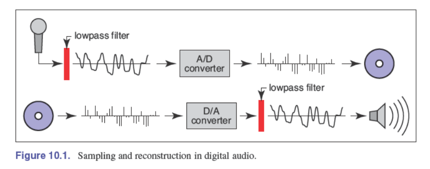
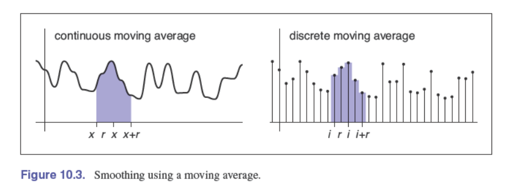
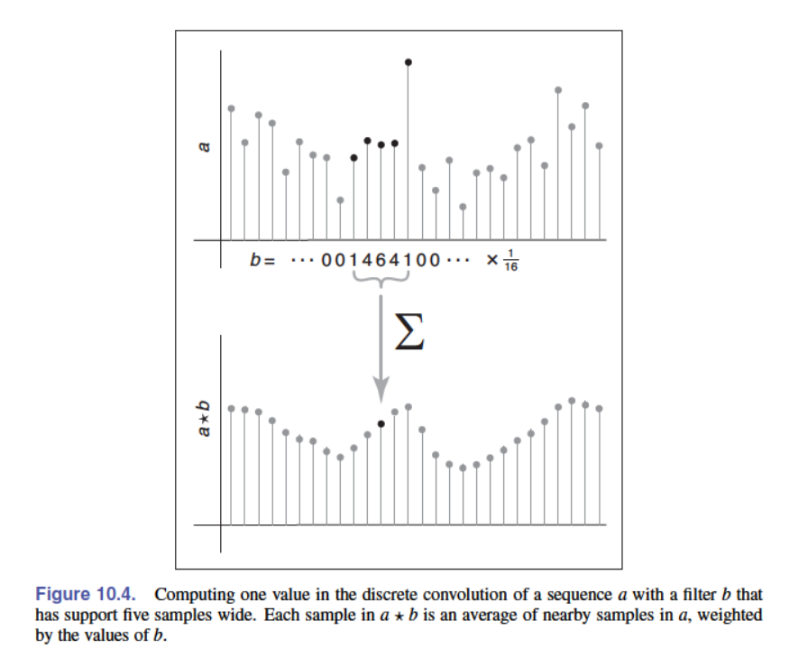
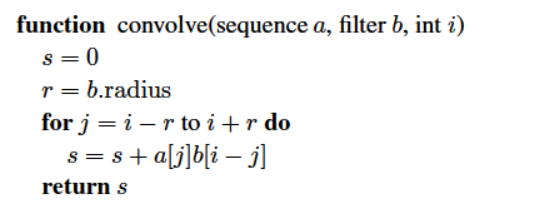
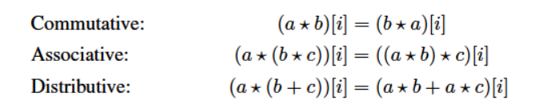

## background 
Q：如何用有限的比特位表示一个连续函数（不知道具体的表达式）？
A：对函数取样(sample)。存储不同的点并reconstruct

example：照相机： $R^2 \rightarrow C$  where $C$ for color. 但我们只存储一张有大小的图片。

## 数字音频：一维采样

### 取样的缺陷和走样
解决方法：filter before sampling and fiter again during reconstruction
引入了三个问题：
• What sample rate is high enough to ensure good results? （取样率）
• What kinds of filters are appropriate for sampling and reconstruction? （filter选择）
• What degree of smoothing is required to avoid aliasing? （soothing 方法）

## convolution 卷积 自相关
定义：把两个函数组合成一个新的函数。the result of applying convolution to the functions f and g is f ⋆ g
即可作用与连续函数也可以是离散函数，一维或者多维。我们假设函数的定义域是无限的。

### 移动平均 moving averages

给定一个点$x$，计算$[x-r, x+r]$范围内函数的平均值。连续函数积分即可。

卷积和移动平均类似，踏实带有权重的平均

### 离散自相关
$$(a\star b)[i] = \sum_j a[j]b[i-j]$$
$a[i]$是signal， $b[i]$是filter

回忆卷积神经网络：卷积核应该是有局部性和平移不变性的。$b[i]$应该在$[-r, r]$内有非零值，大于$\left| r \right|$的范围的值都是0.
则：
$$(a\star b)[i] = \sum_{j=i-r}^{j=i+r} a[j]b[i-j]$$

#### convolution filters
1. box filter 
   $$b[k]= \begin{cases}
    \frac{1}{2r+1} &-r\leq k\leq r; \\
    0 & otherwise
   \end{cases} $$
2. identity filter

#### 卷积的属性
filter 和 signal 可以交换
$$(a\star b)[i] = \sum_k a[i-k]b[i-(i-k)] \\ = \sum_k b[k]a[i-k]$$
卷积的运算律

### convolution as a sum of shifted filters
$b_{\rightarrow j} [i]=b[i-j]$

### 连续函数的卷积
$$(f\star g)(x) = \int_{-\infin}^{+\infin}f(t)g(x-t)dt$$

## images的信号处理
