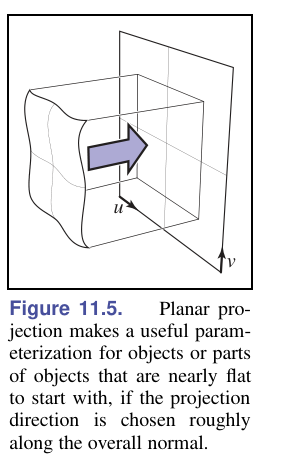
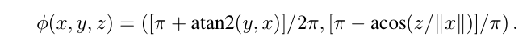
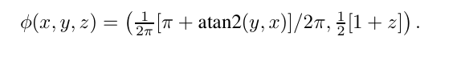
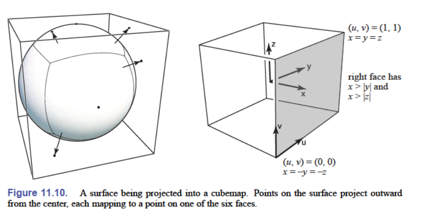
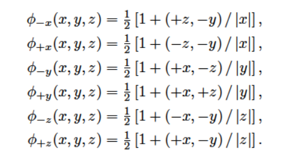
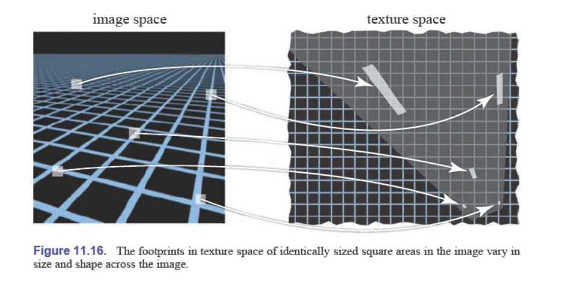
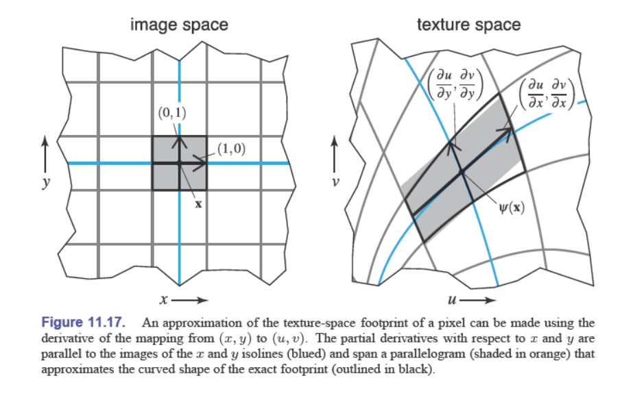
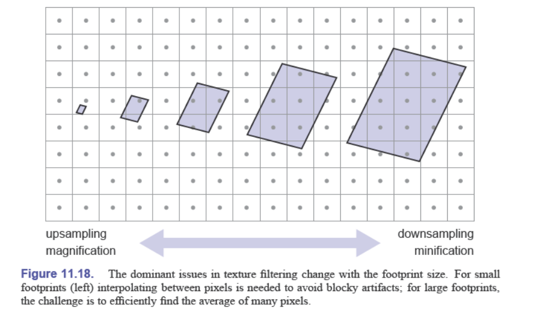

## definition
使用image，称为 texture map, texture image 存储表面的细节。
可以定义：阴影shadows，反射 reflections，光照 illumination，表面形状 surface shape

易出现的问题：
纹理易于失真 distorted
把纹理 map 到 3D 物体的表面很难
纹理映射包含 resampling 的过程，引入artifacts 或者 aliasing


## 查询纹理值 look up texture values

texture lookup:通过计算纹理image在它的坐标系统（UV）下对应于shading point上的位置，然后读值
```cpp
Color texture_lookup(Texture t, float u, float v) {
    int i = round(u * t.width() - 0.5);
    int j = round(v * t.height() - 0.5);
    return t.get_pixel(i,j);
}
Color shade_surface_point(Surface s, Point p, Texture t) {
    Vector normal = s.get_normal(p);
    (u,v) = s.get_texcoord(p);  // surface to texture
    Color diffuse_color = texture_lookup(u,v);
    // compute shading using diffuse_color and normal
    // return shading result
}

```

question: how to get a function that maps from the surface to the texture 
定义 
$$\Phi : S\rightarrow T : (x,y,z)\rightarrow (u, v). $$

表面是曲面怎么办？
高对比度的texture以grazing angle看过去

我们要做到：
定义纹理坐标函数 texture coordinate functions
查询纹理值的同时不过多引入aliasing

## texture coordinate functions
定义$\Phi $应该考虑到：
1. 双射 surface上不同的点映射到不同的texture coord
2. size distortion surface 上距离相同的两点应该映射到纹理上相似距离的点
3. shape distortion surface 上的圆形应该映射到texture上的近似圆形
4. 连续性 continuity 不应该有太多缝合边

surface 使用参数方程的话，uv正好可以作为纹理坐标函数的定义域

### 几何决定的坐标 geometrically determined coordinates

#### planar projection 平面投射


正交情况
$$\phi (x,y,z)=(u,v) \ \ \ \  where \left[  \begin{matrix}
    u \\
    v \\
    * \\
    1
\end{matrix} \right] = M_t  \left[ \begin{matrix}
    x \\
    y \\
    z \\ 
    1
\end{matrix} \right]$$

透视情况
$$\phi (x,y,z)=(\tilde{u}/w,\tilde{v}/w) \ \ \ \  where \left[  \begin{matrix}
    \tilde{u} \\
    \tilde{v} \\
    * \\
    w
\end{matrix} \right] = P_t  \left[ \begin{matrix}
    x \\
    y \\
    z \\ 
    1
\end{matrix} \right]$$

#### 球面坐标 spherical coordinates

两极地区的distortion

#### 柱面坐标 cylindrical coordinates


#### cubemaps
从球面坐标引入的
定义：The idea is to project onto a cube, rather than a sphere, and then use six separate square textures for the six faces of the cube. The collection of six square textures is called a cubemap. 

但在立方体的边处引入的不连续
如何为每一个面定义u和v

OpenGL的定义：


### 沿纹理坐标插值 interpolated texture coordinates
顶点获取纹理坐标，使用重心坐标插值

### tiling, wrapping modes, texture transformations
超出纹理坐标的surface表面如何处理？
重复纹理
白色或者黑色
距离最近的边上的点的color

### 连续性和缝合边 continuity and seams
seams：texture coordinates change suddenly

## antialiasing texture lookups

### the footprint of a pixel
一个像素覆盖住texture的一块区域

记$\psi = \phi \otimes \pi^{-1}$, the footprint of a pixel is the image of that pixel’s square area of the image under the mapping $\psi$.

纹理在物体上，物体project到image space中。
$$\psi(x)=\psi(x_0)+J(x-x_0)$$ 
x是二维向量
表示一阶泰勒展开
$$J=\left[ \begin{matrix}
    \frac{du}{dx} & \frac{du}{dy} \\
    \frac{dv}{dx} & \frac{dv}{dy}
\end{matrix} \right ]$$



### reconstruction
footprint < texel 放大 texture
footprint > texel


bilinear interpolation
```cpp
Color tex_sample_bilinear(Texture t, float u, float v) {
    u_p = u * t.width - 0.5;
    v_p = v * t.height - 0.5;
    iu0 = floor(u_p); iu1 = iu0 + 1;
    iv0 = floor(v_p); iv1 = iv0 + 1;
    a_u = (iu1 - u_p); b_u = 1 - a_u;
    a_v = (iv1 - v_p); b_v = 1 - a_v;
    return a_u * a_v * t[iu0][iv0] + a_u * b_v * t[iu0][iv1] +
    b_u * a_v * t[iu1][iv0] + b_u * b_v * t[iu1][iv1];
}
```

### mipmapping
思想：预计算并存储不同形状和大小的区域的texture的平均颜色值
multim in parvo -> much in a small space

original：level 0
a texel at level k -> a square area of $2^k \times 2^k$ texels of orignal texture

### basic texture filtering with mipmaps
a footprint covers many texel at level 0: query high level of image pyramid

```cpp
Color mipmap_sample_trilinear(Texture mip[], float u, float v, matrix J) {
    D = max_column_norm(J);
    k = log2(D);
    k0 = floor(k); k1 = k0 + 1;
    a = k1 - k; b = 1 - a;
    c0 = tex_sample_bilinear(mip[k0], u, v);
    c1 = tex_sample_bilinear(mip[k1], u, v);
    return a * c0 + b * c1;
}
```
不足：不能处理 拉长 过的footprint

### anisotropic filtering
也存储拉长过的footprint

## application
### controlling shading parameters
在计算着色的时候，控制diffuse color，specular reflectance， roughness

### normal maps and bump maps
surface normal： shading normal != geometric normal
normal maps：表面的发现分布有纹理决定。需要定义依附于surface的坐标系统。来源于对光滑表面的近似或测量真实的表面

bump maps：height field，a function that gives the local height of the detailed surface above the smooth surface
high -> bright(white)

### displacement maps
改变几何

### shadow maps
从点光源获得阴影
z-buffer:记录最近的表面，并且在渲染是更新。
shadow map：整个场景中最近表面的距离
percentage closer filtering

### environment map
image based light
来自远距离的光，光照强度在场景中不同的点改变很少
仅仅依赖于视角 view angle


## procedural 3D textures

### 3D stripe textures

### solid noise  perlin noise
### turbulence
