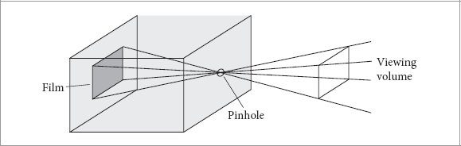
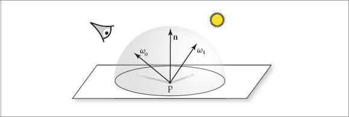
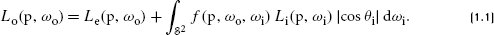

## core concepts:
1. `Cameras`: A camera model determines how and from where the scene is being viewed, including how an image of the scene is recorded on a sensor.
2. `Ray–object intersections`: We must be able to tell precisely where a given ray intersects a given geometric object. additionally, surface normal, material
3. `Light sources`: location, distribution of light
4. `Visibility`: whether there is an uninterrupted path from the point to the light source.
5. `Light scattering at surfaces`: parameterized so that they can simulate a variety of appearances.
6. `Indirect light transport`: Because light can arrive at a surface after bouncing off or passing through other surfaces, it is usually necessary to trace additional rays tocapture this effect.
7. `Ray propagation`:  what happens to light traveling along a ray as it passes through space.

### cameras and lens
pinpoint camera: only light rays that travel along the vector between the pinhole and a point on the film can contribute to that film location.

an important task of the camera simulator is to take a point on the image and generate rays along which incident light will contribute to that image location. it uses the pinhole for the origin and the vector from the pinhole to the imaging plane as the ray’s direction

### ray-object intersections
ray: $\vec{r}(t)=o+t\vec{d}$
implicit surface: $F(x, y, z)=0$
needed information: `intersection point`; `geometric infomations` such as `surface normal` and `partial derivatives` with respect to it;

### light distribution
1. goal: find the amount of light leaving this point in the direction of the camera. 
2. so: we need to know how much light is arriving at this point (power per unit area). (including geometry and radiometric distribution of light)
3. `area light sources`: associated with a geometric object that emits illumination from its surface.
4. Scenes with multiple lights are easily handled because illumination is `linear`: the contribution of each light can be computed separately and summed to obtain the overall contribution. 

### visibility
1. `shadows`: Each light contributes illumination to the point being shaded only if the path from the point to the light’s position is unobstructed
2. `shadow rays`: construct a new ray whose origin is at the surface point and whose direction points toward the light.

### light scattering at surfaces
1. determine how the incident lighting is scattered at the surface, especially energy
2. Each object in the scene provides a `material`, which is a `description` of its appearance properties at each point on the surface. given by: `bidirectional reflectance distribution function` (BRDF)
3. transmitted light (obtaining a BTDF)
4. A function that describes general scattering is called a `bidirectional scattering distribution function` (BSDF).
5. `bidirectional scattering surface reflectance distribution function` (BSSRDF), which models light that exits a surface at a different point than it enters. (translucent materials)

### indirect light transport
1. recursive nature
2. rendering equation or light transport equation
3. whitted-style ray tracing: ignoring incoming light from most directions and only evaluating Li(p, ωi) for directions to light sources and for the directions of perfect `reflection` and `refraction`. 

### ray propogation
1. The presence of participating media such as smoke, fog, or dust can invalidate the assumption that the light’s power was distributed equally on the surface of a sphere centered at the light without decreasing along the way.
2. `participating media`: extinguish (or attenuate) light, either by absorbing it or by scattering it in a different direction; add to the light along a ray (emit light): volume light transport equation.

## pbrt: system overview
1. interface + implementation; ex: bounding box.
2. `tag-based dispatcch`: each specific type implementation is assigned a unique integer that determines its type at runtime.

### phases of execution
1. parses the scene description file: a text file that specifies the `geometric shapes` that make up the scene, their `material properties`, the `lights` that illuminate them, where the virtual `camera` is positioned in the scene, and parameters to all the individual algorithms used throughout the system. 
2. `BasicScene` class: store the scene specification. `pbrt` creates specific objects corresponding to the scene; for example, if a `perspective projection` has been specified, it is in this phase that a `PerspectiveCamera` object corresponding to the specified viewing parameters is created.
3. In the third phase, the main rendering loop executes. This phase is where pbrt usually spends the majority of its running time

### main() function
1. defined in `cmd/pbrt.cpp`
2. `PBRTOptions` class stores various rendering options that are generally more suited to be specified on the command line rather than in scene description files.It is passed to the `InitPBRT()` function, which aggregates the various system-wide initialization tasks 
3. `ParseFiles()` function takes over to handle the first of the three phases of execution. `BasicSceneBuilder` and `BasicScene`, it loops over the provided filenames, parsing each file in turn.
4. `RenderWavefront()` supports both the CPU and GPU rendering paths, processing a million or so image samples in parallel.
5. Both of these functions start by converting the BasicScene into a form suitable for efficient rendering and then pass control to a processor-specific integrator

### integrator interface (CPU)
1. `primitive`: geometry objects
2. `shape`
3. `material`
4. `Integrator::aggregate`, holds references to other primitives. data structure
5. `light`, `Preprocess()` for bounding box
6. 

