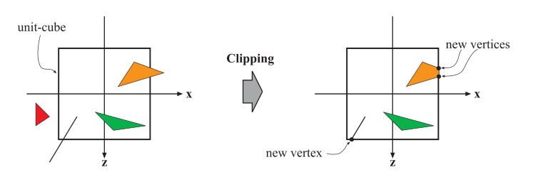

## introduction
1. goal: generate, or render, a two-dimensional image, given a virtual camera, three-dimensional objects, light sources, and more.
2. `locations` and `shapes` of the objects in the image are determined by their `geometry`, the characteristics of the `environment`, and the placement of the `camera`.
3. The `appearance` of the objects is affected by `material properties`, `light sources`, `textures` , and `shading equations`.

## architecture
1. A pipeline consists of several stages, each of which performs part of a larger task. The pipeline stages execute in parallel, with each stage dependent upon the result of the previous stage.
2. The basic construction of the rendering pipeline, consisting of four stages: `application`, `geometry processing`, `rasterization`, and `pixel processing`. Each of these stages may be a pipeline 
3. rendering speed: `frames per second (FPS)`; `Hertz (Hz)`; state the time `milliseconds`

## application stage
1. Some of the tasks traditionally performed on the CPU include `collision detection`, `global acceleration algorithms` such as `culling`, `animation`, `physics simulation`
2. could decrease the number of triangles to be rendered
3. can use `compute shader` for rendering
4. at the end of the application stage, the geometry to be rendered is fed to the geometry processing stage. 
5. `collision detection`:  a response may be generated and sent back to the colliding objects, as well as to a force feedback device. 
6. The application stage is also the place to take care of input from other sources, such as the keyboard, the mouse, or a head-mounted display.

## geometry processing
1. `per-triangle` or `per-vertex` operations
2. four functional stage: `vertex shading`, `projection`, `clipping`, and `screen mapping`
3. all object in `object world` or `object space`; that says, all object is in 3D format. except some texture (or terrain??).

### vertex shading
1. tasks: compute the `position` for a vertex; `appearance` using vertex output data such as `texture coordinates`, `normal direction` to `rasterization` and `pixel processing`
2. position: `model space` -> `world space` (by model matrix) -> `camera space` or `eye/view space` by view transform.
3. appearance: `material`, `light`, ... This operation of determining the effect of a light on a material is known as `shading`.

### projection
1. transforms the `view volume` into a unit cube (`canonical view volume`) w ith its extreme points at (−1, −1, −1) and (1, 1, 1). but vulkan is ` 0 ≤ z ≤ 1`
2. on the GPU projection is done by the vertex shader.
3. `orthographic` and `perspective` projection; other including `oblique and axonometric projections`
4. `orthographic projection`: parallel lines remain parallel
5. `perspective projection`: the farther away an object lies from the camera, the smaller it appears after projection. `frustrum` -> `uint cube`
6. after either transform, the models are said to be in `clip coordinates`. this occurs before division by `w`. The GPU’s vertex shader must always output coordinates of this type in order for the next functional stage, clipping, to work correctly.
7. why called `projection`:  after projection, the `z-coordinate` is not stored in the image generated but is stored in a `z-buffer`. In this way, the models are projected from three to two dimensions.
8. `interpolation` before `projection`

### optional vertex processing
1. inclulding `tessellation`, `geometry shading`, and `stream output`
2. primitive not `line`, `point`, `triangle`, but `patch`. The tessellation stage consists of a series of stages itself — `hull shader`, `tessellator`, and `domain shader` — that converts these sets of `patch vertices` into (normally) larger sets of vertices that are then used to make new sets of `triangles`
3. `Geometry shaders` takes in primitives of various sorts and can produce or delete new vertices. they have several uses, with one of the most popular being particle generation (Imagine simulating a fireworks explosion). 
4. `tream output`, Instead of sending our processed vertices down the rest of the pipeline to be rendered to the screen, at this point we can optionally output these to an array for further processing. used for particle simulations.

### clipping
1. Only the primitives wholly or partially inside the view volume need to be passed on to the `rasterization stage `
2. three cases: `outside the volume`, `inside the volume`, `partially inside the volume`
3. primitives are always clipped against the unit cube.
4. In addition to the six clipping planes of the view volume, the user can define additional clipping planes to visibly chop objects. 
5. The clipping step uses the 4-value homogeneous coordinates produced by projection to perform clipping.`perspective division` places the resulting triangles’ positions into three-dimensional `normalized device coordinates`.

### screen mapping
1. convert `clipping space` to `window coordinates`
2. The x- and y-coordinates of each primitive are transformed to form `screen coordinates`. Screen coordinates together with the z-coordinates are also called `window coordinates`.
3. sending data to rasterization stage.
4. `(0, 0)` is in the upeer-left corner for `vulkan` and `DirectX`

## rasterization 
1. Given the transformed and projected vertices with their associated shading data, the goal is to find all pixels that are inside the primitive (such as `triangle`) being rendered. 
2. also called `scan conversion`
3. Rasterization can also be thought of as a synchronization point between geometry processing and pixel processing
4. `primitive assembly` or `triangle setup`; `triangle traversal`

### Triangle Setup
1. fixed-function hardware is used
2. differentials, edge equations, and other data for the triangle are computed. used for `triangle traversal` and `interpolation`

### Triangle Traversal
1. Here is where each pixel that has its center (or a sample) covered by the triangle is checked and a fragment generated for the part of the pixel that overlaps the triangle.
2. Finding which `samples` or `pixels` are inside a `triangle` is often called triangle traversal.
3. `perspective-correct interpolation` over the triangles is performed 
4. All pixels or samples that are inside a primitive are then sent to the pixel processing stage, described next.

## pixel processing
1. `pixel shading` and `merging`
2. `per-pixel` or `per-sample` computations

### pixel shading
1. input: interpolated shading data; output: colors.
2. can use many techniques such as `texturing`
3. The information for each pixel is stored in the `color buffer` or `color attachment`, which is a rectangular array of colors (a red, a green, and a blue component for each color).

### merging
1. combine the fragment color produced by the pixel shading stage with the color currently stored in the `framebuffer`
2. also called `ROP`: `raster operations` in pipeline; `render output unit` in hardware
3. not fully programmable but highly configurable
4. `resolving visibility`; `z-buffer` each pixel it stores the z-value to the currently closest primitive. the z-buffer stores only a single depth at each point on the screen, so it cannot be used for partially transparent primitives. These must be rendered after all opaque primitives, and in back-to-front order, or using a separate order-independent algorithm
5. other information about a pixel: The `alpha channel` is associated with the color buffer and stores a related opacity value for each pixel. 
6. The `stencil buffer` is an offscreen buffer used to record the locations of the rendered primitive. It typically contains 8 bits per pixel. the buffer’s contents can then be used to control rendering into the color buffer and z-buffer.
7. `raster operations (ROP)` or `blend operations`. mix color in `color attachment/buffer` with `pixel shader output`.
8. `framebuffer`: including `stencil buffer`, `depth buffer`, `color buffer`; or `attachment`
9. `double buffer`: `front buffer` and `back buffer`

