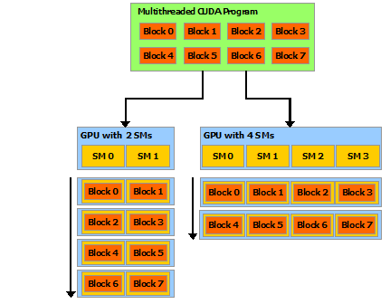

## 1. the benefits of using GPUs
1. The GPU is specialized for highly parallel computations and therefore designed such that more transistors are devoted to data processing rather than data caching and flow control. 
2. the GPU can hide memory access latencies with computation, instead of relying on large data caches and complex flow control to avoid long memory access latencies,

## 2. CUDA: A General-Purpose Parallel Computing Platform and Programming Model

## 3. A Scalable Programming Model
1. three key abstractions: a hierarchy of thread groups, shared memories, and barrier synchronization 
2. a compiled CUDA program can execute on any number of multiprocessors, only the runtime system needs to know the physical multiprocessor count.

## 5. programming model

