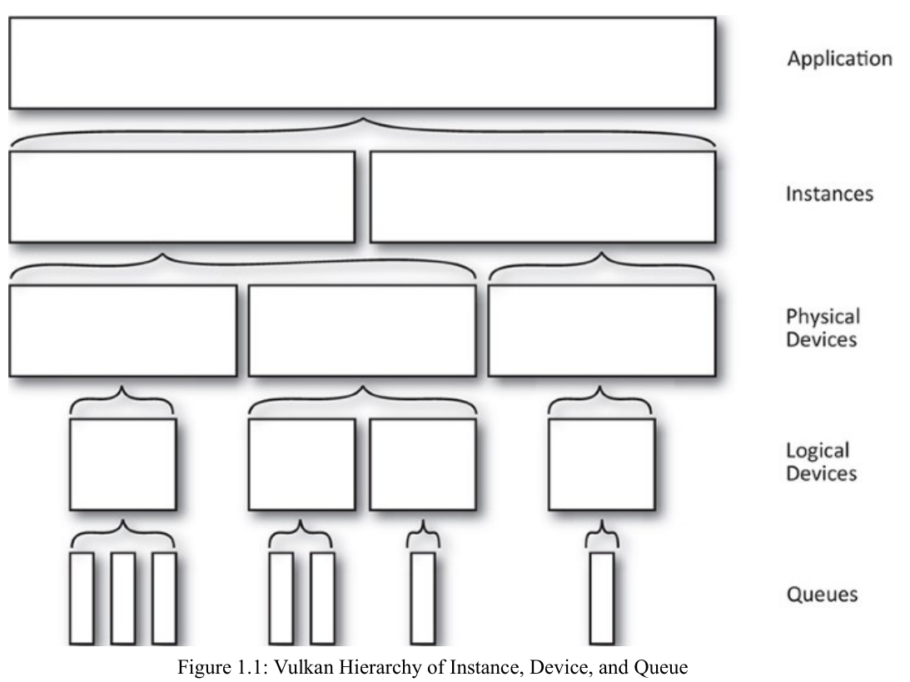
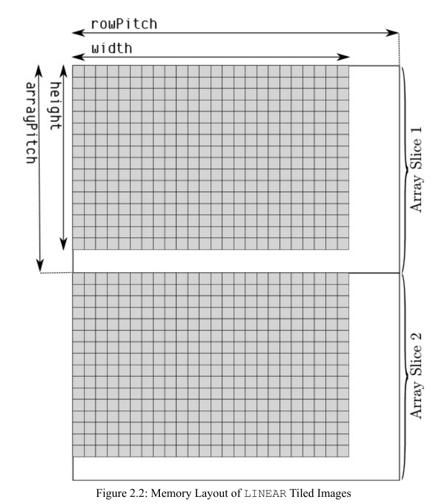
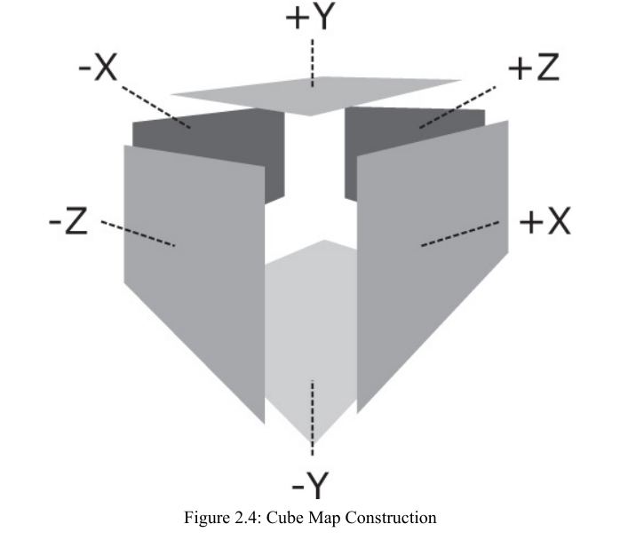
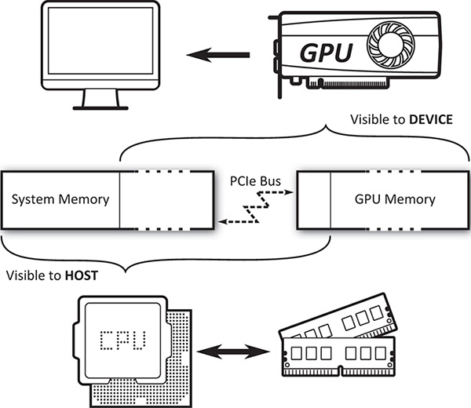
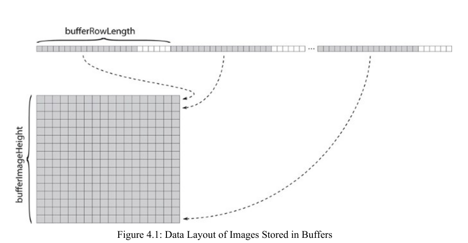
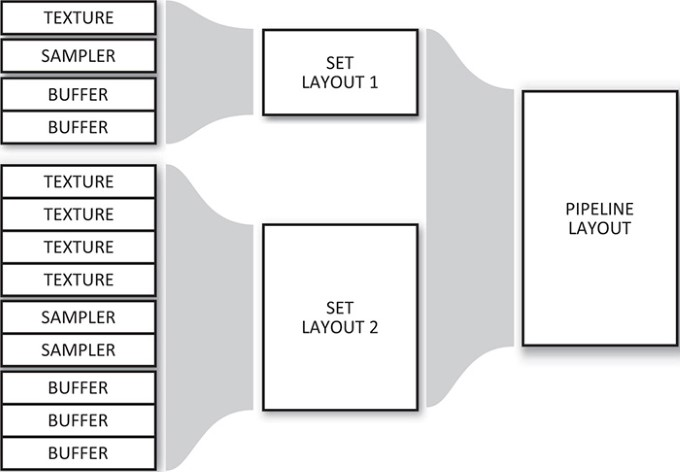
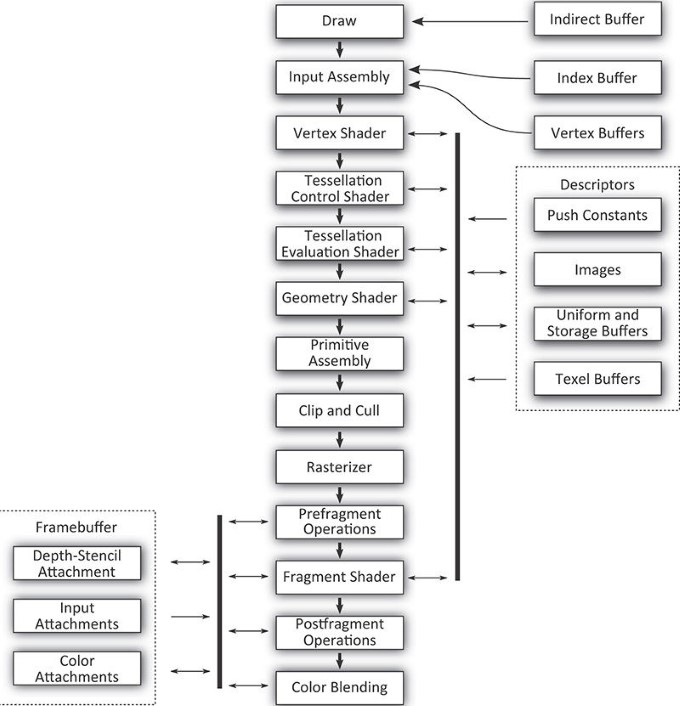
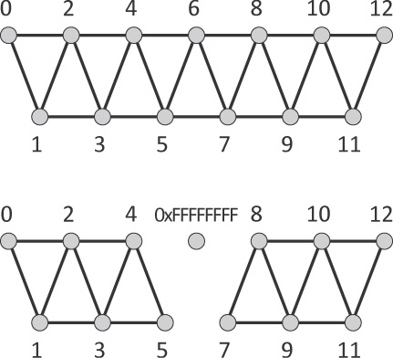
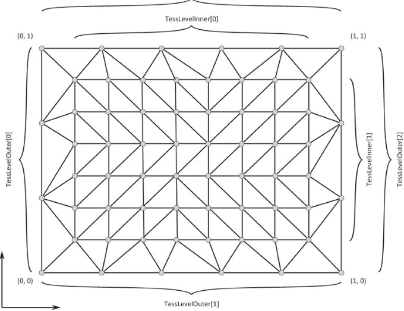
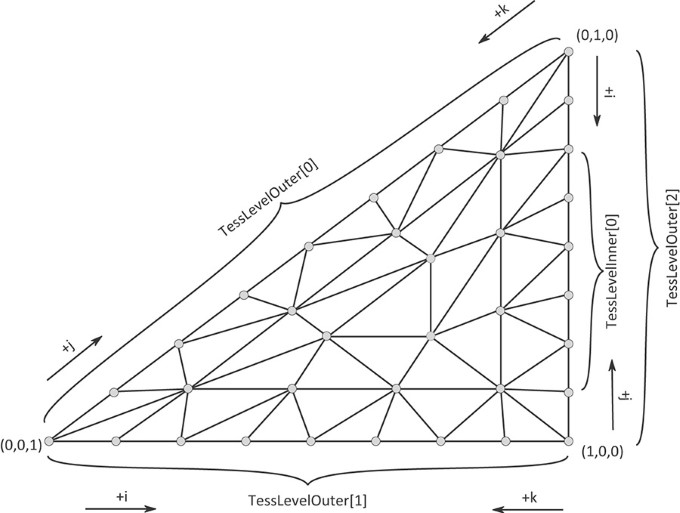

# chapter 1
## core concepts
1. `instance`: aggregates all Vulkan-capable `devices` together; Each device then exposes one or more `queues`
2. `physical device`: members of the `instance`
3. `logical device`: software construct around a `physical device` and represents a reservation of resources such as `queues`;  execute work that is submitted to `queues`

4. `queue family`: a group of `queues` that have identical `capabilities` but are able to run in parallel. numbers
5. `queue`: 

### import things
1. Vulkan doesn’t introduce any global state into your application, all tracked state must be stored in an object that you provide. 
2. Layers are used to intercept the Vulkan API and provide logging, profiling, debugging, or other additional features.
3. the `pAllocator` parameter is a pointer to a host memory allocator that your application can supply in order to manage the host memory that the Vulkan system uses. 
4. `Device memory` in Vulkan refers to memory that is accessible to the device and usable as a backing store for textures and other data.
5. vulkan 中 `flags` 是一个或多个`flagbits`的组合
6. You will need to retrieve the queue family properties before creating the logical device
7. physical device features, a Vulkan implementation may need to `allocate extra memory`, `track additional state`, `configure hardware` slightly differently, or p`erform some other operation`
8. Virtually everything in Vulkan is represented as an object that is referred to by a handle. `dispatchable objects` and `nondispatchable objects`
9. `dispatchable objects`: `VkInstance`, `VkPhysicalDevice`, `VkDevice`, `VkCommandBuffer`, `VkQueue`
10. It is recommended that device memory allocators allocate memory in large chunks. 
11. vulkan generally assumes that the application will ensure that no two threads are mutating the same object at the same time. This is known as `external synchronization`. each parameter that must be protected from concurrent access by the host is marked as `externally synchronized`. handles to objects or other data are embdedd in data structures, included in arrays, or otherwise passed to commands through some indirect means. Those paramters must also be `externally synchronized`.
12. `Layers`: logging, tracing, providing diagnostics, profiling, debugging
    1. `VK_LAYER_LUNARG_api_dump`: prints Vulkan calls and their parameters and values to the console.
    2. `VK_LAYER_LUNARG_core_validation`: performs validation on parameters and state
    3. `VK_LAYER_LUNARG_device_limits`: ensures that values passed to Vulkan commands as arguments or data structure members fall within the device’s supported feature set limits
    4. `VK_LAYER_LUNARG_image`: image usage is consistent with supported formats
    5. `VK_LAYER_LUNARG_object_tracker`: catch leaks, use-after-free errors, and other invalid object usage
    6. `VK_LAYER_LUNARG_parameter_validation`: parameter values passed to Vulkan functions are valid.
    7. `VK_LAYER_LUNARG_swapchain`: performs validation on functionality provided by the WSI (Window System Integration) extensions 
    8. `VK_LAYER_GOOGLE_threading`: ensures valid usage of Vulkan commands with respect to threading
    9. `VK_LAYER_GOOGLE_unique_objects`: ensures that every object will have a unique handle for easier tracking by the application
    10. `VK_LAYER_LUNARG_standard_validation`:  a large number of layers
13. Extensions are divided into two categories: `instance extensions` and `device extensions`. 
14. Some extensions provide new functionality in the form of additional entry points that you can call.These are exposed as function pointers, the values of which you must query either from the instance or from the device after enabling the extension. 
15. Complete or otherwise terminate all work that your application is doing both on the host and the device, in all threads related to Vulkan. Destroy objects in the reverse order from the order in which they were created.
16. before destroy `VkDevice`, call `vkDeviceWaitIdle(VkDevice)`  all work submitted to the device on behalf of your application is guaranteed to have completed

### memory
1. Vulkan provides two types of memory: `host memory` and `device memory`. 
2. `host memory`: Objects created by the Vulkan API 
3. `device memory`: Resource objects such as buffers images samplers

### higher-level synchronized features
1. Host memory allocations can be handled through a host memory allocation structure passed to object creation functions. By using an allocator per thread, the data structures in that allocator don’t need to be protected.
2. Command buffers are allocated from pools, and access to the pool is externally synchronized. If an application uses a separate command pool per thread, command buffers can be allocated from those pools without blocking against one another. 
3. Descriptors are allocated in sets from descriptor pools. Descriptors are the representation ofresources as used by shaders running on the device. If a separate pool is used for each thread, then descriptor sets can be allocated from those pools without the threads blocking one another.
4. Second-level command buffers allow the contents of a large renderpass (which must be contained in a single command buffer) to be generated in parallel and then grouped as they’re called from the primary command buffer. 

### vulkan 坐标系统
1. `object space` or `model space`: vertex coordinates in a 3D coordinate space (represented as homogenous vectors with w components of 1.0) relative to the origin of the object of which they are part. 
2. `view space`: a position relative to the viewer. 
3. `clip space`: removes sections of primitives that lie outside the visible region being rendered. pushing primitives into the projective space 
4. ` normalized device coordinates`, or `NDC`: the visible part of the coordinate system is from −1.0 to 1.0 in the x and y directions and from 0.0 to 1.0 in the z direction. vertex positions are normalized by `dividing` through by their w components.
5. `viewport`: describes how NDC maps into a window or image into which the picture is being rendered.

#### VkMemoryPropertyFlagBits
1. `VK_MEMORY_PROPERTY_DEVICE_LOCAL_BIT`: local to your GPU. otherwise host
2. `VK_MEMORY_PROPERTY_HOST_VISIBLE_BIT`: can be mapped and read or written by the host. 
3. `VK_MEMORY_PROPERTY_HOST_COHERENT_BIT`: concurrently accessed by both the host and device, those accesses will be coherent between the two clients.  同步？？ gpu可能看不到cpu flush后的行为
4. `VK_MEMORY_PROPERTY_HOST_CACHED_BIT`: cached by the host 其余内存全部在device端？
5. `VK_MEMORY_PROPERTY_LAZILY_ALLOCATED_BIT`:  memory allocated with this type doesn’t necessarily consume space from the associated heap immediately and that a driver might defer physical memory allocation until the memory object is used to back a resource.

#### VkQueueFlagBits
1. `VK_QUEUE_GRAPHICS_BIT`: drawing points, lines, and triangles
2. `VK_QUEUE_COMPUTE_BIT`: dispatching compute shaders
3. `VK_QUEUE_TRANSFER_BIT`: copying buffer and image contents
4. `VK_QUEUE_SPARSE_BINDING_BIT`: memory binding operations used to update sparse resources.


### 重要API
```cpp
VkResult vkCreateInstance (
    const VkInstanceCreateInfo* pCreateInfo,
    const VkAllocationCallbacks* pAllocator,
    VkInstance* pInstance);

VkResult vkEnumeratePhysicalDevices (
    VkInstance instance,
    uint32_t* pPhysicalDeviceCount,
    VkPhysicalDevice* pPhysicalDevices);

// query the device for its capabilities
void vkGetPhysicalDeviceProperties (
VkPhysicalDevice physicalDevice,
VkPhysicalDeviceProperties* pProperties);

typedef struct VkPhysicalDeviceProperties {
    uint32_t apiVersion; // highest supported vulkan api version
    uint32_t driverVersion; // nvidia driver version ??
    uint32_t vendorID;
    uint32_t deviceID;
    VkPhysicalDeviceType deviceType;
    char deviceName[VK_MAX_PHYSICAL_DEVICE_NAME_SIZE];
    uint8_t pipelineCacheUUID[VK_UUID_SIZE]; // used for pipeline caching
    VkPhysicalDeviceLimits limits;
    VkPhysicalDeviceSparseProperties sparseProperties;
} VkPhysicalDeviceProperties;

// features 要使用的话需要在queue中明确指定 feature举例：各向异性过滤
void vkGetPhysicalDeviceFeatures (
VkPhysicalDevice physicalDevice,
VkPhysicalDeviceFeatures* pFeatures);

// memory properties
void vkGetPhysicalDeviceMemoryProperties (
VkPhysicalDevice physicalDevice,
VkPhysicalDeviceMemoryProperties* pMemoryProperties);


typedef struct VkPhysicalDeviceMemoryProperties {
    uint32_t memoryTypeCount;
    VkMemoryType memoryTypes[VK_MAX_MEMORY_TYPES];
    uint32_t memoryHeapCount;
    VkMemoryHeap memoryHeaps[VK_MAX_MEMORY_HEAPS];
} VkPhysicalDeviceMemoryProperties;

typedef struct VkMemoryType {
    VkMemoryPropertyFlags propertyFlags;
    uint32_t heapIndex;
} VkMemoryType;

typedef struct VkMemoryHeap {
    VkDeviceSize size;
    VkMemoryHeapFlags flags;
} VkMemoryHeap;


// device queues families
void vkGetPhysicalDeviceQueueFamilyProperties (
VkPhysicalDevice physicalDevice,
uint32_t* pQueueFamilyPropertyCount,
VkQueueFamilyProperties* pQueueFamilyProperties);

typedef struct VkQueueFamilyProperties {
    VkQueueFlags queueFlags; // capabilities of this queue family
    uint32_t queueCount; // nvidia 16
    uint32_t timestampValidBits;
    VkExtent3D minImageTransferGranularity;
} VkQueueFamilyProperties;


// create logic device
VkResult vkCreateDevice (
VkPhysicalDevice physicalDevice,
const VkDeviceCreateInfo* pCreateInfo,
const VkAllocationCallbacks* pAllocator,
VkDevice* pDevice);

// device create info
typedef struct VkDeviceCreateInfo {
    VkStructureType sType;
    const void* pNext;
    VkDeviceCreateFlags flags;
    uint32_t queueCreateInfoCount;
    const VkDeviceQueueCreateInfo* pQueueCreateInfos;
    uint32_t enabledLayerCount;
    const char* const* ppEnabledLayerNames;
    uint32_t enabledExtensionCount;
    const char* const* ppEnabledExtensionNames;
    const VkPhysicalDeviceFeatures* pEnabledFeatures;
} VkDeviceCreateInfo;

// queue create info
typedef struct VkDeviceQueueCreateInfo {
    VkStructureType sType;
    const void* pNext;
    VkDeviceQueueCreateFlags flags;
    uint32_t queueFamilyIndex;
    uint32_t queueCount;
    const float* pQueuePriorities; // can set to nullptr
} VkDeviceQueueCreateInfo;
```

#### enhanced vulkan
```cpp
// layers
VkResult vkEnumerateInstanceLayerProperties (
uint32_t* pPropertyCount,
VkLayerProperties* pProperties);

typedef struct VkLayerProperties {
    char layerName[VK_MAX_EXTENSION_NAME_SIZE];
    uint32_t specVersion; 
    uint32_t implementationVersion;
    char description[VK_MAX_DESCRIPTION_SIZE];
} VkLayerProperties;

// extensions  不需要instance 作为参数
VkResult vkEnumerateInstanceExtensionProperties (
const char* pLayerName, // a layer that may provide extensions. usually nullptr
uint32_t* pPropertyCount,
VkExtensionProperties* pProperties);

typedef struct VkExtensionProperties {
    char extensionName[VK_MAX_EXTENSION_NAME_SIZE];
    uint32_t specVersion;
} VkExtensionProperties;

// logical device 还未创造
VkResult vkEnumerateDeviceExtensionProperties (
VkPhysicalDevice physicalDevice,
const char* pLayerName,
uint32_t* pPropertyCount,
VkExtensionProperties* pProperties);

// 获取instance 上的extension function pointer
PFN_vkVoidFunction vkGetInstanceProcAddr(VkInstance instance, const char* pName);
VKAPI_ATTR void VK_API_CALL vkVoidFunction(void);


PFN_vkVoidFunction vkGetDeviceProcAddr (
VkDevice device,
const char* pName);
```

#### 一些例子
1. 新建带有features的logic device
```cpp
VkResult result;
VkPhysicalDeviceFeatures supportedFeatures;
VkPhysicalDeviceFeatures requiredFeatures = {};
vkGetPhysicalDeviceFeatures(m_physicalDevices[0], &supportedFeatures);
requiredFeatures.multiDrawIndirect = supportedFeatures.multiDrawIndirect;
requiredFeatures.tessellationShader = VK_TRUE;
requiredFeatures.geometryShader = VK_TRUE;
const VkDeviceQueueCreateInfo deviceQueueCreateInfo = {
    VK_STRUCTURE_TYPE_DEVICE_QUEUE_CREATE_INFO, // sType
    nullptr, // pNext
    0, // flags
    0, // queueFamilyIndex
    1, // queueCount
    nullptr // pQueuePriorities
};
const VkDeviceCreateInfo deviceCreateInfo =
{
    VK_STRUCTURE_TYPE_DEVICE_CREATE_INFO, // sType
    nullptr, // pNext
    0, // flags
    1, // queueCreateInfoCount
    &deviceQueueCreateInfo, // pQueueCreateInfos
    0, // enabledLayerCount
    nullptr, // ppEnabledLayerNames
    0, // enabledExtensionCount
    nullptr,// ppEnabledExtensionNames
    &requiredFeatures // pEnabledFeatures
};
result = vkCreateDevice(m_physicalDevices[0], &deviceCreateInfo, nullptr, &m_logicalDevice);
```

-----

# chapter 2 Memory and Resources
1. How Vulkan manages host and device memory
2. How to manage memory effectively in your application
3.  How Vulkan uses images and buffers to consume and produce data

## core concepts

### import things
1. All resources upon which Vulkan operates must be backed by device memory
2. memory is used to store data structures on the host
3. A buffer is a simple, linear chunk of data 
4. Images are structured and have type and format information
5. resources: `create` and `back to memory`
6. While `buffers` are relatively simple resources and do not have any notion of the `format` of the data they contain, `images` and `buffer views` do include information about their content.
7. An image can be in one of two primary tiling modes: linear, in which image data is laid out linearly in memory, first by row, then by column, and so on; and optimal, in which image data is laid out in highly optimized patterns that make efficient use of the device’s memory subsystem. 
8. `buffers` store linear structured or unstructured data
9. `Images` have specific layouts and format information; filtering, blending, depth or stencil testing
10. format describes how texel data is stored in memory and how it is interpreted by Vulkan
11. Rather than alias the next-higher dimension as an array count, Vulkan uses an explicit array size, which is set in ar`rayLayers`. 类比于卷积神经网络的多通道
12. Images can be moved from layout to layout. The mechanism for changing the layout of an image is known as a `pipeline barrier`. synchronize access to that resource by different stages and by different queues running concurrently on the same device
13. `linear images` CPU端可以读写。width, height, depth, pixel format, array layers, row pitch, array pitch, depth pitch  row pitch: the distance in bytes between the start of each row of the image
14. `image subresources`: aspect, mipmap levels, array layers
15. compressed image format 未讲


#### host memory management
1. vulkan object, `malloc`, `new`
2. requirements: `aligned`

#### VkSystemAllocationScope
1. `VK_SYSTEM_ALLOCATION_SCOPE_COMMAND`: the allocation will be live only for the duration of the command that provoked the allocation.
2. `VK_SYSTEM_ALLOCATION_SCOPE_OBJECT`:  allocation is directly associated with a particular Vulkan object. only be made as part of executing a creation command (vkCreate)
3. `VK_SYSTEM_ALLOCATION_SCOPE_CACHE`: the allocation is associated with some form of internal cache or a VkPipelineCache object.
4. `VK_SYSTEM_ALLOCATION_SCOPE_DEVICE`: allocation is scoped to the device.
5. `VK_SYSTEM_ALLOCATION_SCOPE_INSTANCE`: allocation is scoped to the instance

self-defined memory allocator
```cpp
typedef struct VkAllocationCallbacks {
    void* pUserData; // for your app use; vulkan will not dereference it. 传入下面的callback function 
    PFN_vkAllocationFunction pfnAllocation;
    PFN_vkReallocationFunction pfnReallocation;
    PFN_vkFreeFunction pfnFree;
    PFN_vkInternalAllocationNotification pfnInternalAllocation;
    PFN_vkInternalFreeNotification pfnInternalFree;
} VkAllocationCallbacks;

void* VKAPI_CALL Allocation(
void* pUserData, // your own data structure   
size_t size,
size_t alignment, 
VkSystemAllocationScope allocationScope);

void* VKAPI_CALL Reallocation(
void* pUserData,
void* pOriginal
size_t size,
size_t alignment,
VkSystemAllocationScope allocationScope);

void VKAPI_CALL Free(
void* pUserData,
void* pMemory);
```


#### buffers and images

##### VkBufferUsageFlagBits
1. `VK_BUFFER_USAGE_TRANSFER_SRC_BIT`, `VK_BUFFER_USAGE_TRANSFER_DST_BIT`:  the buffer can be the source or destination, of transfer commands.
2. `VK_BUFFER_USAGE_UNIFORM_TEXEL_BUFFER_BIT`, `VK_BUFFER_USAGE_STORAGE_TEXEL_BUFFER_BIT`: the buffer can be used to back a uniform or storage texel buffer. Texel buffers are formatted arrays of texels that can be used as the source or destination (in the case of storage buffers) of reads and writes by shaders running on the device.
3. `VK_BUFFER_USAGE_UNIFORM_BUFFER_BIT`, `VK_BUFFER_USAGE_STORAGE_BUFFER_BIT`: back uniform or storage buffers.regular uniform and storage buffers have no format associated with them
4. `VK_BUFFER_USAGE_INDEX_BUFFER_BIT`, `VK_BUFFER_USAGE_VERTEX_BUFFER_BIT`: store index or vertex buffer, drawing command
5. `VK_BUFFER_USAGE_INDIRECT_BUFFER_BIT`: store parameters used in indirect dispatch and drawing commands, which are commands that take their parameters directly from buffers rather than from your program. avert `GPU-CPU-GPU` round-trip

#### sharing mode
1. `VK_SHARING_MODE_EXCLUSIVE`: the buffer will only be used on a single queue. set this queue family ignored
2. `VK_SHARING_MODE_CONCURRENT`: use the buffer on multiple queues at the same time


#### VkFormatFeatureFlagBits
give you a VkFormat, they may be satisfied with:
1. `VK_FORMAT_FEATURE_SAMPLED_IMAGE_BIT`: read-only images that will be sampled by shaders.
2. `VK_FORMAT_FEATURE_SAMPLED_IMAGE_FILTER_LINEAR_BIT`: Filter modes that include linear filtering may be used when this format is used for a sampled image.
3. `VK_FORMAT_FEATURE_STORAGE_IMAGE_BIT`: images that will be read and written by shaders
4. `VK_FORMAT_FEATURE_STORAGE_IMAGE_ATOMIC_BIT`: read-write images that also support atomic operations performed by shaders
5. `VK_FORMAT_FEATURE_UNIFORM_TEXEL_BUFFER_BIT`: read-only texel buffer that will be read from by shaders
6. `VK_FORMAT_FEATURE_STORAGE_TEXEL_BUFFER_BIT`: read-write texel buffers that may be read from and written to by shaders.
7. `VK_FORMAT_FEATURE_STORAGE_TEXEL_BUFFER_ATOMIC_BIT`:  read-write texel buffers that also support atomic operations performed by shaders.
8. `VK_FORMAT_FEATURE_VERTEX_BUFFER_BIT`: the source of vertex data by the vertex-assembly stage of the graphics pipeline
9. `VK_FORMAT_FEATURE_COLOR_ATTACHMENT_BIT`: a color attachment in the color-blend stage of the graphics pipeline
10. `VK_FORMAT_FEATURE_COLOR_ATTACHMENT_BLEND_BIT`:  used as color attachments when blending is enabled
11. `VK_FORMAT_FEATURE_DEPTH_STENCIL_ATTACHMENT_BIT`:  a depth, stencil, or depth-stencil attachment.
12. `VK_FORMAT_FEATURE_BLIT_SRC_BIT`: the source of data in an image copy operation
13. `VK_FORMAT_FEATURE_BLIT_DST_BIT`: the destination of an image copy operation.


#### VkImageCreateFlagBits
1. `VK_IMAGE_CREATE_SPARSE_BINDING_BIT`
2. `VK_IMAGE_CREATE_SPARSE_RESIDENCY_BIT`
3. `VK_IMAGE_CREATE_SPARSE_ALIASED_BIT`
4. `VK_IMAGE_CREATE_MUTABLE_FORMAT_BIT`: create views of the image with a different format from the parent
5. `VK_IMAGE_CREATE_CUBE_COMPATIBLE_BIT`: create cube map views of it.

#### VkImageTiling
1. `VK_IMAGE_TILING_LINEAR`: you map the underlying memory and write it with the CPU, it would form a linear image
2. `VK_IMAGE_TILING_OPTIMAL`: lay data out in memory to improve efficiency of the memory subsystem on the device.



#### VkImageUsageFlagBits
1. `VK_IMAGE_USAGE_TRANSFER_SRC_BIT`, `VK_IMAGE_USAGE_TRANSFER_DST_BIT`: the image will be the source or destination of transfer commands
2. `VK_IMAGE_USAGE_SAMPLED_BIT`: the image can be sampled from in a shader
3. `VK_IMAGE_USAGE_STORAGE_BIT`: used for general-purpose storage, including writes from a shader.
4. `VK_IMAGE_USAGE_COLOR_ATTACHMENT_BIT`: bound as a color attachment and drawn into using graphics operations.
5. `VK_IMAGE_USAGE_DEPTH_STENCIL_ATTACHMENT_BIT`: depth or stencil attachment and used for depth or stencil testing 
6. `VK_IMAGE_USAGE_TRANSIENT_ATTACHMENT_BIT`: a special kind of image used to store intermediate results of a graphics operation.
7. `VK_IMAGE_USAGE_INPUT_ATTACHMENT_BIT`:  Input images differ from regular sampled or storage images in that only fragment shaders can read from them and only (read) at their own pixel location.

#### VkImageLayout
1. `VK_IMAGE_LAYOUT_UNDEFINED`:  The state of the image is undefined. The image must be moved into one of the other layouts before it can be used almost for anything.
2. `VK_IMAGE_LAYOUT_GENERAL`: used where no other layout matches the intended use case.
3. `VK_IMAGE_LAYOUT_COLOR_ATTACHMENT_OPTIMAL`: The image is going to be rendered into using a graphics pipeline.
4. `VK_IMAGE_LAYOUT_DEPTH_STENCIL_ATTACHMENT_OPTIMAL`: used as a depth or stencil buffer as part of a graphics pipeline.
5. `VK_IMAGE_LAYOUT_DEPTH_STENCIL_READ_ONLY_OPTIMAL`: used for depth testing but will not be written to by the graphics pipeline.
6. `VK_IMAGE_LAYOUT_SHADER_READ_ONLY_OPTIMAL`: This layout is typically used when an image is going to be used as a texture.
7. `VK_IMAGE_LAYOUT_TRANSFER_SRC_OPTIMAL`, `VK_IMAGE_LAYOUT_TRANSFER_DST_OPTIMAL`: is the source/destination of copy operations.
8. `VK_IMAGE_LAYOUT_PREINITIALIZED`: The image contains data placed there by an external actor, such as by mapping the underlying memory and writing into it from the host. should be used only when you have data in memory that you will bind to the image resource immediately.
9. `VK_IMAGE_LAYOUT_PRESENT_SRC_KHR`: source for presentation, which is the act of showing it to the user

```cpp
// create a buffer
VkResult vkCreateBuffer (
VkDevice device,
const VkBufferCreateInfo* pCreateInfo,
const VkAllocationCallbacks* pAllocator,
VkBuffer* pBuffer);

typedef struct VkBufferCreateInfo {
VkStructureType sType;
const void* pNext;
VkBufferCreateFlags flags; // relating to sparse buffers
VkDeviceSize size;
VkBufferUsageFlags usage;
VkSharingMode sharingMode;
uint32_t queueFamilyIndexCount;
const uint32_t* pQueueFamilyIndices;
} VkBufferCreateInfo;


// image and buffer formats support
void vkGetPhysicalDeviceFormatProperties (
VkPhysicalDevice physicalDevice,
VkFormat format, // check whether this format is supported
VkFormatProperties* pFormatProperties); // support then write the level to this ptr


typedef struct VkFormatProperties {
    VkFormatFeatureFlags linearTilingFeatures;  //image-relating
    VkFormatFeatureFlags optimalTilingFeatures; //image
    VkFormatFeatureFlags bufferFeatures;        // buffer
} VkFormatProperties;

// image format support
VkResult vkGetPhysicalDeviceImageFormatProperties (
VkPhysicalDevice physicalDevice,
VkFormat format, // queried format
VkImageType type, // VK_IMAGE_TYPE_1D(2D,3D)
VkImageTiling tiling, // VK_IMAGE_TILING_LINEAR(OPTIMAL)
VkImageUsageFlags usage, // how image used
VkImageCreateFlags flags, // the same value as format when creating
VkImageFormatProperties* pImageFormatProperties);

typedef struct VkImageFormatProperties {
    VkExtent3D maxExtent; // max size  few bits --> more size
    uint32_t maxMipLevels; // log2 (max (extent.x, extent.y, extent.z)) mipmap levels original image: level 0
    uint32_t maxArrayLayers; // array layers supported for the image
    VkSampleCountFlags sampleCounts; // multisampling MSAA  n bits --> 2^n samples
    VkDeviceSize maxResourceSize; //  maximum size, in bytes, that a resource of this format might be.
} VkImageFormatProperties;

typedef struct VkExtent3D {
    uint32_t width;
    uint32_t height;
    uint32_t depth;
} VkExtent3D;
```

```cpp
// image create
VkResult vkCreateImage (
VkDevice device,
const VkImageCreateInfo* pCreateInfo,
const VkAllocationCallbacks* pAllocator,
VkImage* pImage);

typedef struct VkImageCreateInfo {
    VkStructureType sType;
    const void* pNext;
    VkImageCreateFlags flags;
    VkImageType imageType;
    VkFormat format;
    VkExtent3D extent;
    uint32_t mipLevels;
    uint32_t arrayLayers;
    VkSampleCountFlagBits samples;
    VkImageTiling tiling;
    VkImageUsageFlags usage;
    VkSharingMode sharingMode;
    uint32_t queueFamilyIndexCount;
    const uint32_t* pQueueFamilyIndices;
    VkImageLayout initialLayout;
} VkImageCreateInfo;


// image subresources
void vkGetImageSubresourceLayout (
VkDevice device,
VkImage image,
const VkImageSubresource* pSubresource,
VkSubresourceLayout* pLayout); // written to pLayout

typedef struct VkImageSubresource {
    VkImageAspectFlags aspectMask; // a component of color/depth/stencil image
    uint32_t mipLevel;
    uint32_t arrayLayer;// set to zero??
} VkImageSubresource;

// all bytes
typedef struct VkSubresourceLayout {
    VkDeviceSize offset;
    VkDeviceSize size;
    VkDeviceSize rowPitch;
    VkDeviceSize arrayPitch;
    VkDeviceSize depthPitch;
} VkSubresourceLayout;
```

### resource views
1. function: partition them, reinterpret their content, or use them for multiple purposes
2. category: Views of buffers, which represent a subrange of a buffer object, are known as` buffer views`, and views of images, which can alias formats or represent a subresource of another image, are known as `image views`.
3. `image view`: a collection of properties and a reference to a parent image resource.
4. all images are essentially considered array images
5. `image arrays`: we only refer to images with a `layerCount` greater than `1` as an array image. `cube map` . filtering cannot be performed across multiple layers in an array image. most Vulkan implementations will not allow you to create a 3D image with an arrayLayers field greater than 1.
6. The first element of the array (at the index specified in the baseArrayLayer field) becomes the `-X` face, and the next five layers become the `+X, -Y, +Y, -Z, and +Z `faces, in that order.



#### VkImageViewType
1. `VK_IMAGE_VIEW_TYPE_1D` `VK_IMAGE_VIEW_TYPE_2D` `VK_IMAGE_VIEW_TYPE_3D`
2. `VK_IMAGE_VIEW_TYPE_CUBE` `VK_IMAGE_VIEW_TYPE_CUBE_ARRAY`
3. `VK_IMAGE_VIEW_TYPE_1D_ARRAY` `VK_IMAGE_VIEW_TYPE_2D_ARRAY`

#### VkComponentSwizzle
1. `VK_COMPONENT_SWIZZLE_R` `VK_COMPONENT_SWIZZLE_G` `VK_COMPONENT_SWIZZLE_B` `VK_COMPONENT_SWIZZLE_A`: set to `R` or `G` or `B` or `A`
2. `VK_COMPONENT_SWIZZLE_ZERO` `VK_COMPONENT_SWIZZLE_ONE`: set to 0 or 1
3. `VK_COMPONENT_SWIZZLE_IDENTITY`: do not change

```cpp
// 只能作用于 texel buffer 上 拥有format
// VK_BUFFER_USAGE_UNIFORM_TEXEL_BUFFER_BIT
// VK_BUFFER_USAGE_STORAGE_TEXEL_BUFFER_BIT
VkResult vkCreateBufferView (
VkDevice device,
const VkBufferViewCreateInfo* pCreateInfo,
const VkAllocationCallbacks* pAllocator,
VkBufferView* pView);


typedef struct VkBufferViewCreateInfo {
    VkStructureType sType;
    const void* pNext;
    VkBufferViewCreateFlags flags;
    VkBuffer buffer;
    VkFormat format; // 
    VkDeviceSize offset; // starting 
    VkDeviceSize range; // a window of original buffer
} VkBufferViewCreateInfo;

// image views: change format (compatible, bits per pixel) channel can vary
VkResult vkCreateImageView (
VkDevice device,
const VkImageViewCreateInfo* pCreateInfo,
const VkAllocationCallbacks* pAllocator,
VkImageView* pView);

typedef struct VkImageViewCreateInfo {
    VkStructureType sType;
    const void* pNext;
    VkImageViewCreateFlags flags;
    VkImage image;
    VkImageViewType viewType;
    VkFormat format;
    VkComponentMapping components;
    VkImageSubresourceRange subresourceRange;
} VkImageViewCreateInfo;

// rgba -> bgra 交换通道内的值
typedef struct VkComponentMapping {
    VkComponentSwizzle r;
    VkComponentSwizzle g;
    VkComponentSwizzle b;
    VkComponentSwizzle a;
} VkComponentMapping;

typedef struct VkImageSubresourceRange {
    // can only refer to one aspect
    VkImageAspectFlags aspectMask;  // depth-stencil or color or metadata(compression tech)
    uint32_t baseMipLevel;
    uint32_t levelCount;
    uint32_t baseArrayLayer;
    uint32_t layerCount;
} VkImageSubresourceRange;
```

#### resource destroy
```cpp
void vkDestroyBuffer (
VkDevice device,
VkBuffer buffer,
const VkAllocationCallbacks* pAllocator);

void vkDestroyBufferView (
VkDevice device,
VkBufferView bufferView,
const VkAllocationCallbacks* pAllocator);

void vkDestroyImage (
VkDevice device,
VkImage image,
const VkAllocationCallbacks* pAllocator);

void vkDestroyImageView (
VkDevice device,
VkImageView imageView,
const VkAllocationCallbacks* pAllocator);
```

### device memory management
1. the Vulkan device operates on data, the data must be stored in device memory.
2. Any memory that is accessible to the `device` is known as `device memory`, even if that memory is physically attached to the `host` -- `host local device memory`.
3. `system memory`: regular memory allocated with a function such as malloc or new. 
4. Device memory may also be accessible to the host through a mapping.
5. All of these pools of memory will appear as a heap to the host, and memory will be mapped into those heaps via the various types of memory.
6. `unified memory architecture`: share memory controller and subsystem with the host processor. access to main system memory is coherent and the device will expose fewer heaps
7. `device memory`: buffers and images, other types of device objects, internal allocations and data structures, scratch storage
8. access to memory must be externally synchronized.
9. create a small number of large allocations and then suballocate from them to place many resources in the same allocation.
10. whether a memory allocation is physically backed and how much backing has actually been allocated for a memory object, call `vkGetDeviceMemoryCommitment()`
11. `mapping memory`: give you a pointer to memory allocated from host-accessible regions of device.map device memory into the host’s address space
12. It’s not possible to map the same memory object more than once at the same time.
13. flush host caches that might contain pending writes, call `vkFlushMappedMemoryRanges()`  device see host
14. host see device changes: invalidate any caches on the host  `vkInvalidateMappedMemoryRanges`
15. `vkFlushMappedMemoryRanges()` and `vkInvalidateMappedMemoryRanges()` affect only caches and coherency of access by the `host` and have no effect on the device. Regardless of whether a memory mapping is coherent or not, access by the device to memory that has been mapped must still be synchronized using barriers





```cpp
VkResult vkAllocateMemory (
VkDevice device,
const VkMemoryAllocateInfo* pAllocateInfo,
const VkAllocationCallbacks* pAllocator,
VkDeviceMemory* pMemory);

typedef struct VkMemoryAllocateInfo {
    VkStructureType sType;
    const void* pNext;
    VkDeviceSize allocationSize; // byte
    uint32_t memoryTypeIndex; // vkGetPhysicalDeviceMemoryProperties()
} VkMemoryAllocateInfo;

void vkFreeMemory (
VkDevice device,
VkDeviceMemory memory,
const VkAllocationCallbacks* pAllocator);

void vkGetDeviceMemoryCommitment (
VkDevice device,
VkDeviceMemory memory,
VkDeviceSize* pCommittedMemoryInBytes); // full size of memory

// host visible memory
VkResult vkMapMemory (
VkDevice device,
VkDeviceMemory memory,
VkDeviceSize offset, // 0
VkDeviceSize size, // VK_WHOLE_SIZE
VkMemoryMapFlags flags, // 0
void** ppData); // host端指针的地址

void vkUnmapMemory (
VkDevice device,
VkDeviceMemory memory);

VkResult vkFlushMappedMemoryRanges (
VkDevice device,
uint32_t memoryRangeCount,
const VkMappedMemoryRange* pMemoryRanges);

typedef struct VkMappedMemoryRange {
    VkStructureType sType;
    const void* pNext;
    VkDeviceMemory memory;
    VkDeviceSize offset;
    VkDeviceSize size;
} VkMappedMemoryRange;

VkResult vkInvalidateMappedMemoryRanges (
VkDevice device,
uint32_t memoryRangeCount,
const VkMappedMemoryRange* pMemoryRanges);
```

#### binding memory to resources
1. Before memory is bound to a resource, you should determine what `type` of memory and how much of it the resource requires. 

```cpp
void vkGetBufferMemoryRequirements (
VkDevice device,
VkBuffer buffer,
VkMemoryRequirements* pMemoryRequirements);


void vkGetImageMemoryRequirements (
VkDevice device,
VkImage image,
VkMemoryRequirements* pMemoryRequirements);

typedef struct VkMemoryRequirements {
    VkDeviceSize size; // byte
    VkDeviceSize alignment;
    // can be used in allocate memory   memoryTypeIndex
    uint32_t memoryTypeBits; // the memory types that the resource can be bound to.
} VkMemoryRequirements;

// bind resources
VkResult vkBindBufferMemory (
VkDevice device,
VkBuffer buffer,
VkDeviceMemory memory,
VkDeviceSize memoryOffset);


VkResult vkBindImageMemory (
VkDevice device,
VkImage image,
VkDeviceMemory memory,
VkDeviceSize memoryOffset);
```

```cpp
// choose a memory type for an image
uint32_t application::chooseHeapFromFlags(
    const VkMemoryRequirements& memoryRequirements,
    VkMemoryPropertyFlags requiredFlags,
    VkMemoryPropertyFlags preferredFlags)
{
    VkPhysicalDeviceMemoryProperties deviceMemoryProperties;
    vkGetPhysicalDeviceMemoryProperties(m_physicalDevices[0], &deviceMemoryProperties);
    uint32_t selectedType = ~0u;
    uint32_t memoryType;
    for (memoryType = 0; memoryType < 32; ++memoryType)
    {
        if (memoryRequirements.memoryTypeBits & (1 << memoryType))
        {
        const VkMemoryType& type = deviceMemoryProperties.memoryTypes[memoryType];
            // If it exactly matches my preferred properties, grab it.
            if ((type.propertyFlags & preferredFlags) == preferredFlags)
            {
                selectedType = memoryType;
                break;
            }
        }
    }
    if (selectedType == ~0u)
    {
        for (memoryType = 0; memoryType < 32; ++memoryType)
        {
            if (memoryRequirements.memoryTypeBits & (1 << memoryType))
            {
                const VkMemoryType& type = deviceMemoryProperties.memoryTypes[memoryType];
                // If it has all my required properties, it'll do.
                if ((type.propertyFlags & requiredFlags) == requiredFlags)
                {
                    selectedType = memoryType;
                    break;
                }
            }
        }
    }
    return selectedType;
}
```


### chapter 3 queues and commands
1. What a queue is and how to use it
2. How to create commands and send them to Vulkan
3. How to ensure that a device has finished processing your work

### device queues
1. process work on behalf of your application

```cpp
typedef struct VkDeviceQueueCreateInfo {
    VkStructureType sType; // VK_STRUCTURE_TYPE_QUEUE_CREATE_INFO
    const void* pNext;
    VkDeviceQueueCreateFlags flags;
    uint32_t queueFamilyIndex;
    uint32_t queueCount;
    const float* pQueuePriorities;
} VkDeviceQueueCreateInfo;

// get a queue from device
void vkGetDeviceQueue (
VkDevice device,
uint32_t queueFamilyIndex,
uint32_t queueIndex,
VkQueue* pQueue);
```

#### command buffers
1. Work is represented as a sequence of commands that are recorded into `command buffers`. 
2. record command and submit it to queue.
3. `Command buffers` themselves are not created directly, but allocated from `pools`.
4. The internal data structures representing `device commands` will generally vary too greatly for any unit of measurement, such as bytes or commands, to make much sense. Vulkan will manage the command buffer memory for you.
5. freeing a `command buffer` doesn’t necessarily free all of the resources associated with it but returns them to the pool from which they were allocated.


##### VkCommandPoolCreateFlagBits
1. `VK_COMMAND_POOL_CREATE_TRANSIENT_BIT`: `command buffers` taken from the pool will be short-lived and returned to the pool shortly after use.   fragment
2. `VK_COMMAND_POOL_CREATE_RESET_COMMAND_BUFFER_BIT`: individual command buffers to be reused by resetting them or restarting them.  If this bit is not specified, then only the pool itself can be reset, which implicitly recycles all of the command buffers allocated from it.  trace every command buffers
3. 上述两个策略会增加实现overhead


```cpp
VkResult vkCreateCommandPool (
VkDevice device,
const VkCommandPoolCreateInfo* pCreateInfo,
const VkAllocationCallbacks* pAllocator,
VkCommandPool* pCommandPool);

typedef struct VkCommandPoolCreateInfo {
    VkStructureType sType;  // VK_STRUCTURE_TYPE_COMMAND_POOL_CREATE_INFO
    const void* pNext;
    VkCommandPoolCreateFlags flags;
    uint32_t queueFamilyIndex;  // submit to which queues of their family
} VkCommandPoolCreateInfo;


VkResult vkAllocateCommandBuffers (
VkDevice device,
const VkCommandBufferAllocateInfo* pAllocateInfo,
VkCommandBuffer* pCommandBuffers);

typedef struct VkCommandBufferAllocateInfo {
    VkStructureType sType; // VK_STRUCTURE_TYPE_COMMAND_BUFFER_ALLOCATE_INFO
    const void* pNext;    
    VkCommandPool commandPool;
    VkCommandBufferLevel level; // VK_COMMAND_BUFFER_LEVEL_PRIMARY/SECONDARY
    uint32_t commandBufferCount; // allocate count
} VkCommandBufferAllocateInfo;


void vkFreeCommandBuffers (
VkDevice device,
VkCommandPool commandPool,
uint32_t commandBufferCount,
const VkCommandBuffer* pCommandBuffers);

// free all resources, including command buffers
void vkDestroyCommandPool (
VkDevice device,
VkCommandPool commandPool,
const VkAllocationCallbacks* pAllocator);
```

#### recording commands
1. Commands are recorded into command buffers using Vulkan command functions
2. Access to the command buffer must be externally synchronized, meaning that it is the responsibility of your application to ensure that no two threads simultaneously attempt to record commands into the same command buffer at the same time.
3. One thread can record commands into multiple command buffers by simply calling command buffer functions on different command buffers in succession.
4. Two or more threads can participate in building a single command buffer, so long as the application can guarantee that no two of them are ever executing a command buffer building function concurrently.
5. It’s best to have one or more command buffers for each thread rather than to try sharing one
6.  `vkResetCommandPool()` is typically used at the end of a frame to return a batch of reusable `command buffers` to their pool rather than individually reset individual command buffers.


##### VkCommandBufferUsageFlagBits
1. `VK_COMMAND_BUFFER_USAGE_ONE_TIME_SUBMIT_BIT`: be recorded, executed only once, and then destroyed or recycled.
2. `VK_COMMAND_BUFFER_USAGE_RENDER_PASS_CONTINUE_BIT`: used inside a `renderpass` and is valid only for `secondary command buffers`.
3. `VK_COMMAND_BUFFER_USAGE_SIMULTANEOUS_USE_BIT`: might be executed or pending execution more than once.


##### when copy
1. Ensure that the data is in the source region before the command is executed by the device.
2. Ensure that the data in the source region is valid until after the command has been executed on the device.
3. Ensure that you don’t read the destination data until after the command has been executed on the device.
```cpp
// 1. init command buffer 
VkResult vkBeginCommandBuffer (
VkCommandBuffer commandBuffer,
const VkCommandBufferBeginInfo* pBeginInfo);

typedef struct VkCommandBufferBeginInfo {
VkStructureType sType;
const void* pNext;
VkCommandBufferUsageFlags flags; // how the command buffer will be used
// which states are inherited from the primary command buffer that will call it
const VkCommandBufferInheritanceInfo* pInheritanceInfo; // used for secondary buffer
} VkCommandBufferBeginInfo;

// 2. record command
void vkCmdCopyBuffer (
VkCommandBuffer commandBuffer,
VkBuffer srcBuffer,
VkBuffer dstBuffer,
uint32_t regionCount,
const VkBufferCopy* pRegions);

typedef struct VkBufferCopy {
    VkDeviceSize srcOffset; 
    VkDeviceSize dstOffset;
    VkDeviceSize size;
} VkBufferCopy;


// 3. end recording
VkResult vkEndCommandBuffer (
VkCommandBuffer commandBuffer);


// 4. recycling command buffers
VkResult vkResetCommandBuffer (
VkCommandBuffer commandBuffer,
// efficient than free and reallocate command buffer;  avoid eventually all command buffers will grow as large as the most complex command buffers.
VkCommandBufferResetFlags flags); // VK_COMMAND_BUFFER_RESET_RELEASE_RESOURCES_BIT release resource to the command pool

VkResult vkResetCommandPool (
VkDevice device,
VkCommandPool commandPool,
VkCommandPoolResetFlags flags); // VK_COMMAND_POOL_RESET_RELEASE_RESOURCES_BIT

// 5. submit to queue
VkResult vkQueueSubmit (
VkQueue queue,
uint32_t submitCount,
const VkSubmitInfo* pSubmits,
VkFence fence);

typedef struct VkSubmitInfo {
    VkStructureType sType;
    const void* pNext;
    uint32_t waitSemaphoreCount;
    const VkSemaphore* pWaitSemaphores;
    const VkPipelineStageFlags* pWaitDstStageMask;
    uint32_tcommandBufferCount;
    const VkCommandBuffer* pCommandBuffers;
    uint32_t signalSemaphoreCount;
    const VkSemaphore* pSignalSemaphores;
} VkSubmitInfo;


// wait all work. useful in before shutting down app, reinit app
VkResult vkQueueWaitIdle(VkQueue queue);
VkResult vkDeviceWaitIdle(VkDevice device);
```

### chapter 4 moving data
1. How to manage the state of resources as they are used by Vulkan
2. How to copy data between resources and fill buffers and images with a known value
3. How to perform blit operations to stretch and scale image data
4. `blit`: a computer graphics operation in which two bitmap patterns are combined

#### managing resource state
1. The state of an image: its `layout`, which determines how the data is laid out in memory; a record of who last wrote to the image, which affects caching and coherency of data on the device 
2. changing image layout: `pipeline barriers` or `renderpass`. moving a resource from state to state is known as a `barrier` -- a synchronization mechanism for memory access mamangement and resource state movement within the stages of the Vulkan pipeline. 

#### import things
1. The `srcStageMask` specifies when the source stage has finished reading or writing a resource. As a result, moving the effective position of that stage later in the pipeline doesn’t change the fact that those accesses have completed; it may mean only that the implementation waits longer than it really needs to for them to complete.
2. the `dstStageMask` specifies the point at which the pipeline will wait before proceeding. If an implementation moves that wait point earlier, that will still work. The event that it waits on will still have completed when the logically later parts of the pipeline begin execution. That implementation just misses the opportunity to perform work when it was instead waiting.
3. The `source access mask` specifies how the memory was last written, and the `destination access mask` specifies how the memory will next be read. 
4. `Memory barriers`: help avoid hazards; help ensure data consistency.
5. The `VkAccessFlagBits` flags specify `what` operation is being performed, and the `VkPipelineStageFlagBits` describe `where` in the pipeline the action is performed.


##### VkPipelineStageFlagBits
1. `VK_PIPELINE_STAGE_TOP_OF_PIPE_BIT`: The top of pipe is considered to be hit as soon as the device starts processing the command.
2. `VK_PIPELINE_STAGE_DRAW_INDIRECT_BIT`: executes an `indirect` command, it fetches some of the parameters for the command from memory. This is the stage that fetches those parameters.
3. `VK_PIPELINE_STAGE_VERTEX_INPUT_BIT`: vertex attributes are fetched from their respective buffers.
4. `VK_PIPELINE_STAGE_VERTEX_SHADER_BIT`: vertex shader work resulting from a drawing command is completed.
5. `VK_PIPELINE_STAGE_TESSELLATION_CONTROL_SHADER_BIT`:  all tessellation control shader invocations produced as the result of a drawing command have completed execution.
6. `VK_PIPELINE_STAGE_TESSELLATION_EVALUATION_SHADER_BIT`: all tessellation evaluation shader invocations produced as the result of a drawing command have completed execution 
7. `VK_PIPELINE_STAGE_GEOMETRY_SHADER_BIT`: This stage is passed when all geometry shader invocations produced as the result of a drawing command have completed execution.
8. `VK_PIPELINE_STAGE_FRAGMENT_SHADER_BIT`: This stage is passed when all fragment shader invocations produced as the result of a drawing command have completed execution.
9. `VK_PIPELINE_STAGE_EARLY_FRAGMENT_TESTS_BIT`: All per-fragment tests that might occur `before` the fragment shader is launched have completed.
10. `VK_PIPELINE_STAGE_LATE_FRAGMENT_TESTS_BIT`:All per-fragment tests that might occur `after` the fragment shader is executed have completed. outputs to the depth and stencil attachments happen
11. `VK_PIPELINE_STAGE_COLOR_ATTACHMENT_OUTPUT_BIT`: Fragments produced by the pipeline have been written to the color attachments.
12. `VK_PIPELINE_STAGE_COMPUTE_SHADER_BIT`: Compute shader invocations produced as the result of a dispatch have completed.
13. `VK_PIPELINE_STAGE_TRANSFER_BIT`: Any pending transfers triggered as a result of calls to `vkCmdCopyImage()` or `vkCmdCopyBuffer()` have completed.
14. `VK_PIPELINE_STAGE_BOTTOM_OF_PIPE_BIT`: All operations considered to be part of the graphics pipeline have completed.
15. `VK_PIPELINE_STAGE_HOST_BIT`: This pipeline stage corresponds to access from the host.
16. `VK_PIPELINE_STAGE_ALL_GRAPHICS_BIT`: When used as a destination, this special flag means that any pipeline stage may access memory. As a source, it’s effectively equivalent to `VK_PIPELINE_STAGE_BOTTOM_OF_PIPE_BIT`.
17. `VK_PIPELINE_STAGE_ALL_COMMANDS_BIT`: Whenever you just don’t know what’s going on, use this; it will synchronize everything with everything.

##### dependencyFlags
1. how the dependency represented by the barrier affects the resources referenced by the barrier
2. `VK_DEPENDENCY_BY_REGION_BIT`: the barrier affects only the region modified by the source stages 

##### VkAccessFlagBits
1. `VK_ACCESS_INDIRECT_COMMAND_READ_BIT`:  The memory referenced will be the source of commands in an indirect drawing or dispatch command such as `vkCmdDrawIndirect()` or `vkCmdDispatchIndirect()`.
2. `VK_ACCESS_INDEX_READ_BIT`:  the source of index data in an indexed drawing command such as `vkCmdDrawIndexed()` or `vkCmdDrawIndexedIndirect()`
3. `VK_ACCESS_VERTEX_ATTRIBUTE_READ_BIT`: vertex data fetched by Vulkan’s fixed-function vertex assembly stage
4. `VK_ACCESS_UNIFORM_READ_BIT`:  a uniform block accessed by a shader
5. `VK_ACCESS_INPUT_ATTACHMENT_READ_BIT`:  back an image used as an input attachment.
6. `VK_ACCESS_SHADER_READ_BIT`: back an image object that is read from using image loads or texture reads in a shader.
7. `VK_ACCESS_SHADER_WRITE_BIT`: ack an image object that is written to using image stores in a shader.
8. `VK_ACCESS_COLOR_ATTACHMENT_READ_BIT`:  back an image used as a color attachment where reads are performed, perhaps because blending is enabled. 
9. `VK_ACCESS_COLOR_ATTACHMENT_WRITE_BIT`: back an image used as a color attachment that will be written to.
10. `VK_ACCESS_DEPTH_STENCIL_ATTACHMENT_READ_BIT`: back an image used as a depth or stencil attachment that will be read from because the relevant test is enabled.
11. `VK_ACCESS_DEPTH_STENCIL_ATTACHMENT_WRITE_BIT`: back an image used as a depth or stencil attachment that will be written to because the relevant write mask is enabled.
12. `VK_ACCESS_TRANSFER_READ_BIT`:  the source of data in a transfer operation 
13. `VK_ACCESS_TRANSFER_WRITE_BIT`: the destination of data in a transfer operation 
14. `VK_ACCESS_HOST_READ_BIT`: The memory referenced is mapped and will be read from by the host.
15. `VK_ACCESS_HOST_WRITE_BIT`: The memory referenced is mapped and will be written to by the host.
16. `VK_ACCESS_MEMORY_READ_BIT`: All other memory reads not explicitly covered by the preceding cases should specify this bit.
17. `VK_ACCESS_MEMORY_WRITE_BIT`: All other memory writes not explicitly covered by the preceding cases should specify this bit.

```cpp
void vkCmdPipelineBarrier (
VkCommandBuffer commandBuffer,
VkPipelineStageFlags srcStageMask, // pipeline stage wrote to the resource last
VkPipelineStageFlags dstStageMask, // stages will read from the resource
VkDependencyFlags dependencyFlags,
uint32_t memoryBarrierCount,
const VkMemoryBarrier* pMemoryBarriers,
uint32_t bufferMemoryBarrierCount,
const VkBufferMemoryBarrier* pBufferMemoryBarriers,
uint32_t imageMemoryBarrierCount,
const VkImageMemoryBarrier* pImageMemoryBarriers);
```

1. `Global Memory Barriers` synchronized access to mapped memory between the host and the device. 
2. `buffer barriers` and `image barriers` primarily affect device access to buffer and image resources


```cpp
typedef struct VkMemoryBarrier {
    VkStructureType sType;
    const void* pNext;
    VkAccessFlags srcAccessMask;
    VkAccessFlags dstAccessMask;
} VkMemoryBarrier;

typedef struct VkBufferMemoryBarrier {
    VkStructureType sType;
    const void* pNext;
    VkAccessFlags srcAccessMask;
    VkAccessFlags dstAccessMask;
    uint32_t srcQueueFamilyIndex; // transfer ownership of the buffer  or VK_QUEUE_FAMILY_IGNORED
    uint32_t dstQueueFamilyIndex; 
    VkBuffer buffer;
    VkDeviceSize offset;
    VkDeviceSize size;
} VkBufferMemoryBarrier;

typedef struct VkImageMemoryBarrier {
    VkStructureType sType;
    const void* pNext;
    VkAccessFlags srcAccessMask;
    VkAccessFlags dstAccessMask;
    VkImageLayout oldLayout;
    VkImageLayout newLayout;
    uint32_t srcQueueFamilyIndex;
    uint32_t dstQueueFamilyIndex;
    VkImage image;
    VkImageSubresourceRange subresourceRange;
} VkImageMemoryBarrier;

typedef struct VkImageSubresourceRange {
    // It is possible, using the aspect flags, to discard stencil data while keeping depth data for later sampling
    VkImageAspectFlags aspectMask;
    uint32_t baseMipLevel;
    uint32_t levelCount;
    uint32_t baseArrayLayer;
    uint32_t layerCount;
} VkImageSubresourceRange;

```
##### an example
This barrier takes an image that previously was written to as a color attachment by a graphics pipeline and moves it into a state in which it can be read from by a shader.
```cpp
const VkImageMemoryBarrier imageMemoryBarriers =
{
VK_STRUCTURE_TYPE_IMAGE_MEMORY_BARRIER, // sType
nullptr, // pNext
VK_ACCESS_COLOR_ATTACHMENT_WRITE_BIT, // srcAccessMask
VK_ACCESS_SHADER_READ_BIT, // dstAccessMask
VK_IMAGE_LAYOUT_COLOR_ATTACHMENT_OPTIMAL, // oldLayout
VK_IMAGE_LAYOUT_SHADER_READ_ONLY_OPTIMAL, // newLayout
VK_QUEUE_FAMILY_IGNORED, // srcQueueFamilyIndex
VK_QUEUE_FAMILY_IGNORED, // dstQueueFamilyIndex
image, // image
{
    // subresourceRange
    VK_IMAGE_ASPECT_COLOR_BIT, // aspectMask
    0, // baseMipLevel
    VK_REMAINING_MIP_LEVELS, // levelCount
    0, // baseArrayLayer
    VK_REMAINING_ARRAY_LAYERS // layerCount
    }
};
vkCmdPipelineBarrier(m_currentCommandBuffer,
VK_PIPELINE_STAGE_COLOR_ATTACHMENT_OUTPUT_BIT,
VK_PIPELINE_STAGE_FRAGMENT_SHADER_BIT,
0,
0, nullptr,
0, nullptr,
1, &imageMemoryBarrier);
```

#### clearing and filling buffers
1. filling buffers with a known value
2. updating the value of a vector or small data structrue. `vkCmdUpdateBuffer()` copies data directly from host memory into a buffer object.


```cpp
// offset and size: multiple of 4
void vkCmdFillBuffer (
VkCommandBuffer commandBuffer,
VkBuffer dstBuffer,
VkDeviceSize dstOffset,
VkDeviceSize size,
uint32_t data);

void vkCmdUpdateBuffer (
VkCommandBuffer commandBuffer,
VkBuffer dstBuffer,
VkDeviceSize dstOffset,
VkDeviceSize dataSize,
const uint32_t* pData); // host memory containing the data
```

#### Clearing and Filling Images
```cpp
void vkCmdClearColorImage (
VkCommandBuffer commandBuffer,
VkImage image,
VkImageLayout imageLayout, // VK_IMAGE_LAYOUT_GENERAL or VK_IMAGE_LAYOUT_TRANSFER_DST_OPTIMAL
const VkClearColorValue* pColor,
uint32_t rangeCount,
const VkImageSubresourceRange* pRanges);


typedef union VkClearColorValue {
    float float32[4];
    int32_t int32[4];
    uint32_t uint32[4];
} VkClearColorValue;

void vkCmdClearDepthStencilImage (
VkCommandBuffer commandBuffer,
VkImage image,
VkImageLayout
imageLayout, const VkClearDepthStencilValue* pDepthStencil,
uint32_t rangeCount,
const VkImageSubresourceRange * pRanges);

typedef struct VkClearDepthStencilValue {
    float depth;
    uint32_t stencil;
} VkClearDepthStencilValue;
```

#### copying resources
1. copying image data from a buffer to an image, between images, and from an image to a buffer.
2. You can copy data into only a single mipmap


```cpp
void vkCmdCopyBufferToImage (
VkCommandBuffer commandBuffer,
VkBuffer srcBuffer,
VkImage dstImage,
VkImageLayout dstImageLayout,
uint32_t regionCount,
const VkBufferImageCopy* pRegions);

typedef struct VkBufferImageCopy {
    VkDeviceSize bufferOffset;
    uint32_t bufferRowLength; // zero for image.width
    uint32_t bufferImageHeight; // 0 for image.height
    VkImageSubresourceLayers imageSubresource;
    VkOffset3D imageOffset; // compute mipmap offset
    VkExtent3D imageExtent;
} VkBufferImageCopy;

typedef struct VkImageSubresourceLayers {
    VkImageAspectFlags aspectMask;
    uint32_t mipLevel;
    uint32_t baseArrayLayer;
    uint32_t layerCount;
} VkImageSubresourceLayers;


void vkCmdCopyImageToBuffer (
VkCommandBuffer commandBuffer,
VkImage srcImage, // VK_IMAGE_LAYOUT_TRANSFER_SRC_OPTIMAL
VkImageLayout srcImageLayout,
VkBuffer dstBuffer,
uint32_t regionCount,
const VkBufferImageCopy* pRegions);

void vkCmdCopyImage (
VkCommandBuffer commandBuffer,
VkImage srcImage,
VkImageLayout srcImageLayout,
VkImage dstImage, 
VkImageLayout dstImageLayout, 
uint32_t regionCount,
const VkImageCopy* pRegions);

typedef struct VkImageCopy {
VkImageSubresourceLayers srcSubresource;
VkOffset3D srcOffset;
VkImageSubresourceLayers dstSubresource;
VkOffset3D dstOffset;
VkExtent3D extent;
} VkImageCopy;
```

#### stretching images
1. resize iamge copied area
2. `block image transfer` refers to the operation of not only copying image data, but potentially also processing it along the way.

```cpp
void vkCmdBlitImage (
VkCommandBuffer commandBuffer,
VkImage srcImage,
VkImageLayout srcImageLayout,
VkImage dstImage,
VkImageLayout dstImageLayout,
uint32_t regionCount,
const VkImageBlit* pRegions, 
VkFilter filter); //VK_FILTER_NEAREST VK_FILTER_LINEAR

typedef struct VkImageBlit {
    VkImageSubresourceLayers srcSubresource;
    VkOffset3D srcOffsets[2]; // 拷贝的左上角和右下角
    VkImageSubresourceLayers dstSubresource;
    VkOffset3D dstOffsets[2];
} VkImageBlit;
```


### chapter 5 presentation
1. How to display the results of your program on screen
2. How to determine the display devices attached to the system
3. How to change display modes and interface with a native window system

#### presentation surfaces
1. The object to which graphics data is rendered in order to be presented is known as a surfac
2. the resulting VkSurfaceKHR handle refers to Vulkan’s view of a window

```cpp
// windows
VkBool32 vkGetPhysicalDeviceWin32PresentationSupportKHR(
VkPhysicalDevice physicalDevice,
uint32_t queueFamilyIndex);

VkResult vkCreateWin32SurfaceKHR(
VkInstance instance,
const VkWin32SurfaceCreateInfoKHR* pCreateInfo,
const VkAllocationCallbacks* pAllocator,
VkSurfaceKHR* pSurface);

typedef struct VkWin32SurfaceCreateInfoKHR {
    VkStructure Type sType; // VK_STRUCTURE_TYPE_DISPLAY_SURFACE_CREATE_INFO_KHR
    const void* pNext;
    VkWin32SurfaceCreateFlagsKHR flags;
    HINSTANCE hinstance;
    HWND hwnd;
} VkWin32SurfaceCreateInfoKHR;
```

#### swap chains
1. `Swap-chain` objects are used to ask the native window system to create one or more images that can be used to present into a Vulkan surface. Each swap-chain object manages a set of images, usually in some form of `ring buffer`. We can ask the swap chain for the next available image, render into it, and then hand the image back to the swap chain ready for display.

##### VkPresentModeKHR
1. `VK_PRESENT_MODE_IMMEDIATE_KHR`: the image is presented to the user as soon as possible, without waiting for any external events such as vertical blanking. This provides the highest possible frame rate but can introduce tearing or other artifacts.
2. `VK_PRESENT_MODE_MAILBOX_KHR`: When a new image is presented, it is marked as the pending image, and at the next opportunity (probably after the next vertical refresh), the system will display it to the user. If a new image is presented before this happens, that image will be shown, and the previously presented image will be discarded.
3. `VK_PRESENT_MODE_FIFO_KHR`:Images to be presented are stored in an internal queue and shown to the user in order. A new image is taken from the queue at regular intervals (usually after each vertical refresh).
4. `VK_PRESENT_MODE_FIFO_RELAXED_KHR`:  if the queue is empty and vertical refresh occurs, the next image posted to the queue will be displayed immediately

```cpp
VkResult vkCreateSwapchainKHR(
VkDevice device,
const VkSwapchainCreateInfoKHR* pCreateInfo,
const VkAllocationCallbacks* pAllocator,
VkSwapchainKHR* pSwapchain);

typedef struct VkSwapchainCreateInfoKHR {
    VkStructureType sType; // VK_STRUCTURE_TYPE_SWAPCHAIN_CREATE_INFO_KHR
    const void* pNext;
    VkSwapchainCreateFlagsKHR flags;
    VkSurfaceKHR surface; //  new swap chain will present 
    uint32_t minImageCount; // number of images in swapchain
    VkFormat imageFormat;
    VkColorSpaceKHR imageColorSpace; // VK_COLORSPACE_SRGB_NONLINEAR_KHR
    VkExtent2D imageExtent;
    uint32_t imageArrayLayers;
    VkImageUsageFlags imageUsage; // VK_IMAGE_USAGE_STORAGE_BIT: wirte with shader ...  VK_IMAGE_USAGE_COLOR_ATTACHMENT_BIT
    VkSharingMode imageSharingMode;
    uint32_t queueFamilyIndexCount;
    const uint32_t* pQueueFamilyIndices; 
    VkSurfaceTransformFlagBitsKHR preTransform; //  how the images should be transformed prior to presentation to the user such as rotated, flipped ...
    VkCompositeAlphaFlagBitsKHR compositeAlpha; // how alpha composition is handled by the window system VK_COMPOSITE_ALPHA_OPAQUE_BIT_KHR: ignore alpha channel, set 1.0f
    VkPresentModeKHR presentMode;
    VkBool32 clipped; // eliminate some area for true
    VkSwapchainKHR oldSwapchain;
} VkSwapchainCreateInfoKHR;


VkResult vkGetPhysicalDeviceSurfaceCapabilitiesKHR(
VkPhysicalDevice physicalDevice,
VkSurfaceKHR surface,
VkSurfaceCapabilitiesKHR* pSurfaceCapabilities);

typedef struct VkSurfaceCapabilitiesKHR {
    uint32_t minImageCount;
    uint32_t maxImageCount;
    VkExtent2D currentExtent; // get surface current size
    VkExtent2D minImageExtent; // for resizable surface
    VkExtent2D maxImageExtent;
    uint32_t maxImageArrayLayers;
    VkSurfaceTransformFlagsKHR supportedTransforms;
    VkSurfaceTransformFlagBitsKHR currentTransform;
    VkCompositeAlphaFlagsKHR supportedCompositeAlpha;
    VkImageUsageFlags supportedUsageFlags;
} VkSurfaceCapabilitiesKHR;

// get the image in swapchain
VkResult vkGetSwapchainImagesKHR(
VkDevice device,
VkSwapchainKHR swapchain,
uint32_t* pSwapchainImageCount,
VkImage* pSwapchainImages);


// get the formats which can be used for swap chains associated with a surface
VKAPI_ATTR VkResult VKAPI_CALL vkGetPhysicalDeviceSurfaceFormatsKHR(
VkPhysicalDevice physicalDevice,
VkSurfaceKHR surface,
uint32_t* pSurfaceFormatCount,
VkSurfaceFormatKHR* pSurfaceFormats);


typedef struct VkSurfaceFormatKHR {
    VkFormat format;
    VkColorSpaceKHR colorSpace;
} VkSurfaceFormatKHR;

// get the next image in the swap chain your app can render to
// not ready -> VK_NOT_READY
VkResult vkAcquireNextImageKHR(
VkDevice device,
VkSwapchainKHR swapchain,
uint64_t timeout, // nanoseconds
VkSemaphore semaphore, // unsignal -> signal
VkFence fence, // unsignal -> signal
uint32_t* pImageIndex);
```


##### create a swap chain
```cpp
VkResult result;
// First, we create the swap chain.
VkSwapchainCreateInfoKHR swapChainCreateInfo =
{
    VK_STRUCTURE_TYPE_SWAPCHAIN_CREATE_INFO_KHR, // sType
    nullptr, // pNext
    0, // flags
    m_mainSurface, // surface
    2, // minImageCount
    VK_FORMAT_R8G8B8A8_UNORM, // imageFormat
    VK_COLORSPACE_SRGB_NONLINEAR_KHR, // imageColorSpace
    { 1024, 768 }, // imageExtent
    1, // imageArrayLayers
    VK_IMAGE_USAGE_COLOR_ATTACHMENT_BIT, // imageUsage
    VK_SHARING_MODE_EXCLUSIVE, // imageSharingMode
    0, // queueFamilyIndexCount
    nullptr, // pQueueFamilyIndices
    VK_SURFACE_TRANSFORM_INHERIT_BIT_KHR, // preTransform
    VK_COMPOSITE_ALPHA_OPAQUE_BIT_KHR, // compositeAlpha
    VK_PRESENT_MODE_FIFO_KHR, // presentMode
    VK_TRUE, // clipped
    m_swapChain // oldSwapchain
};
result = vkCreateSwapchainKHR(m_logicalDevice,&swapChainCreateInfo, nullptr, &m_swapChain);
// Next, we query the swap chain for the number of images it actually contains.
uint32_t swapChainImageCount = 0;
if (result == VK_SUCCESS)
{
    result = vkGetSwapchainImagesKHR(m_logicalDevice,
    m_swapChain,
    &swapChainImageCount,
    nullptr);
}
if (result == VK_SUCCESS)
{
// Now we resize our image array and retrieve the image handles from the swap chain.
    m_swapChainImages.resize(swapChainImageCount);
    result = vkGetSwapchainImagesKHR(m_logicalDevice,
        m_swapChain,
        &swapChainImageCount,
        m_swapChainImages.data());
}
return result == VK_SUCCESS? m_swapChain : VK_NULL_HANDLE;
```
#### full-screen surfaces
1. `VK_KHR_display`, `VK_KHR_display_swapchain`: render directly to a display.These extensions provide a platform-independent mechanism for discovering displays attached to a system, determining their properties and supported modes

```cpp
VkResult vkGetPhysicalDeviceDisplayPropertiesKHR(
VkPhysicalDevice physicalDevice,
uint32_t* pPropertyCount,
VkDisplayPropertiesKHR* pProperties);

typedef struct VkDisplayPropertiesKHR {
    VkDisplayKHR display;
    const char* displayName;
    VkExtent2D physicalDimensions; // millimeters
    VkExtent2D physicalResolution; // pixels
    VkSurfaceTransformFlagsKHR supportedTransforms;
    VkBool32 planeReorderPossible; // more than one plane VK_TRUE
    VkBool32 persistentContent;
} VkDisplayPropertiesKHR;
```


#### performing presentation
1.  Before you can use a queue for presentation to a surface, you must determine whether that queue supports presentation to that surface.


```cpp
VkResult vkGetPhysicalDeviceSurfaceSupportKHR(
VkPhysicalDevice physicalDevice,
uint32_t queueFamilyIndex,
VkSurfaceKHR surface,
VkBool32* pSupported);
```


##### an example: transitioning an Image to Present Source
```cpp
const VkImageMemoryBarrier barrier =
{
VK_STRUCTURE_TYPE_IMAGE_MEMORY_BARRIER, // sType
nullptr, // pNext
VK_ACCESS_COLOR_ATTACHMENT_WRITE_BIT, // srcAccessMask
VK_ACCESS_MEMORY_READ_BIT, // dstAccessMask
VK_IMAGE_LAYOUT_COLOR_ATTACHMENT_OPTIMAL, // oldLayout
VK_IMAGE_LAYOUT_PRESENT_SRC_KHR, // newLayout
0, // srcQueueFamilyIndex
0, // dstQueueFamilyIndex
sourceImage, // image
{
    // subresourceRange
    VK_IMAGE_ASPECT_COLOR_BIT, // aspectMask
    0, // baseMipLevel
    1, // levelCount
    0, // baseArrayLayer
    1, // layerCount
}
};
vkCmdPipelineBarrier(cmdBuffer,
VK_PIPELINE_STAGE_COLOR_ATTACHMENT_OUTPUT_BIT,
VK_PIPELINE_STAGE_BOTTOM_OF_PIPE_BIT,
0,
0, nullptr,
0, nullptr,
1, &barrier);


// present multiple images to multiple swap chains
VkResult vkQueuePresentKHR(
VkQueue queue,
const VkPresentInfoKHR* pPresentInfo);

typedef struct VkPresentInfoKHR {
    VkStructureType sType;
    const void* pNext;
    uint32_t waitSemaphoreCount;
    const VkSemaphore* pWaitSemaphores;
    uint32_t swapchainCount;
    const VkSwapchainKHR* pSwapchains;
    const uint32_t* pImageIndices;
    VkResult* pResults;
} VkPresentInfoKHR;

void vkDestroySwapchainKHR(
VkDevice device,
VkSwapchainKHR swapchain,
const VkAllocationCallbacks* pAllocator);
```


### chapter 6 shaders and pipelines
1. What a shader is and how it’s used
2. The basics of SPIR-V, the Vulkan shading language
3. How to construct a shader pipeline and use it to do work


#### important things
1. Shaders are the fundamental building blocks of work to be executed on the device. Vulkan shaders are represented by SPIR-V, which is a binary intermediate representation of program code. 
2. Minor modifications were made to the GLSL specification for use with Vulkan
3. `GL_KHR_vulkan_glsl`: SPIR-V shader suitable for use with Vulkan

#### brief GLSL
1. Matrices of integers, however, are not supported in GLSL
2. GLSL 矩阵元素 列主序


```glsl
#version 450 core

void main(void) {

}
```

#### birif SPIR-V
1. SPIR-V shaders are embedded in modules. Each module can contain `one or many shaders`. Each shader has an entry point that has a name and a shader type, used to construct `pipelines`
2. All SPIR-V modules begin with a `magic number` that can be used to weakly validate that the binary blob is, in fact, a SPIR-V module. `0x07230203`

```cpp
VkResult vkCreateShaderModule (
VkDevice device,
const VkShaderModuleCreateInfo* pCreateInfo,
const VkAllocationCallbacks* pAllocator,
VkShaderModule* pShaderModule);


typedef struct VkShaderModuleCreateInfo {
    VkStructureType sType;
    const void* pNext;
    VkShaderModuleCreateFlags flags;
    size_t codeSize;
    const uint32_t* pCode;
} VkShaderModuleCreateInfo;

void vkDestroyShaderModule (
VkDevice device,
VkShaderModule shaderModule,
const VkAllocationCallbacks* pAllocator)
```


#### pipelines
1. The `graphics pipeline` is rather complex and contains a lot of state unrelated to shaders. However, a `compute pipeline` is conceptually much simpler and contains essentially nothing but the shader code itself.
2. The `compute shader` provides raw access to the compute capabilities of the Vulkan device. The device can be seen as a collection of wide vector processing units that operate on related pieces of data. A compute shader is written as though it were `a serial, single track of execution`. However, there are hints that many such tracks of execution may run together. This is, in fact, how most Vulkan devices are constructed. Each track of execution is known as an `invocation`.
3. The invocations are grouped into `local work groups` of fixed size, and then one or more such groups are launched together in what is sometimes known as a `global work group`. both the local and global work groups are `three-dimensional`.
4.  a single shader module can contain `multiple entry points` and ultimately `many shaders`, the entry point that represents this particular pipeline is specified in the `pName`
5. In GLSL, a specialization constant is declared as a regular constant that is given an ID in a `layout` qualifier. can be `Booleans`, `integers`, `floating-point` values, or composites such as `arrays`, `structures`, `vectors`, or `matrices`


```glsl
#version 450 core
layout (local_size_x = 4, local_size_y = 5, local_size_z = 6) in;

layout (constant_id = 0) const int numThings = 42; // default value can be changed by the processing of creating compute pipeline
layout (constant_id = 1) const float thingScale = 4.2f;
layout (constant_id = 2) const bool doThat = false;

void main(void)
{
    // Do nothing.
}

```


```cpp
// create compute pipeline
VkResult vkCreateComputePipelines (
VkDevice device,
VkPipelineCache pipelineCache, // accelerate the creation of pipeline
uint32_t createInfoCount, // 一次创造多个compute pipeline
const VkComputePipelineCreateInfo* pCreateInfos,
const VkAllocationCallbacks* pAllocator,
VkPipeline* pPipelines);

typedef struct VkComputePipelineCreateInfo {
    VkStructureType sType; // VK_STRUCTURE_TYPE_COMPUTE_PIPELINE_CREATE_INFO
    const void* pNext; // nullptr
    VkPipelineCreateFlags flags; // 0
    VkPipelineShaderStageCreateInfo stage;
    VkPipelineLayout layout;
    VkPipeline basePipelineHandle;
    int32_t basePipelineIndex;
} VkComputePipelineCreateInfo;


typedef struct VkPipelineShaderStageCreateInfo {
    VkStructureType sType;
    const void* pNext;
    VkPipelineShaderStageCreateFlags flags;
    VkShaderStageFlagBits stage; // VK_SHADER_STAGE_COMPUTE_BIT
    VkShaderModule module; // created shader module
    const char* pName; // entry point
    const VkSpecializationInfo* pSpecializationInfo;
} VkPipelineShaderStageCreateInfo;

typedef struct VkSpecializationInfo {
    uint32_t mapEntryCount; // number of specialization constant to be set
    const VkSpecializationMapEntry* pMapEntries;
    size_t dataSize; // 整个buffer的大小
    const void* pData; // host端的data指针  用于修改compute shader里的constant_id 对应的值
} VkSpecializationInfo;

typedef struct VkSpecializationMapEntry {
    uint32_t constantID; // layout(constant_id=...)
    uint32_t offset; // 这个const 相当于pData的偏移
    size_t size; // 这个constant的大小
} VkSpecializationMapEntry;

void vkDestroyPipeline (
VkDevice device,
VkPipeline pipeline,
const VkAllocationCallbacks* pAllocator);
```

##### accelerating pipeline creation
```cpp
VkResult vkCreatePipelineCache (
VkDevice device,
const VkPipelineCacheCreateInfo* pCreateInfo,
const VkAllocationCallbacks * pAllocator,
VkPipelineCache* pPipelineCache);


typedef struct VkPipelineCacheCreateInfo {
    VkStructureType sType;
    const void * pNext;
    VkPipelineCacheCreateFlags flags;
    size_t initialDataSize; // initial data ??
    const void * pInitialData;
} VkPipelineCacheCreateInfo;


// call twice..  
VkResult vkGetPipelineCacheData (
VkDevice device,
VkPipelineCache pipelineCache,
size_t* pDataSize,
void* pData); // recived the cache data

VkResult vkMergePipelineCaches (
VkDevice device,
VkPipelineCache dstCache,
uint32_t srcCacheCount,
const VkPipelineCache* pSrcCaches);

void vkDestroyPipelineCache (
VkDevice device,
VkPipelineCache pipelineCache,
const VkAllocationCallbacks* pAllocator);
```


##### an example: saving pipelile cache data to a file
```cpp
VkResult SaveCacheToFile(VkDevice device, VkPipelineCache cache, const char* fileName)
{
    size_t cacheDataSize;
    VkResult result = VK_SUCCESS;
    // Determine the size of the cache data.
    result = vkGetPipelineCacheData(device,
    cache,
    &cacheDataSize,
    nullptr);
    if (result == VK_SUCCESS && cacheDataSize != 0)
    {
        FILE* pOutputFile;
        void* pData;
        // Allocate a temporary store for the cache data.
        result = VK_ERROR_OUT_OF_HOST_MEMORY;
        pData = malloc(cacheDataSize);
        if (pData != nullptr)
        {
            // Retrieve the actual data from the cache.
            result = vkGetPipelineCacheData(device,
            cache,
            &cacheDataSize,
            pData);
            if (result == VK_SUCCESS)
            {
                // Open the file and write the data to it.
                pOutputFile = fopen(fileName, "wb");
                if (pOutputFile != nullptr) 
                {
                    fwrite(pData, 1, cacheDataSize, pOutputFile);
                    fclose(pOutputFile);
                }
            }
            free(pData);
        }

    }
    return result;
}
```

#### binding pipelines
1. Before you can use a pipeline, it must be bound into the a command buffer that will execute drawing or dispatching commands.When such a command is executed, the current pipeline (and all the shaders in it) are used to process the commands.
2.  The maximum size of a local work group is typically small but must be at least 128 invocations × 128 invocations × 64 invocations.
3.  Kicking off work in a `compute shader` is therefore called `dispatching` work, or a `dispatch`. 


```cpp
void vkCmdBindPipeline (
VkCommandBuffer commandBuffer,
VkPipelineBindPoint pipelineBindPoint, // VK_PIPELINE_BIND_POINT_COMPUTE or VK_PIPELINE_BIND_POINT_GRAPHICS
VkPipeline pipeline); 

// dispatch a global work group
void vkCmdDispatch (
VkCommandBuffer commandBuffer,
uint32_t x,
uint32_t y,
uint32_t z);

// indirect dispatch: read from a buffer object
// three consecutive uint32_t variables at the offset 
void vkCmdDispatchIndirect (
VkCommandBuffer commandBuffer,
VkBuffer buffer,
VkDeviceSize offset);
```


#### resources access in shaders
1. we introduce `descriptor sets`, which are representations of the set of resources that shaders can interact with.
2. A` descriptor set `is a set of resources that are bound into the pipeline as a group. Each set has a `layout`, which describes the `order and types of resources` in the set. Two sets with the same layout are considered to be compatible and interchangeable.
3. the set of sets that are accessible to a pipeline are grouped into another object: the `pipeline layout`.
4. Each resource accessible to a shader is given a `binding number`. do not need to be contiguous 
5. there is an upper bound on the number and type of resources that can be accessed by a single pipeline
6. some devices may not support accessing all of the pipeline’s resources from every shader stage simultaneously and therefore have a per-stage upper limit on the number of resources accessible from each stage.
7. two pipeline layouts to be compatible for descriptor sets, they must: Use the same number of `push constant ranges`; Use the same `descriptor set layouts` (or identical layouts) in the `same order`




##### descriptorType
1. `VK_DESCRIPTOR_TYPE_SAMPLER`: A sampler is an object that can be used to perform operations such as filtering and sample coordinate transformations when reading data from an image.
2. `VK_DESCRIPTOR_TYPE_SAMPLED_IMAGE`: A sampled image is an image that can be used in conjunction with a sampler to provide filtered data to a shader.
3. `VK_DESCRIPTOR_TYPE_COMBINED_IMAGE_SAMPLER`: A combined `image-sampler` object is a sampler and an image paired together. The same sampler is always used to samplefrom the image, which can be more efficient on some architectures.
4. `VK_DESCRIPTOR_TYPE_STORAGE_IMAGE`:  A storage image is an image that cannot be used with a sampler but can be written to. This is in contrast to a sampled image, which cannot be written to.
5. `VK_DESCRIPTOR_TYPE_UNIFORM_TEXEL_BUFFER`:  A uniform texel buffer is a buffer that is filled with homogeneous formatted data that cannot be written by shaders. Knowing that buffer content is constant may allow some Vulkan implementations to optimize access to the buffer better.
6. `VK_DESCRIPTOR_TYPE_STORAGE_TEXEL_BUFFER`: A storage texel buffer is a buffer that contains formatted data much like a uniform texel buffer, but a storage buffer can be written to.
7. `VK_DESCRIPTOR_TYPE_UNIFORM_BUFFER` and`VK_DESCRIPTOR_TYPE_STORAGE_BUFFER`: the data is unformatted and described by structures declared in the shader.
8. `VK_DESCRIPTOR_TYPE_UNIFORM_BUFFER_DYNAMIC` and `VK_DESCRIPTOR_TYPE_STORAGE_BUFFER_DYNAMIC`: include an offset and size that are passed when the descriptor set is bound to the pipeline rather than when the descriptor is bound into the set. This allows a single buffer in a single set to be updated at high frequency.
9. `VK_DESCRIPTOR_TYPE_INPUT_ATTACHMENT`: An input attachment is a special type of image whose content is generated by earlier operations on the same image in a graphics pipeline.


##### declaring resources in GLSL
```glsl
#version 450 // core
layout(set=0, binding=0) uniform sampler2DmyTexture;
layout(set=0, binding=2) uniform sampler3DmyLut;
layout(set=1, binding=0) uniform myTransforms {
    mat4 model;
    mat4 view;
    mat4 proj;
};

void main() {
    // do nothing! 
    
}

```

```cpp
VkResult vkCreateDescriptorSetLayout (
VkDevice device,
const VkDescriptorSetLayoutCreateInfo* pCreateInfo,
const VkAllocationCallbacks* pAllocator,
VkDescriptorSetLayout* pSetLayout);

typedef struct VkDescriptorSetLayoutCreateInfo {
    VkStructureType sType;
    const void* pNext;
    VkDescriptorSetLayoutCreateFlags flags;
    uint32_t bindingCount;
    const VkDescriptorSetLayoutBinding* pBindings;
} VkDescriptorSetLayoutCreateInfo;

typedef struct VkDescriptorSetLayoutBinding {
    uint32_t binding;
    VkDescriptorType descriptorType;
    uint32_t descriptorCount;
    VkShaderStageFlags stageFlags;
    const VkSampler* pImmutableSamplers;
} VkDescriptorSetLayoutBinding;


// group two or more descriptor set layout into one
VkResult vkCreatePipelineLayout (
VkDevice device,
const VkPipelineLayoutCreateInfo* pCreateInfo,
const VkAllocationCallbacks* pAllocator,
VkPipelineLayout* pPipelineLayout);

typedef struct VkPipelineLayoutCreateInfo {
    VkStructureType sType;
    const void* pNext;
    VkPipelineLayoutCreateFlags flags;
    uint32_t setLayoutCount;
    const VkDescriptorSetLayout* pSetLayouts;
    uint32_t pushConstantRangeCount;
    const VkPushConstantRange* pPushConstantRanges;
} VkPipelineLayoutCreateInfo;

// frees any resources associated with the pipeline layout
void vkDestroyPipelineLayout (
VkDevice device,
VkPipelineLayout pipelineLayout,
const VkAllocationCallbacks* pAllocator);

void vkDestroyDescriptorSetLayout (
VkDevice device,
VkDescriptorSetLayout descriptorSetLayout,
const VkAllocationCallbacks* pAllocator);
```

#### binding resources to descriptor set
1. Resources are represented by descriptors and are bound to the pipeline by first binding their descriptors into sets and then binding those descriptor sets to the pipeline.
2. The `descriptors` are allocated from pools called `descriptor pools.`
3. After a `descriptor set layout` is destroyed, its handle is no longer valid, and it should not be used again. However, `descriptor sets`, `pipeline layouts`, and other objects created by referencing the set remain `valid`.
4. To bind resources into descriptor sets, we can either write to the descriptor set directly or copy bindings from another descriptor set. 
5. When `vkUpdateDescriptorSets()` executes, the updates are performed by the host. Any access by the device to the descriptor sets referenced by the `pDescriptorWrites` or `pDescriptorCopies` arrays must be complete before `vkUpdateDescriptorSets()` is called. This includes work described in command buffers that have already been submitted but may not yet have completed execution.


```cpp
VkResult vkCreateDescriptorPool (
VkDevice device,
const VkDescriptorPoolCreateInfo* pCreateInfo,
const VkAllocationCallbacks* pAllocator,
VkDescriptorPool* pDescriptorPool);


typedef struct VkDescriptorPoolCreateInfo {
    VkStructureType sType;
    const void* pNext;
    VkDescriptorPoolCreateFlags flags; //VK_DESCRIPTOR_POOL_CREATE_FREE_DESCRIPTOR_SET_BIT:  application may free individual descriptors allocated from the pool,
    uint32_t maxSets; // 你想分配的max total number of sets
    uint32_t poolSizeCount; // 不同类型的descriptor
    const VkDescriptorPoolSize* pPoolSizes; // 这个结构体指向的descriptor type 才能allocate
} VkDescriptorPoolCreateInfo;

typedef struct VkDescriptorPoolSize {
    VkDescriptorType type;
    uint32_t descriptorCount; // 分配该种type的最多数量
} VkDescriptorPoolSize;

// 分配descriptor set
VkResult vkAllocateDescriptorSets (
VkDevice device,
const VkDescriptorSetAllocateInfo* pAllocateInfo,
VkDescriptorSet* pDescriptorSets);

typedef struct VkDescriptorSetAllocateInfo {
    VkStructureType sType;
    const void* pNext;
    VkDescriptorPool descriptorPool;
    uint32_t descriptorSetCount;
    const VkDescriptorSetLayout* pSetLayouts;
} VkDescriptorSetAllocateInfo;

// set VK_DESCRIPTOR_POOL_CREATE_FREE_DESCRIPTOR_SET_BIT
VkResult vkFreeDescriptorSets (
VkDevice device,
VkDescriptorPool descriptorPool,
uint32_t descriptorSetCount,
const VkDescriptorSet* pDescriptorSets);

// 
VkResult vkResetDescriptorPool (
VkDevice device,
VkDescriptorPool descriptorPool,
VkDescriptorPoolResetFlags flags);

void vkDestroyDescriptorPool(
VkDevice device,
VkDescriptorPool descriptorPool,
const VkAllocationCallbacks* pAllocator);

//  write to the descriptor set directly or copy bindings from another descriptor set. 
void vkUpdateDescriptorSets (
VkDevice device,
uint32_t descriptorWriteCount, // 直接写入descriptor set
const VkWriteDescriptorSet* pDescriptorWrites,
uint32_t descriptorCopyCount,
const VkCopyDescriptorSet* pDescriptorCopies);

typedef struct VkWriteDescriptorSet {
    VkStructureType sType; // VK_STRUCTURE_TYPE_WRITE_DESCRIPTOR_SET
    const void* pNext; // nullptr
    VkDescriptorSet dstSet;  // allocated descriptor set
    uint32_t dstBinding;  // layout(set=0, binding=...)
    uint32_t dstArrayElement; // starting index of element. not array, 0
    uint32_t descriptorCount; // number of consecutive descriptor set
    VkDescriptorType descriptorType;
    const VkDescriptorImageInfo* pImageInfo;
    const VkDescriptorBufferInfo* pBufferInfo;
    const VkBufferView* pTexelBufferView;
} VkWriteDescriptorSet;

typedef struct VkDescriptorImageInfo {
    VkSampler sampler; // for combined image-sampler 
    VkImageView imageView;
    VkImageLayout imageLayout;
} VkDescriptorImageInfo;

typedef struct VkDescriptorBufferInfo {
    VkBuffer buffer;
    VkDeviceSize offset; // 0
    VkDeviceSize range; // VK_WHOLE_SIZE
} VkDescriptorBufferInfo;

typedef struct VkCopyDescriptorSet {
    VkStructureType sType;
    const void* pNext;
    VkDescriptorSet srcSet;
    uint32_t srcBinding;
    uint32_t srcArrayElement;
    VkDescriptorSet dstSet;
    uint32_t dstBinding;
    uint32_t dstArrayElement;
    uint32_t descriptorCount;
} VkCopyDescriptorSet;

// binding DescriptorSets
void vkCmdBindDescriptorSets (
VkCommandBuffer commandBuffer,
VkPipelineBindPoint pipelineBindPoint, // VK_PIPELINE_BIND_POINT_COMPUTE or VK_PIPELINE_BIND_POINT_GRAPHICS
VkPipelineLayout layout,  
uint32_t firstSet, // index of descriptor set
uint32_t descriptorSetCount,
const VkDescriptorSet* pDescriptorSets,
uint32_t dynamicOffsetCount, // dynamic uniform or shader storage bindings
const uint32_t* pDynamicOffsets);
```

##### uniform texel, storage buffers
1. `Uniform blocks` provide fast access to constant (read-only) data stored in buffer objects. They are declared as though they were structures in a shader and are attached to memory using a buffer resource bound into the descriptor set.
2. `Shader storage blocks` provide read-write access to buffer objects. Declared similarly to uniform blocks, data is arranged as though it were a structure but can be written to. Shader storage blocks also support atomic operations.
3. `Texel buffers` provide access to long, linear arrays of formatted texel data. They are read-only, and a texel buffer binding performs format conversion from the underlying data format into the floating-point representation that the shader expects when the buffer is read.


```glsl
#version 450

// uniform block  std140
layout(set=0, binding=1) uniform my_uniform_buffer_t{
    float foo;
    vec4 bar;
    int baz[42];
} my_uniform_buffer;

// storage block   std430
layout(set=0, binding=2) buffer my_storage_buffer_t {
    int peas;
    float carrots;
    vec3 potatoes[99];
} my_storage_buffer;

```

#### push constants
1. A `push constant` is a uniform variable in a shader that can be used just like a member of a uniform block, but rather than being backed by memory, it is owned and updated by Vulkan itself.new values for these constants can be pushed into the pipeline directly from the command buffer
2. `Push constants` are logically considered to be part of the pipeline’s resources.
3.  there is `only one` push constant block available to each pipeline


```cpp
// the region of push constant
typedef struct VkPushConstantRange {
    VkShaderStageFlags stageFlags;
    uint32_t offset;
    uint32_t size;
} VkPushConstantRange;


void vkCmdPushConstants (
VkCommandBuffer commandBuffer,
VkPipelineLayout layout,
VkShaderStageFlags stageFlags,
uint32_t offset,
uint32_t size,
const void* pValues);
```

```glsl
#version 450

// push constant
layout (push_constant) uniform my_push_constant_t {
    int bourbon;
    int scotch;
    int beer;
} my_push_constant;

```

##### sampled images
1. Sampling can include operations such as performing basic transformations on the image coordinates or filtering texels to smooth the image data returned to the shader.

###### iamge filtering
used when image magnified or minified
1. `VK_FILTER_NEAREST`:  the nearest texel in the image is chosen and returned directly to the shader.
2. `VK_FILTER_LINEAR`: A `2 × 2 footprint` containing the texel coordinates is used to produce a weighted average of four texels, and this average is returned to the shader.


###### mipmapping
how mipmaps are used in the image when it is sampled. 
the level selected is the `log2` of the maximum of the derivatives of each of the texture
coordinate dimensions.
1. `VK_SAMPLER_MIPMAP_MODE_NEAREST`: The computed level-of-detail is rounded to the nearest integer, and that level is used to select the mipmap level. If sampling from the base level, then the filtering mode specified in magFilter is used to sample from that level; otherwise, the minFilter filter is used.
2. `VK_SAMPLER_MIPMAP_MODE_LINEAR`: The computed level of detail is rounded both up and down, and the two resulting mipmap levels are sampled. The two resulting texel values are then blended and returned to the shader.

###### VkSamplerAddressMode
used to select the transform that is applied to texture coordinates that would otherwise sample outside the image.
1. `VK_SAMPLER_ADDRESS_MODE_REPEAT`: As the texture coordinate progresses from `0.0 to 1.0` and beyond, it is wrapped back to 0.0, effectively using only the fractional part of then coordinate to sample from the image. The effect is to tile the image indefinitely.
2. `VK_SAMPLER_ADDRESS_MODE_MIRRORED_REPEAT`
3. `VK_SAMPLER_ADDRESS_MODE_CLAMP_TO_EDGE`
4. `VK_SAMPLER_ADDRESS_MODE_CLAMP_TO_BORDER`: specified in `borderColor` field
5. `VK_SAMPLER_ADDRESS_MODE_MIRROR_CLAMP_TO_EDGE`

`borderColor`:
1. `VK_BORDER_COLOR_FLOAT_TRANSPARENT_BLACK`: 0.0f for all channel
2. `VK_BORDER_COLOR_INT_TRANSPARENT_BLACK`: 0 for all channel
3. `VK_BORDER_COLOR_FLOAT_OPAQUE_BLACK`: 0.0f for RGB, 1.0 for A
4. `VK_BORDER_COLOR_INT_OPAQUE_BLACK`
5. `VK_BORDER_COLOR_FLOAT_OPAQUE_WHITE`: 1.0f for all channel

```cpp
// maxSamplerAllocationCount
VkResult vkCreateSampler (
VkDevice device,
const VkSamplerCreateInfo* pCreateInfo,
const VkAllocationCallbacks* pAllocator,
VkSampler* pSampler);

typedef struct VkSamplerCreateInfo {
    VkStructureType sType;
    const void* pNext;
    VkSamplerCreateFlags flags;
    VkFilter magFilter;
    VkFilter minFilter;
    VkSamplerMipmapMode mipmapMode;
    VkSamplerAddressMode addressModeU;
    VkSamplerAddressMode addressModeV;
    VkSamplerAddressMode addressModeW;
    float mipLodBias; // floating bias to compute level of detail in mipmap
    VkBool32 anisotropyEnable; // VK_TRUE
    float maxAnisotropy; // 1.0 to maxSamplerAnisotropy
    VkBool32 compareEnable; // depth image   percentage closer filtering
    VkCompareOp compareOp;
    float minLod; // 0.0f
    float maxLod; // log2(max_length)
    VkBorderColor borderColor;
    VkBool32 unnormalizedCoordinates;
} VkSamplerCreateInfo;

void vkDestroySampler (
VkDevice device,
VkSampler sampler,
const VkAllocationCallbacks* pAllocator);
```


### chapter 7 graphics pipeline
1. What the Vulkan graphics pipeline looks like
2. How to create a graphics pipeline object
3. How to draw graphical primitives with Vulkan


#### important things


#### The Logical Graphics Pipeline
1. The `graphics pipeline` in Vulkan can be seen as a production line, where commands enter the front of the pipeline and are processed in stages. Each stage performs some kind of transform, taking the commands and their associated data and turning them into something else. By the end of the pipeline, the commands have been transformed into `colorful pixels` making up your output picture.
2. Many parts of the graphics pipeline are `optional` and can be `disabled` or might not even be supported by a Vulkan implementation.
3. `Vertices` are grouped into `primitives` and processed by the Vulkan pipeline




all operations:
1. `Draw`: This is where your commands enter the Vulkan graphics pipeline. Typically, a small processor or dedicated piece of hardware inside the Vulkan device interprets the commands in the command buffer and directly interacts with the hardware to induce work.
2. `Input assembly`: This stage reads the index and vertex buffers that contain information about the vertices making up the draw you’ve sent.
3. `Vertex shader`: This is where the vertex shader executes. It takes as input the properties of the vertex and prepares transformed and processed vertex data for the next stage.
4. `Tessellation control shader`: This programmable shading stage is responsible for producing tessellation factors and other per-patch data that is used by the fixed-function tessellation
engine.
1. `Tessellation primitive generation`:  this fixed function stage uses the tessellation factors produced in the tessellation control shader to break patch primitives into many smaller, simpler primitives ready to be shaded by the tessellation evaluation shader.
2. `Tessellation evaluation shader`: This shading stage runs on each new vertex produced by the tessellation primitive generator. It operates similarly to a vertex shader except that the incoming vertices are generated rather than read from memory.
3. `Geometry shader`: This shading stage operates on full primiitves. The primitives might be points, lines or triangles, or special variations of them that include additional vertices surrounding them. This stage also has the ability to change the primitive type midpipeline.
4. `Primitive assembly`: This stage groups vertices produced by the vertex, tessellation, or geometry stage and groups them into primitives suitable for rasterization. It also culls and clips primitives and transforms them into the appropriate viewport.
5. `Clip and cull`: This fixed-function stage determines which parts of which primitives might contribute to the output image and discards parts of primitives that do not, forwarding potentially visible primitives to the rasterizer.
6.  `Rasterizer`: Rasterization is the fundamental core of all graphics in Vulkan. The rasterizer takes assembled primitives that are still represented by a sequence of vertices and turns them into individual fragments, which may become the pixels that make up your image.
7.  `Prefragment operations`: Several operations can be performed on fragments once their positions are known but before they are shaded. These prefragment operations include `depth and stencil tests` when they are enabled.
8.  `Fragment assembly`: the fragment assembly stage takes the output of the rasterizer along with any per-fragment data and sends it, as a group, into the fragment shading stage.
9.  `Fragment shader`: This stage runs the final shader in the pipeline, which is responsible for computing the data that will be sent on to the final fixed-function processing stages that follow.
10. `Postfragment operations`: In some circumstances, the fragment shader modifies data that would normally be used in prefragment operations. In these cases, those prefragment operations move to the postfragment stage and are executed here.
11. `Color blending`: The color operations take the final results of the fragment shader and postfragment operations and use them to update the framebuffer. The color operations include blending and logic operations.


```cpp
// 先要绑定顶点
void vkCmdDraw (
VkCommandBuffer commandBuffer,
uint32_t vertexCount,
uint32_t instanceCount,
uint32_t firstVertex,
uint32_t firstInstance);
```

#### renderpasses
1. you’ll be using the `graphics pipeline` to render pixels into images that you will either further process or display to the user. In complex graphics applications, the picture is built up over many `passes` where each `pass` is responsible for producing a different part of the scene, applying full-frame effects such as `postprocessing or composition`, rendering user interface elements, and so on.
2. A single `renderpass` object encapsulates multiple `passes` or rendering phases over a single set of output images. Each pass within the renderpass is known as a `subpass`. Renderpass objects can contain many subpasses, but even in simple applications with only a single pass over a single output image, the renderpass object contains information about that output image.
3. All drawing `must` be contained inside a `renderpass`. graphics pipelines need to know where they’re rendering to; therefore, it’s necessary to create a renderpass object before creating a graphics pipeline so that we can tell the pipeline about the images it’ll be producing
4. Each of these `attachments` defines a single image that is to be used as an input, output, or both within one or more of the subpasses in the renderpass.
5. Each `subpass` references a number of `attachments` (from the array you passed in pAttachments) as inputs or outputs.
6. Vulkan can figure out which subpasses are dependent on one another by following the `attachment references` and looking for `inputs and outputs` that make subpasses dependent on one another. However, there are cases in which dependencies cannot easily be represented by a simple `input-to-output` relationship. This generally happens when a subpass writes directly to a resource such as an image or buffer and a subsequent subpass reads that data back.


###### VkAttachmentLoadOp
1. `VK_ATTACHMENT_LOAD_OP_LOAD`: the attachment has data in it already and that you want to keep rendering to it. This causes Vulkan to treat the contents of the attachment as valid when the renderpass begins.
2. `VK_ATTACHMENT_LOAD_OP_CLEAR`: clear attachment
3. `VK_ATTACHMENT_LOAD_OP_DONT_CARE`
4. `VK_ATTACHMENT_STORE_OP_STORE`: keep the contents of the attachment for later use, which usually means that it should write them out into memory. This is usually the case for images you want to display to the user, read from later, or use as an attachment in another renderpass 
5. `VK_ATTACHMENT_STORE_OP_DONT_CARE`

```cpp
VkResult vkCreateRenderPass (
VkDevice device,
const VkRenderPassCreateInfo* pCreateInfo,
const VkAllocationCallbacks* pAllocator,
VkRenderPass* pRenderPass);

typedef struct VkRenderPassCreateInfo {
    VkStructureType sType;
    const void* pNext;
    VkRenderPassCreateFlags flags;
    uint32_t attachmentCount;
    const VkAttachmentDescription* pAttachments;
    uint32_t subpassCount;
    const VkSubpassDescription* pSubpasses;
    uint32_t dependencyCount;
    const VkSubpassDependency* pDependencies;
} VkRenderPassCreateInfo;


typedef struct VkAttachmentDescription {
    // VK_ATTACHMENT_DESCRIPTION_MAY_ALIAS_BIT: maybe another same attchment referenced by the renderpass
    VkAttachmentDescriptionFlags flags;
    VkFormat format;
    VkSampleCountFlagBits samples;
    VkAttachmentLoadOp loadOp; // color or depth part
    VkAttachmentStoreOp storeOp;
    VkAttachmentLoadOp stencilLoadOp;
    VkAttachmentStoreOp stencilStoreOp;
    VkImageLayout initialLayout; // render pass begin. do not transfer to initialLayout
    VkImageLayout finalLayout; // render pass end. auto transfer to final layout
} VkAttachmentDescription;

typedef struct VkSubpassDescription {
    VkSubpassDescriptionFlags flags;
    VkPipelineBindPoint pipelineBindPoint; // VK_PIPELINE_BIND_POINT_GRAPHICS
    uint32_t inputAttachmentCount;
    const VkAttachmentReference* pInputAttachments; // read data
    uint32_t colorAttachmentCount; // write to it 
    const VkAttachmentReference* pColorAttachments; 
    const VkAttachmentReference* pResolveAttachments; //  multisample image data is resolved
    const VkAttachmentReference* pDepthStencilAttachment; // only one. for depth-stencil data
    uint32_t preserveAttachmentCount;
    const uint32_t* pPreserveAttachments; // prevent Vulkan from making any optimizations that might disturb the contents of those attachments.
} VkSubpassDescription;

typedef struct VkAttachmentReference {
    uint32_t attachment; // index of attachments
    VkImageLayout layout;
} VkAttachmentReference;


typedef struct VkSubpassDependency {
    uint32_t srcSubpass; // data producer  index
    uint32_t dstSubpass; // data consumer
    VkPipelineStageFlags srcStageMask;
    VkPipelineStageFlags dstStageMask;
    VkAccessFlags srcAccessMask;
    VkAccessFlags dstAccessMask;
    VkDependencyFlags dependencyFlags;
} VkSubpassDependency;

void vkDestroyRenderPass (
VkDevice device,
VkRenderPass renderPass,
const VkAllocationCallbacks* pAllocator);
```


###### an simple example:
```cpp
// This is our color attachment. It's an R8G8B8A8_UNORM single sample image. We want to clear it at the start of the renderpass and save the contents  when we're done. It starts in UNDEFINED layout, which is a key to Vulkan that it's allowed to throw the old content away, and we want to leave it in COLOR_ATTACHMENT_OPTIMAL state when we're done.
static const VkAttachmentDescription attachments[] =
{
    {
    0, // flags
    VK_FORMAT_R8G8B8A8_UNORM, // format
    VK_SAMPLE_COUNT_1_BIT, // samples
    VK_ATTACHMENT_LOAD_OP_CLEAR, // loadOp
    VK_ATTACHMENT_STORE_OP_STORE, // storeOp
    VK_ATTACHMENT_LOAD_OP_DONT_CARE, // stencilLoadOp
    VK_ATTACHMENT_STORE_OP_DONT_CARE, // stencilStoreOp
    VK_IMAGE_LAYOUT_UNDEFINED, // initialLayout
    VK_IMAGE_LAYOUT_COLOR_ATTACHMENT_OPTIMAL // finalLayout
    }
};
// This is the single reference to our single attachment.
static const VkAttachmentReference attachmentReferences[] =
{
    {
    0, // attachment
    VK_IMAGE_LAYOUT_COLOR_ATTACHMENT_OPTIMAL // layout
    }
};
// There is one subpass in this renderpass, with only a reference to the single output attachment.
static const VkSubpassDescription subpasses[] =
{
    {
    0, // flags
    VK_PIPELINE_BIND_POINT_GRAPHICS, // pipelineBindPoint
    0, // inputAttachmentCount
    nullptr,  // pInputAttachments
    1, // colorAttachmentCount
    &attachmentReferences[0], // pColorAttachments
    nullptr, // pResolveAttachments
    nullptr, // pDepthStencilAttachment
    0, // preserveAttachmentCount
    nullptr // pPreserveAttachments
    }
};
// Finally, this is the information that Vulkan needs to create the renderpass  object.
static VkRenderPassCreateInfo renderpassCreateInfo =
{
VK_STRUCTURE_TYPE_RENDER_PASS_CREATE_INFO, // sType
nullptr, // pNext
0, // flags
1, // attachmentCount
attachments[0], // pAttachments
1, // subpassCount
&subpasses[0], // pSubpasses
0, // dependencyCount
nullptr // pDependencies
};
VkRenderPass renderpass = VK_NULL_HANDLE;
// The only code that actually executes is this single call, which creates the renderpass object.
vkCreateRenderPass(device,
&renderpassCreateInfo,
nullptr,
&renderpass);
```

##### framebuffer
1. The `framebuffer` is an object that represents the set of images that graphics pipelines will render into. These affect the last few stages in the pipeline: depth and stencil tests, blending, logic operations, multisampling, and so on. 
2. A framebuffer object is created by using a `reference` to a renderpass and can be used with any renderpass that has a similar arrangement of attachments.


```cpp
VkResult vkCreateFramebuffer (
VkDevice device,
const VkFramebufferCreateInfo* pCreateInfo,
const VkAllocationCallbacks* pAllocator,
VkFramebuffer* pFramebuffer);

typedef struct VkFramebufferCreateInfo {
    VkStructureType sType;
    const void* pNext; 
    VkFramebufferCreateFlags flags; 
    VkRenderPass renderPass;
    uint32_t attachmentCount;
    const VkImageView* pAttachments;
    uint32_t width;
    uint32_t height;
    uint32_t layers;
} VkFramebufferCreateInfo;

void vkDestroyFramebuffer (
VkDevice device,
VkFramebuffer framebuffer,
const VkAllocationCallbacks* pAllocator);
```

##### create a graphics pipeline

###### VkPipelineCreateFlagBits
1. `VK_PIPELINE_CREATE_DISABLE_OPTIMIZATION_BIT`: not going to be used in `performance-critical applications` and that you would prefer to receive a ready-to-go pipeline object quickly rather than have Vulkan spend a lot of time optimizing thepipeline. You might use this for things like simple shaders for displaying splash screens or user interface elements that you want to display quickly.
2. `VK_PIPELINE_CREATE_ALLOW_DERIVATIVES_BIT` and `VK_PIPELINE_CREATE_DERIVATIVE_BIT`: used with `derivative` pipelines.  group similar pipelines and tell Vulkan that you’ll switch rapidly among them.

###### VkShaderStageFlagBits
1. `VK_SHADER_STAGE_VERTEX_BIT`
2. `VK_SHADER_STAGE_TESSELLATION_CONTROL_BIT`: processes one control point at a time but has access to all of the data that makes up the patch. 
3. `VK_SHADER_STAGE_TESSELLATION_EVALUATION_BIT`: processes one tessellated vertex at a time
4. `VK_SHADER_STAGE_GEOMETRY_BIT`:  executes once for each primitive that passes through the pipeline: points, lines, or triangles.
5. `VK_SHADER_STAGE_FRAGMENT_BIT`:  executes once per fragment, after rasterization. It is primarily responsible for computing the final color of each pixel.

###### vertex input state/stage
1. You can use the vertex and instance indices that are provided by SPIR-V to programmatically generate geometry or explicitly fetch geometry data from a buffer. Alternatively, you can describe the layout of geometric data in memory and Vulkan can fetch it for you, supplying it directly to your shader.

###### VkPrimitiveTopology
1. `VK_PRIMITIVE_TOPOLOGY_POINT_LIST`
2. `VK_PRIMITIVE_TOPOLOGY_LINE_LIST`
3. `VK_PRIMITIVE_TOPOLOGY_TRIANGLE_LIST`
4. `VK_PRIMITIVE_TOPOLOGY_LINE_STRIP`
5. `VK_PRIMITIVE_TOPOLOGY_TRIANGLE_STRIP`
6. `VK_PRIMITIVE_TOPOLOGY_TRIANGLE_FAN`
7. `VK_PRIMITIVE_TOPOLOGY_LINE_LIST_WITH_ADJACENCY`:  geometry shader is present when with adjacency
8. `VK_PRIMITIVE_TOPOLOGY_LINE_STRIP_WITH_ADJACENCY`
9. `VK_PRIMITIVE_TOPOLOGY_TRIANGLE_LIST_WITH_ADJACENCY`
10. `VK_PRIMITIVE_TOPOLOGY_TRIANGLE_STRIP_WITH_ADJACENCY`
11. `VK_PRIMITIVE_TOPOLOGY_PATCH_LIST`: tessellation enabled


###### Tessellation state
1. Tessellation is the process of breaking a large, complex primitive into a large number of smaller primitives approximating the original.

###### view posrt state
1. NDC -> window coordinates
2. can use multiple viewports
3. the index used for the viewport and scissor rectangles when drawing is the same
4. In order to simply render to the full framebuffer, disable the scissor test and create a single viewport with the same dimensions as the framebuffer’s color attachments.

###### rasterization state
1. `depthClampEnable`:  turn depth clamping on or off. Depth clamping causes fragments that would have been clipped away by the near or far planes to instead be projected onto those planes and can be used to fill holes in geometry that would be caused by clipping.
2. `rasterizerDiscardEnable`: turn off rasterization altogether. When this flag is set, the rasterizer will not run, and no fragments will be produced.
3. `polygonMode`: `VK_POLIGON_MODE_FILL`, LINE, POINT
4. `cullMode`: `VK_CULL_MODE_FRONT_BIT` or BACK, Polygons (triangles) that are considered to face/face away the viewer are discarded. `VK_CULL_MODE_FRONT_AND_BACK`. they don't affect line or point
5. `VkFrontFace`: `VK_FRONT_FACE_COUNTER_CLOCKWISE` or `VK_FRONT_FACE_CLOCKWISE`
6. depth bias features: allows fragments to be offset in depth before the depth test and can be used to prevent depth fighting. can be used in shadow map??

###### VkDynamicState
vulkan can optimize `static state`
1. `VK_DYNAMIC_STATE_VIEWPORT`:The viewport rectangle is dynamic and will be updated using `vkCmdSetViewport()`.
2. `VK_DYNAMIC_STATE_SCISSOR`
3. `VK_DYNAMIC_STATE_LINE_WIDTH`
4. `VK_DYNAMIC_STATE_BLEND_CONSTANTS`
5. `VK_DYNAMIC_STATE_DEPTH_BOUNDS`
6. `VK_DYNAMIC_STATE_STENCIL_COMPARE_MASK`
7. `VK_DYNAMIC_STATE_STENCIL_WRITE_MASK`
8. `VK_DYNAMIC_STATE_STENCIL_REFERENCE`

```cpp
VkResult vkCreateGraphicsPipelines (
VkDevice device,
VkPipelineCache pipelineCache,
uint32_t createInfoCount,
const VkGraphicsPipelineCreateInfo* pCreateInfos,
const VkAllocationCallbacks* pAllocator,
VkPipeline* pPipelines);

typedef struct VkGraphicsPipelineCreateInfo {
    VkStructureType sType;
    const void* pNext;
    VkPipelineCreateFlags flags;
    uint32_t stageCount;
    const VkPipelineShaderStageCreateInfo* pStages;
    const VkPipelineVertexInputStateCreateInfo* pVertexInputState;
    const VkPipelineInputAssemblyStateCreateInfo* pInputAssemblyState;
    const VkPipelineTessellationStateCreateInfo* pTessellationState;
    const VkPipelineViewportStateCreateInfo* pViewportState;
    const VkPipelineRasterizationStateCreateInfo* pRasterizationState;
    const VkPipelineMultisampleStateCreateInfo* pMultisampleState;
    const VkPipelineDepthStencilStateCreateInfo* pDepthStencilState;
    const VkPipelineColorBlendStateCreateInfo* pColorBlendState;
    const VkPipelineDynamicStateCreateInfo* pDynamicState;
    VkPipelineLayout layout;
    VkRenderPass renderPass;
    uint32_t subpass;
    VkPipeline basePipelineHandle;
    int32_t basePipelineIndex;
} VkGraphicsPipelineCreateInfo;


typedef struct VkPipelineShaderStageCreateInfo {
    VkStructureType sType;
    const void* pNext;
    VkPipelineShaderStageCreateFlags flags;
    VkShaderStageFlagBits stage;
    VkShaderModule module;
    const char* pName;
    const VkSpecializationInfo* pSpecializationInfo;
} VkPipelineShaderStageCreateInfo;

typedef struct VkPipelineVertexInputStateCreateInfo {
    VkStructureType sType;
    const void* pNext;
    VkPipelineVertexInputStateCreateFlags flags;
    uint32_t vertexBindingDescriptionCount;
    const VkVertexInputBindingDescription* pVertexBindingDescriptions;
    uint32_t vertexAttributeDescriptionCount;
    const VkVertexInputAttributeDescription* pVertexAttributeDescriptions;
} VkPipelineVertexInputStateCreateInfo;

typedef struct VkVertexInputBindingDescription {
    uint32_t binding;
    uint32_t stride;
    // VK_VERTEX_INPUT_RATE_VERTEX or INSTANCE
    VkVertexInputRate inputRate;
} VkVertexInputBindingDescription;

typedef struct VkVertexInputAttributeDescription {
    uint32_t location;
    uint32_t binding;
    VkFormat format;
    uint32_t offset;
} VkVertexInputAttributeDescription;

typedef struct VkPipelineInputAssemblyStateCreateInfo {
    VkStructureType sType;
    const void* pNext;
    VkPipelineInputAssemblyStateCreateFlags flags;
    VkPrimitiveTopology topology;
    VkBool32 primitiveRestartEnable;
} VkPipelineInputAssemblyStateCreateInfo;

// set input assembly to patch list
typedef struct VkPipelineTessellationStateCreateInfo {
    VkStructureType sType;
    const void* pNext;
    VkPipelineTessellationStateCreateFlags flags;
    uint32_t patchControlPoints; // sets the number of control points that will be grouped into a single primitive (patch)
} VkPipelineTessellationStateCreateInfo;

typedef struct VkPipelineViewportStateCreateInfo {
    VkStructureType sType;
    const void* pNext;
    VkPipelineViewportStateCreateFlags flags;
    uint32_t viewportCount;
    const VkViewport* pViewports;
    uint32_t scissorCount;
    const VkRect2D* pScissors;
} VkPipelineViewportStateCreateInfo;


typedef struct VkViewport {
    float x;
    float y;
    float width;
    float height;
    float minDepth;
    float maxDepth;
} VkViewport;

typedef struct VkRect2D {
    VkOffset2D offset;
    VkExtent2D extent;
} VkRect2D;


typedef struct VkPipelineRasterizationStateCreateInfo {
    VkStructureType sType;
    const void* pNext;
    VkPipelineRasterizationStateCreateFlags flags;
    VkBool32 depthClampEnable;
    VkBool32 rasterizerDiscardEnable;
    VkPolygonMode polygonMode;
    VkCullModeFlags cullMode;
    VkFrontFace frontFace;
    VkBool32 depthBiasEnable;
    float depthBiasConstantFactor;
    float depthBiasClamp;
    float depthBiasSlopeFactor;
    float lineWidth;
} VkPipelineRasterizationStateCreateInfo;

// Multisampling is the process of generating multiple samples for each pixel in an image. the color and depth-stencil attachments must be multisample images
typedef struct VkPipelineMultisampleStateCreateInfo {
    VkStructureType sType;
    const void* pNext;
    VkPipelineMultisampleStateCreateFlags flags;
    VkSampleCountFlagBits rasterizationSamples;
    VkBool32 sampleShadingEnable;
    float minSampleShading;
    const VkSampleMask* pSampleMask;
    VkBool32 alphaToCoverageEnable;
    VkBool32 alphaToOneEnable;
} VkPipelineMultisampleStateCreateInfo;

// The depth-stencil state controls how the depth and stencil tests are conducted and what happens to a fragment should it pass or fail either of those tests. By default, the tests occur after the fragment shader
typedef struct VkPipelineDepthStencilStateCreateInfo {
    VkStructureType sType;
    const void* pNext;
    VkPipelineDepthStencilStateCreateFlags flags;
    VkBool32 depthTestEnable;
    VkBool32 depthWriteEnable;
    VkCompareOp depthCompareOp;
    VkBool32 depthBoundsTestEnable;
    VkBool32 stencilTestEnable;
    VkStencilOpState front;
    VkStencilOpState back;
    float minDepthBounds;
    float maxDepthBounds;
} VkPipelineDepthStencilStateCreateInfo;


// color blending: writing fragments into the color attachments. 
// logical operations between the output of the fragment shader and the content of the color attachments
typedef struct VkPipelineColorBlendStateCreateInfo {
    VkStructureType sType;
    const void* pNext;
    VkPipelineColorBlendStateCreateFlags flags;
    VkBool32 logicOpEnable;
    VkLogicOp logicOp;
    uint32_t attachmentCount;
    const VkPipelineColorBlendAttachmentState* pAttachments;
    float blendConstants[4];
} VkPipelineColorBlendStateCreateInfo;

typedef struct VkPipelineColorBlendAttachmentState {
    VkBool32 blendEnable;
    VkBlendFactor srcColorBlendFactor;
    VkBlendFactor dstColorBlendFactor;
    VkBlendOp colorBlendOp;
    VkBlendFactor srcAlphaBlendFactor;
    VkBlendFactor dstAlphaBlendFactor;
    VkBlendOp alphaBlendOp;
    VkColorComponentFlags colorWriteMask; // rgba VK_COLOR_COMPONENT_G_BIT write to color attachment
} VkPipelineColorBlendAttachmentState;

typedef struct VkPipelineDynamicStateCreateInfo {
    VkStructureType sType;
    const void* pNext;
    VkPipelineDynamicStateCreateFlags flags;
    uint32_t dynamicStateCount;
    const VkDynamicState* pDynamicStates;
} VkPipelineDynamicStateCreateInfo;

```


### chapter8 drawing
1. The details of the different drawing commands in Vulkan
2. How to draw many copies of data through instancing
3. How to pass drawing parameters through buffers


#### getting ready to draw
1. simple rendering that draws into a single output image must be part of a renderpass
```cpp
void vkCmdBeginRenderPass (
VkCommandBuffer commandBuffer,
const VkRenderPassBeginInfo* pRenderPassBegin,
VkSubpassContents contents);

typedef struct VkRenderPassBeginInfo {
    VkStructureType sType;
    const void* pNext;
    VkRenderPass renderPass;
    VkFramebuffer framebuffer; // a collection of images
    VkRect2D renderArea; // offset {0, 0}, extent{image.width/height}
    uint32_t clearValueCount; // VK_ATTACHMENT_LOAD_OP_CLEAR 
    const VkClearValue* pClearValues;
} VkRenderPassBeginInfo;

typedef union VkClearValue {
    VkClearColorValue color;
    VkClearDepthStencilValue depthStencil;
} VkClearValue;

typedef union VkClearColorValue {
    float float32[4];
    int32_t int32[4];
    uint32_t uint32[4];
} VkClearColorValue;

typedef struct VkClearDepthStencilValue {
    float depth;
    uint32_t stencil;
} VkClearDepthStencilValue;

void vkCmdEndRenderPass (
VkCommandBuffer commandBuffer);
```

#### binding data
1. vertex data
2. indexed draws


```cpp
void vkCmdBindVertexBuffers (
VkCommandBuffer commandBuffer,
uint32_t firstBinding,
uint32_t bindingCount,
const VkBuffer* pBuffers,
const VkDeviceSize* pOffsets);

void vkCmdDrawIndexed (
VkCommandBuffer commandBuffer,
uint32_t indexCount,
uint32_t instanceCount,
uint32_t firstIndex,
int32_t vertexOffset,
uint32_t firstInstance); // offset + firstIndex * sizeof(index)

void vkCmdBindIndexBuffer (
VkCommandBuffer commandBuffer,
VkBuffer buffer,
VkDeviceSize offset,
VkIndexType indexType) // VK_INDEX_TYPE_UINT16/32
```

###### an example
```glsl
#version 450 core
vec3 unpackA2R10G10B10_snorm(uint value)
{
    int val_signed = int(value);
    vec3 result;
    const float scale = (1.0f / 512.0f);
    result.x = float(bitfieldExtract(val_signed, 30, 20));
    result.y = float(bitfieldExtract(val_signed, 20, 10));
    result.z = float(bitfieldExtract(val_signed, 0, 10));
    return result * scale;
}
void main(void)
{
    gl_Position = vec4(unpackA2R10G10B10_snorm(gl_VertexIndex), 1.0f);
}
```

#### reset indices
set a index value to `0xFFFF` or `0xFFFFFFFF`
`VK_PRIMITIVE_TOPOLOGY_TRIANGLE_STRIP` or `VK_PRIMITIVE_TOPOLOGY_TRIANGLE_FAN`


#### instancing
1. This is a technique whereby many copies of the same geometry can be sent into the `graphics pipeline`. Each copy is known as an `instance`. We can apply variation to them
2. Use the `InstanceIndex` built-in decoration on a vertex shader input to receive the index of the current instance as an input to the shader. This input variable can then be used to fetch parameters from a uniform buffer or programmatically compute per-instance variation.
3. Use `instanced vertex attributes` to have Vulkan feed your vertex shader with unique data for each instance


```glsl
#version 450 core

// layout(binding=0, location=0) in vec4 positions[3];
layout(set=0, binding=0) uniform matrix_uniform_b {
    mat4 mvp_matrix[1024];
};

layout (set = 0, binding = 1) uniform color_uniforms_b
{
    vec4 cube_colors[1024];
};
layout (location = 0) in vec3 i_position;
out vs_fs
{
    flat vec4 color;
};
void main(void)
{
    float f = float(gl_VertexIndex / 6) / 6.0f;
    vec4 color1 = cube_colors[gl_InstanceIndex];
    vec4 color2 = cube_colors[gl_InstanceIndex & 512];
    color = mix(color1, color2, f);
    gl_Position = mvp_matrix[gl_InstanceIndex] * vec4(i_position, 1.0f);
}
```

#### indirect draws  not covered too much
1. The overall structure of the geometry is known, but the exact number of `vertices` and `locations` of data in the vertex buffers is not known, such as when an object is always rendered the same way but its level of detail may change over time.
2. The drawing commands are to be generated by the device, rather than the host. In this situation, the total number and layout of vertex data may never be known to the host.

```cpp
void vkCmdDrawIndirect (
VkCommandBuffer commandBuffer,
VkBuffer buffer, // device -accessible
VkDeviceSize offset, // at the offset of buffer: VkDrawIndirectCommand
uint32_t drawCount,
uint32_t stride);


typedef struct VkDrawIndirectCommand {
    uint32_t vertexCount;
    uint32_t instanceCount;
    uint32_t firstVertex;
    uint32_t firstInstance;
} VkDrawIndirectCommand;

void vkCmdDrawIndexedIndirect (
VkCommandBuffer commandBuffer,
VkBuffer buffer,
VkDeviceSize offset,
uint32_t drawCount,
uint32_t stride);

typedef struct VkDrawIndexedIndirectCommand {
    uint32_t indexCount;
    uint32_t instanceCount;
    uint32_t firstIndex;
    int32_t vertexOffset; //  the offset value to be added to the index data
    uint32_t firstInstance;
} VkDrawIndexedIndirectCommand;
```

### chapter 9 gemotry processing
1. Using tessellation to increase the geometric detail of your scene
2. Using geometry shaders to process whole primitives
3. Clipping geometry against user-specified planes

#### tessellation
1. `Tessellation` takes as input patches, which are really just collections of control points represented as vertices, and breaks them down into many smaller, simpler primitives — such as points, lines, or triangles — that can be rendered by the rest of the pipeline in the normal manner.
2. the `tessellation control shader`, is responsible for processing the control points of a patch, setting up some per-patch parameters, and handing control to the fixed-function tessellation block. 
3. `tessellation evaluation shader` runs for each generated vertex.
4. The fundamental operation of the tessellation engine is to `take the patch` and, given a set of `tessellation levels`, `subdivide each edge` according to its level. The distance of each subdivided point along each edge is assigned a value between 0.0 and 1.0. The two main modes of tessellation treat the patch as either a `rectangle` or a `triangle`. When the patch is tessellated as a rectangle, the subdivided coordinates form a 2D barycentric coordinate, and when the patch is tessellated as a triangle, the generated vertices have 3D barycentric coordinates.
5. Each patch has a set both of inner and of outer tessellation levels. The outer tessellation levels control the level of tessellation along the outer edge of the patch. If you set this level the same as that calculated for adjacent patches in a larger geometry, you can form seamless joins. The inner tessellation modes control the level of tessellation in the center of the patch.
6. Tessellation stages operate on `patches`, a primitive type denoted by the constant `GL_PATCHES`. A patch primitive is a general-purpose primitive, where every `n​ vertices` is a new patch primitive. The number of vertices per patch can be defined on the application-level.

##### Tessellation control shader
1. controls how much tessellation a particular patch gets;
2. defines the size of a patch, thus allowing it to augment data. 
3. it is most similar to `Compute Shaders`.
4. each TCS invocation is only responsible for producing a single vertex of output to the output patch.
5. The output patch size is the number of vertices in the output patch. It also determines the number of TCS invocations used to compute this patch data. The output patch size does not have to match the input patch size `layout(vertices = patch_size​) out;`
6. All inputs from vertex shaders to the TCS are aggregated into arrays, based on the size of the input patch. The size of these arrays is the number of input vertices provided by the patch primitive.
7. Every `TCS invocation` for an input patch has access to the same input data, save for `gl_InvocationID` which will be different for each invocation. So any TCS invocation can look at the input vertex data for the entire input patch
8. The different invocations that provide data to the `same patch` are `interconnected`. These invocations all share their output values. They can read output values that other invocations for the same patch have written to. But in order to do so, they must use a synchronization mechanism to ensure that all other invocations for the patch have executed at least that far
9. All inputs from vertex shaders to the TCS are aggregated into arrays, based on the size of the input patch. The `size` of these arrays is the number of `input vertices` provided by the `patch primitive`
10. TCS output variables are passed directly to the Tessellation Evaluation Shader, without any form of interpolation (that's the TES's main job). These can be per-vertex outputs and per-patch outputs.
11. `Per-vertex outputs` are aggregated into arrays. `out vec2 vertexTexCoord[];` the length of this array is the size of output patch. method: `vetexTexCoord[gl_InvocagtionID]`
12. `Per-patch output` variables are not aggregated into arrays (unless you want them to be, in which case you must specify a size). All TCS invocations for this patch see the same patch variables.  `patch out vec4 data;` all TCS invocations will generally write to a per-patch output. so long as they are all computing and writing the exact same value.
13. Ensuring that invocations have written to a variable requires `synchronization` between invocations. This is done via the `barrier()` function. When executed, it will not complete until all other TCS invocations for this patch have reached that barrier. 
14. `barrier()` function: `Directly` in the main() function; `Outside` of any flow control; `Before` any use of return, even a conditional one.

###### TCS built-in input variables and outputs
1. `gl_PatchVerticesIn`: the number of vertices in the input patch
2. `gl_PrimitiveID`: the index of the current patch within this rendering command.
3. `gl_InvocationID`: the index of the TCS invocation within this patch. A TCS invocation writes to per-vertex output variables by using this to index them
4. `patch out float gl_TessLevelOuter[4];` used for tessellation primitive generator
5. `patch out float gl_TessLevelInner[2];`

```glsl
// 其他内置输入和输出
in gl_PerVertex
{
  vec4 gl_Position;
  float gl_PointSize;
  float gl_ClipDistance[];
} gl_in[gl_MaxPatchVertices];

out gl_PerVertex
{
  vec4 gl_Position;
  float gl_PointSize;
  float gl_ClipDistance[];
} gl_out[];
```

##### tessellation primitive generation
1. Primitive generation is a fixed-function stage responsible for creating a set of new primitives from the input patch. 
2. affected by:
   1. The tessellation levels, provided either by the TCS or the default values
   2. The spacing of the tessellated vertices, as defined by the subsequent TES stage. It may be `equal_spacing`, `fractional_even_spacing`, or `fractional_odd_spacing`.
   3. The input primitive type defined by the subsequent TES which may be one of `triangles`, `quads` or `isolines`. The TES can also force the generation of the tessellation as a series of points rather than triangles or lines by providing the `point_mode` primitive.
   4. The primitive generation order defined by the subsequent TES, which may be `cw` or `ccw`. This, coupled with the position of the generated primitives, is used to determine the primitive's Winding Order.
3. the primitive generation is not affected by the `user-defined outputs of the TCS` (or vertex shader if no TCS is active), the TCS's `output patch size`, or any `per-patch` TCS outputs besides the tessellation levels. The primitive generation part of the tessellation stage is completely blind to the `actual vertex coordinates` and `other patch data`.


quad tessellation

triangle tessellation

```cpp
typedef struct VkPipelineTessellationStateCreateInfo {
    VkStructureType sType;
    const void* pNext;
    VkPipelineTessellationStateCreateFlags flags;
    uint32_t patchControlPoints; // the number of control points that make up a patch
} VkPipelineTessellationStateCreateInfo;
```