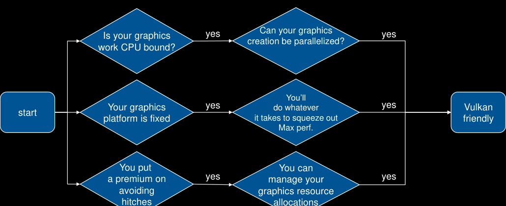
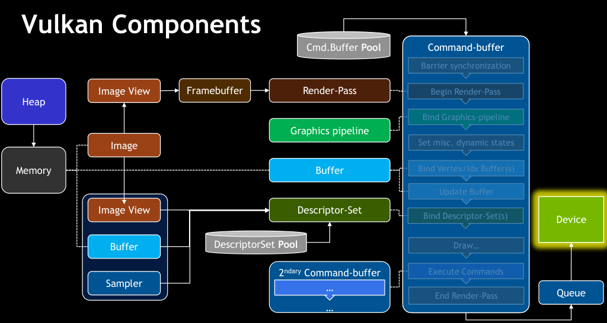
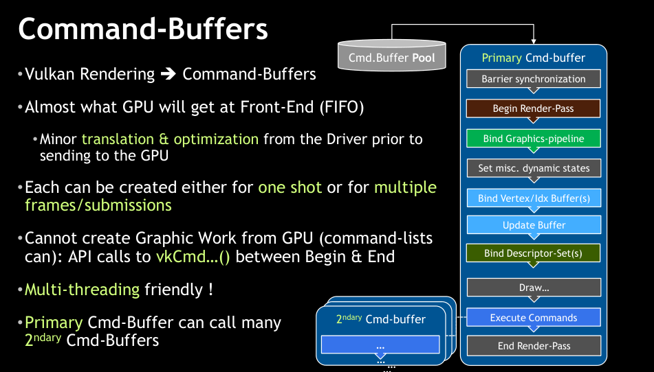
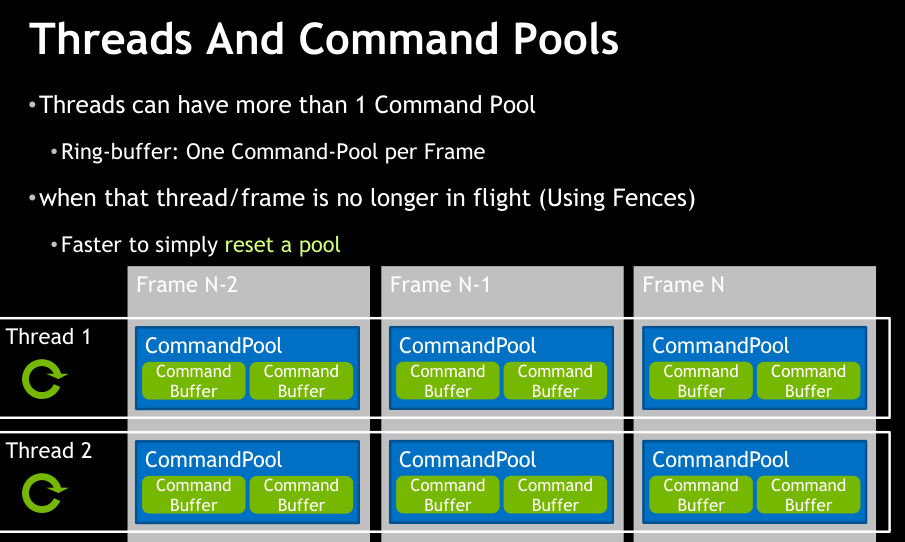
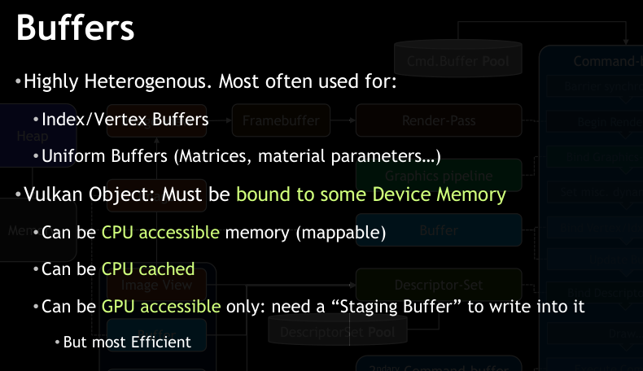
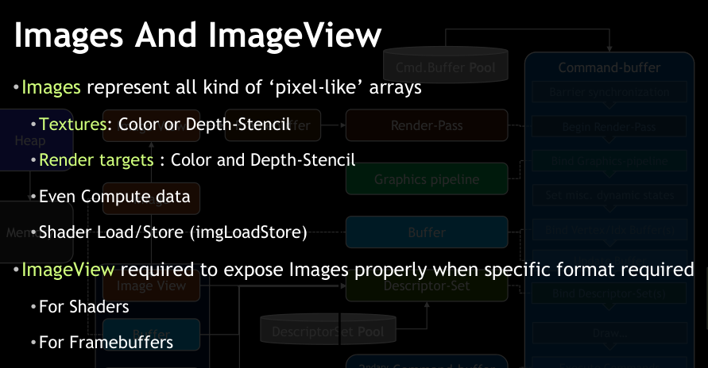
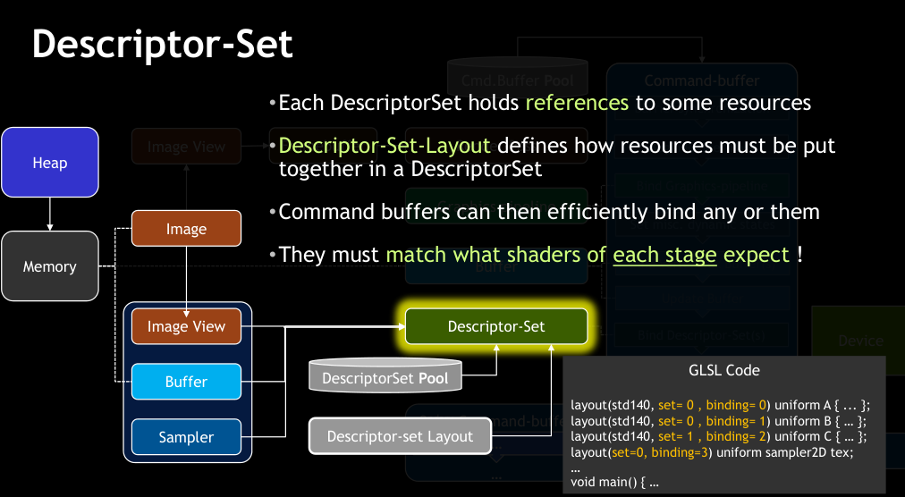
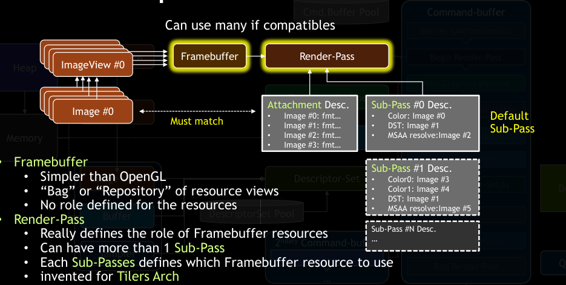
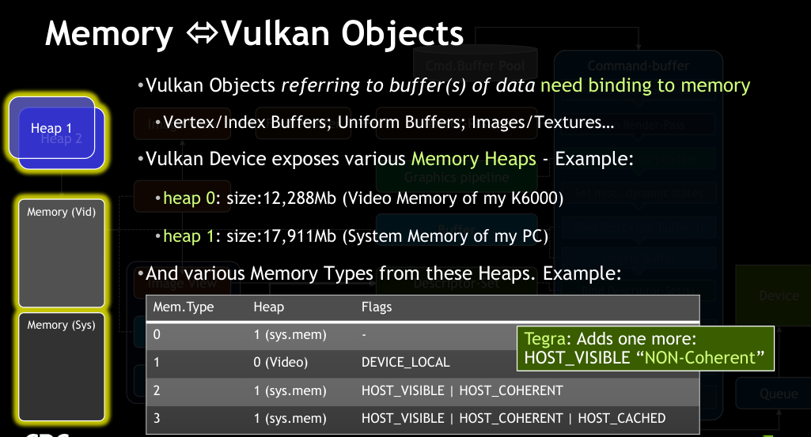

### 什么是vulkan
Vulkan是Khronos在2016年的GDC上提出的新一代的图形API。它提供对现代 GPU 的更强的控制以及跨平台访问，这些现代GPU用于从PC和Console到手机等各种设备(Window/Linux/Android，在Apple上可以通过MoltenVk将Vulkan转译为Metal代码，也就是说Vulkan基本全平台通行)。然而Vulkan诞生的最重要的理由是性能，更具体的说是`优化驱动程序和应用程序渲染逻辑中的CPU侧负载`。

Vulkan是显式控制的API也就是说几乎所有的事情开发者都需要亲自负责，但是也提供更强的控制能力。驱动程序只用于接收API调用传递过来的指令和数据，并将它们进行转换成硬件可以理解的命令。但是在传统图形API(例如OpenGL)里驱动程序会跟踪大量对象的状态，自动管理内存和同步以及在程序运行时进行状态检查。这对开发人员非常友好，驱动开发表示负重前行。但是这种模式显然会消耗宝贵的CPU性能。Vulkan解决这个问题的方案是将状态跟踪、同步和内存管理交给了开发者，同时将状态正确性检验交给各种不同的Layer(比如Synchronization Validation和Validation Layer)进行完成，而要想使用这些Layer必须手动启用。这些Layer在正常情况下不会在Vulkan正式版本中应用程序里运行，仅在Debug版本使用。

### vulkan philosophies
Not specifically "the" core philosophies of Vulkan; just a few we want to highlight
1. Take advantage of an application's high-level knowledge
    Do not require the driver to determine and optimize for“intent”implicitly
2. Ensure that the APl is thread-friendly and explicitly documented for app threading
    Place the synchronization responsibility upon the app to allow higher-level sync
3. Reduce by explicit re-use
    Make explicit as many cases of resource/state/command reuse as possible

### vulkan 利弊

不太可能有用。。
1. Need for compatibility to pre-Vulkan platforms
2. Heavily GPU-bound application
3. Heavily CPU-bound application due to non-graphics work
4. Single-threaded application, unlikely to change
5. App can target middle-ware engine, avoiding 3D graphics API dependencies

### vulkan 组件

#### Queues
1. Command queue was hidden in OpenGL Context… now explitly declared
    Multiple threads can submit work to a queue (or queues)!
2. Queues accept GPU work via CommandBuffer submissions
    few operations available:, “submit work” and “wait for idle”
3. Queue submissions can include sync primitives for the queue to:
    Wait upon before processing the submitted work
    Signal when the work in this submission is completed
4. Queue “families” can accept different types of work, e.g.
5. NVIDIA exposes 16 Queues
    Only one type of queue for all the types of work

#### command buffer

update, push constant

#### 同步

#### 线程 和 命令池

#### pipeline

#### buffers

#### images and image views

#### descriptor set

#### render pass

#### memory

### 专题概念解析

#### 资源绑定 resource binding

主要概念
1. descriptor: shader resource like buffer, image, sampler ...
2. descriptor set: descriptor pool allocates them. binding it with descriptor
3. descriptor set layout: contain descriptor sets; shader stage --binding
4. descriptor binding
5. pipeline layout
6. push constant
