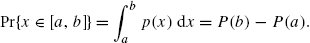
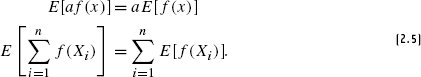
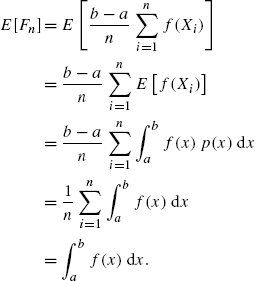
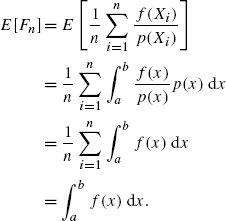
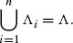
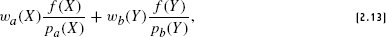
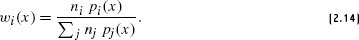

## overview
1. numerical methods: use random sampling to evaluate integrals with a convergence rate that is independent of the dimensionality of the integrand.
2. requirements: evaluate an integrand f(x) at arbitrary points in the domain

## basics

### BACKGROUND AND PROBABILITY REVIEW
1. `random variable`: a value chosen by some random process
2. A function `p(X)` that gives a `discrete` random variable’s probability is termed a `probability mass function` (PMF)
3. independent: $p(X,Y)=p(X)p(Y)$
4. a random variable’s probability is conditioned on many values; for example, when choosing a light source from which to sample illumination, the `BVHLightSampler` in  considers the 3D position of the receiving point and its surface normal, and so the choice of light is conditioned on them.  多元随机变量
5. A particularly important random variable is the `canonical uniform random variable`, which we will write as ξ.
6. The `cumulative distribution function` (CDF) P(x) of a random variable is the probability that a value from the variable’s distribution is less than or equal to some value x: 累计概率分布，类似于前缀和
7. The `probability density function` (PDF) formalizes this idea: it describes the relative probability of a random variable taking on a particular value and is the continuous analog of the PMF. The `PDF p(x)` is the derivative of the random variable’s `CDF`
8. For uniform random variables, p(x) is a constant;

$$CDF: P(x)=Pr{X\leq x} \\ PDF: p(x)=\frac{dP(x)}{dx}$$

### expected value 期望
1. The `expected value` $E_p[f(x)]$ of a function f is defined as the average value of the function over some distribution of values p(x) over its domain D.  函数值乘以概率密度
$$E_p[f(x)]=\int_D f(x)p(x)dx$$
2. property

### THE MONTE CARLO ESTIMATOR
1. compute the expected value of estimator
$$integral: \int^b_a f(x)dx \\ estimator: F_n = \frac{b-a}{n}\sum_{i=1}^n f(X_i)$$

2. If the random variables $X_i$ are drawn from a `PDF p(x)`, then the estimator $F_n = \frac{1}{n}\sum_{i=1}^n \frac{f(X_i)}{p(X_i)}$

### error 误差
1. variance: $V[F]=E[(F-E[F])^2] = E[F^2]-E[F]^2$
2. `biasd estimators`: estimators of integrals have expected values that are not equal to the value of the integral.
3. `consistent`: its error goes to 0 in the limit as the number of samples n goes to infinity

## improving efficiency
1. goal: reduce variance
2. method: careful placement of samples in order to better capture the features of the integrand

### stratified sampling
1. decomposes the integration domain into regions and places samples in each one -- called a stratum. ex: supersampling in a pixel.
2. downside: uffers from the same “curse of dimensionality” as standard numerical quadrature.Full stratification in D dimensions with S
strata per dimension requires $S^D$ samples

$\Lambda _i$中的monte carlo 估计为
$$F_i = \frac{1}{n_i}\sum_{j=1}^{n_i}\frac{f(X_{i,j})}{p_i(X_{i,j})}$$
$X_{i,j}$ 表示取得的第`j`个样本

### importance sampling
1. key observation: Monte Carlo estimator converges more quickly if the samples are taken from a distribution p(x) that is similar to the function f(x) in the integrand. 

### MULTIPLE IMPORTANCE SAMPLING
when estimating an integral, we should draw samples from multiple sampling distributions, chosen in the hope that at least one of them will match the shape of the integrand reasonably well, even if we do not know which one this will be.

The `balance heuristic`’s weighting function for the ith sampling technique

power heuristic

### russian roulette
1. skipping the evaluation of samples that would make a small contribution to the final result. 减少采样点
2. but maybe increase variance

### splitting
$$\int_A \int_B f(x,y)dxdy = \frac{1}{n}\sum _{i=1}{n}\frac{1}{m}\sum _{j=1}{m}\frac{f(X_i, Y_{i, j})}{p_x{X_i}p_y{Y_{i,j}}}$$

## SAMPLING USING THE INVERSION METHOD
`inversion method`: maps uniform samples from `[0, 1)` to a given 1D probability distribution by inverting the distribution’s CDF. 
生成随机数

## transformation between distributions
