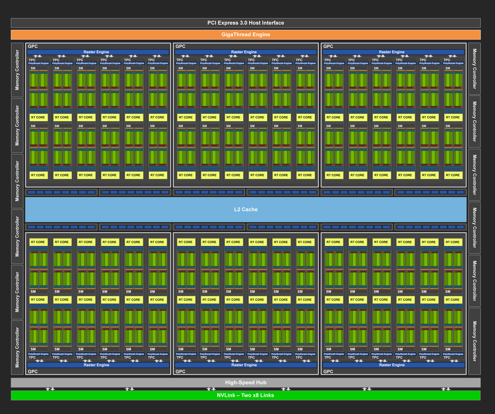
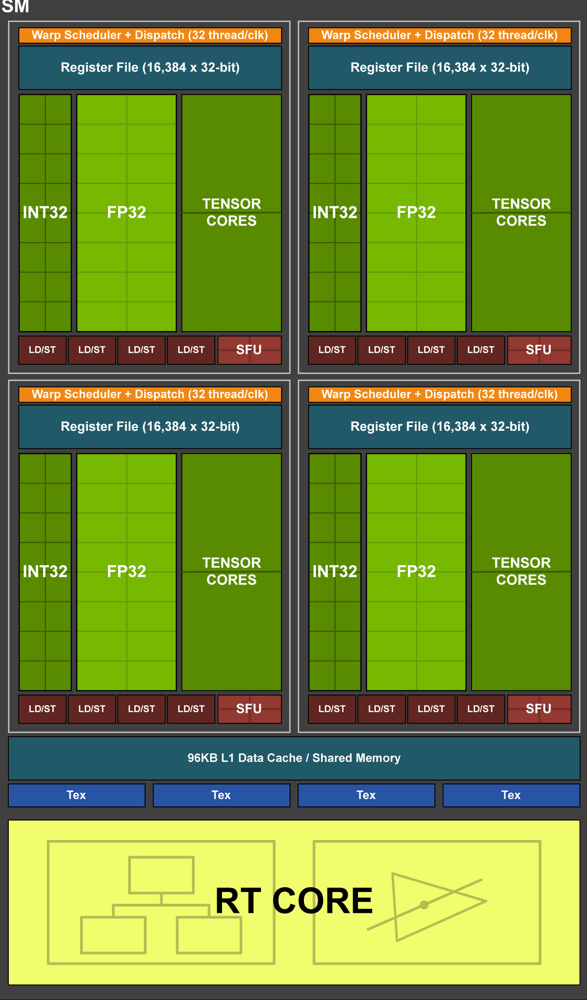

## introduction
1. new (streaming multiprocessor—SM) architecture
2. new memory system architecture.support GDDR6 memory
3. Tensor core -> game, AI inferecing
4. RT core + NVIDIA RTX™ software technology and sophisticated filtering algorithms -> real-time ray tracing with reflections, refractions, shadows ...
5. CUDA -> independent thread scheduling, hardware-accelerated multi process service with address space isolation for multiple applications, and Cooperative Groups are all part of the Turing GPU architecture.

### Streaming Multiprocessor
1. new independent integer datapath that can execute instructions concurrently with the floating-point math datapath.
2. SM memory path has been redesigned to unify shared memory, texture caching, and memory load caching into one unit. 

### tensor core
1. designed specifically for performing the tensor / matrix operations
2. add new `INT8` and `INT4` precision modes for inferencing workloads that can tolerate quantization and don’t require FP16 precision
3. DLSS: extract multidimensional features of the rendered scene and intelligently combine details from multiple frames to construct a high-quality final image.

### real-time ray tracing acceleration

### shading advancements

#### mesh shading
1. mesh shading: Mesh shading advances NVIDIA’s geometry processing architecture by offering a new shader model for the vertex, tessellation, and geometry shading stages of the graphics pipeline, supporting more flexible and efficient approaches for computation of geometry.
2. moving the key performance bottleneck of object list processing off of the CPU and into highly parallel GPU mesh shading programs

#### variable rate shading
1. VRS allows developers to control shading rate dynamically, shading as little as once per sixteen pixels or as often as eight times per pixel.
2. application specifies shading rate using a combination of a shading-rate surface and a per-primitive (triangle) value

#### Texture-Space Shading
1. objects are shaded in a private coordinate space (a texture space) that is saved to memory, and pixel shaders sample from that space rather than evaluating results directly. 

### deep learning

## architecture in depth

### turing TU102 GPU
1. includes six Graphics Processing Clusters (GPCs), 36 Texture Processing Clusters (TPCs), and 72 Streaming Multiprocessors (SMs).
2. Each `GPC` includes a dedicated `raster engine` and `six TPCs`, with each TPC including `two SMs`. Each SM contains `64 CUDA Cores`, `eight Tensor Cores`, `a 256 KB register file`, `four texture units`, and `96 KB of L1/shared memory` which can be configured for various capacities depending on the compute or graphics workloads.
3. Ray tracing acceleration is performed by a new `RT Core processing engine` within `each SM`
4. Tied to each `memory controller` are `eight ROP units` and `512 KB of L2 cache`. The full TU102 GPU consists of 96 ROP units and 6144 KB of L2 cache. 

### turing SM
1. each SM: a total of 64 `FP32` Cores and 64 `INT32` Cores; eight mixed-precision Turing Tensor Cores; one RT Core.
2. The Turing SM is partitioned into four processing blocks, each with 16 FP32 Cores, 16 INT32 Cores, two Tensor Cores, one warp scheduler, and one dispatch unit. 
3. Each block includes a new `L0 instruction cache` and a `64 KB register file`. 
4. The four processing blocks share a combined `L1 data cache/shared memory`.
5. Concurrent Execution of Floating Point and Integer Instructions 
6. unified architecture for `shared memory`, `L1`, and `texture caching`. allows the L1 cache to leverage resources; `32kB shared memory + 64KB L1 cache` or `64kB shared memory + 32KB L1 cache`

### turing tensor core
1. adds `INT8` and `INT4` precision modes
2. Each Tensor Core can perform up to 64 floating point fused multiply-add (FMA) operations per clock using FP16 inputs.

### memory architecture
1. Turing improves `main memory`, `cache memory`, and `compression architectures` to increase memory bandwidth and reduce access latency.
2. GDDR6 Memory Subsystem
3. L2 Cache and ROPs:  6MB of L2 cache. -> 1MB per GPC. each ROP partition in Turing contains `eight ROP units` and each unit can process a single-color sample.
4. Memory Compression:
5. Video and Display Engine:  H.265 (HEVC) 25% imporved; H.264 15%

## TURING RAY TRACING TECHNOLOGY