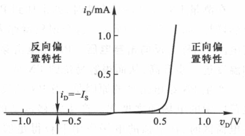

## 半导体
1. 定义：有一定导电能力的器件；共价键；价电子;
2. 独特的物理性质：光热的激励作用；参杂后导电能力提高

### 本征半导体
1. 本征半导体：完全纯净的，完整结构的半导体（热运动->本征激发）；晶体结构；
2. 电导率：单位体积内的载流子数量相关。载流子数量与温度，杂质相关
3. 本征激发：价电子逃离共价键的束缚，形成空穴（区分导体和半导体）和自由电子；浓度越大导电能力越好。
4. 自由电子浓度和空穴浓度相等
5. 复合：空穴和自由电子的复合；
6. 动态平衡：本征激发的速率和复合的速率几乎一致  载流子符合率等于产生率时

### 杂质半导体
1. 目的：提高载流子浓度
2. 手段：掺入少量的杂质元素
   1. N型半导体：掺入磷（P）5价元素，大量自由电子；自由电子（多子），空穴（少子） 温度对多子影响不大，对少子影响很大。 
   2. P型半导体：掺入硼（B）3价元素 空穴多。本征激发的产生电子数远少于空穴数

### PN结形成
1. 扩散运动：浓度高->浓度低的运动 由浓度差和热运动引起
2. 飘移运动：载流子在空间电场的作用下的移动。一般电子的移动更快 （空穴受到共价键的束缚更大）
3. 空间电荷区：耗尽区，阻挡层，PN结 这是由于扩散运动形成的（在一块半导体的两侧分别掺入B和P）
4. 由于P区的空穴和N区的电子在空间电荷区复合，留下了N区相对较多的带有正电的施主离子和P区带有负电的受主离子 --> 形成内电场（N区指向P区） --> 对于两个区域的多子来说：势垒，“堤坝” 大多数“过去不了”   对于少子来说：飘移！
5. 多子的扩散与少子的飘移形成动态平衡。漂移运动使空间电场区变窄；扩散变宽
6. 参杂的浓度有影响。 一样：对称结；否则不对称结

### PN结的单向导电性
1. 只有外加电压才能显示
2. 外加正向电压：P区接正极，N区接负极  削弱PN结（与PN结内电场形成的电场方向相反） PN结电流由扩散电流决定 $I_F$ PN结导通
3. 反向电压：PN结越来越大，几乎不导电 增加了电场强度 有一个反向电流 $I_R$ 趋于稳定后称为反向饱和电流 $I_S$   PN结截至
4. $i_D=I_S(e^{\frac{v_D}{nV_T}-1})$, $i_D$ 为通过PN结的电流，$v_D$为PN结所加电压 $I_S$为反向饱和电流

### PN结的反向击穿
1. 雪崩击穿：电压增加，少子通过电场后增加很大的能量，与原子晶体发生碰撞，打破共价键的束缚，形成更多的空穴-自由电子对。 倍增效应 载流子增加多且快，反向电流急剧增大。（参杂浓度低）温度越高，击穿电压越大；
2. 齐纳击穿（参杂浓度高）温度越高，击穿电压越低； 由于电场对电子的影响而产生
3. 后果：引起温度上升烧坏了。。  可以做稳压二极管

### PN结的电容效应
1. 电容：电量与电压的关系；电压变化，储存的电量变化
2. 扩散电容：PN结处于正向偏置时
3. 发生在势垒上，称之为势垒电容； 非线性 势垒区的变化意味着空间电荷数的增减。

## 二极管

### 二极管的结构
1. 面接触型 和 点接触型

### 二极管的伏安特性曲线
1. 体电阻的存在：电流比PN结小
2. 反向电流大一些
3. 温度上升，正向左移，反向下移； 室温下，上升1℃，正向电压下降2~2.5mv;10℃，方向电流增大一倍。
4. 规定电流的路径；

