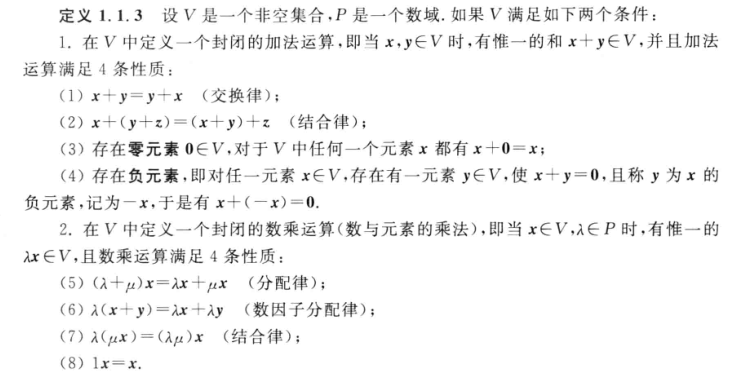

## intro
1. 矩阵是线性系统中线性算子在基偶下的一种数量表示
2. 线性空间：集合中的元素在线性运算方面的性质
3. 线性算子
4. 线性运算是线性空间的本质

## 线性空间的线性算子与矩阵

### 线性空间

#### 数环与数域
1. 数环描述非空集合中元素之间的 `和、差、积` 运算的封闭性 {0}
2. 数域描述至少两个元素集合中元素之间的 `和、差、积、商` 运算的封闭性 Q，R，C

#### 线性空间
1. n维向量空间的推广
2. 研究的元素不一定是 `有序数组`，但仍然由`加法，减法，乘法和除法`
3. $p[x]_n = \{a_nx^n+a_{n-1}x^{n-1}+\dots + a_1x+a_0 \ | \  a_i\in \R \}$
4. 常系数二阶其次线性微分方程的解的集合
5. 全体n阶实矩阵构成的集合
6. 实线性空间和复线性空间
7. 同一个集合定义了两种不同的线性运算就构成了两个不同的线性空间；定义的运算不是线性运算就不是线性空间。

#### 线性空间的基本性质
1. 0元素唯一
2. 负元素唯一
3. 零空间的定义

#### 基、维数与坐标
1. 线性组合(线性表示)的定义. hint: 线性空间V和数域Ｐ; 单一向量与一组向量
2. 线性相关与线性无关
3. 基的定义 ---- n个向量构成的向量组 + 线性无关
4. 维数的定义 $dimV = n$ n维线性空间 $V^n$
5. 无限维线性空间 $\R$
6. 自然基的定义 线性空间不同基所含向量的个数相等
7. 线性空间的维数与所选数域$P$相关

